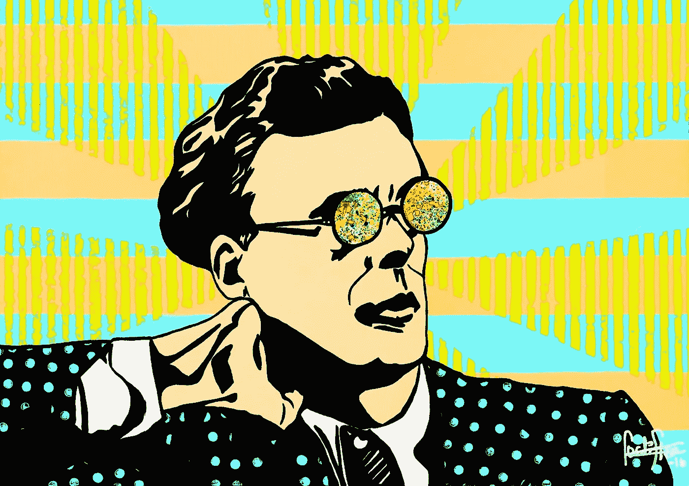

# 不让你的自我说话的力量

> 原文：<https://medium.com/swlh/the-power-of-not-letting-your-ego-do-the-talking-b7ae6e2925f2>

## 你可以做两个决定，而不是把一切都点燃。

Image Credit: Sandmade.eu/Aldous-Huxley

我们都不得不面对这种情况，在这种情况下，我们的自我会表现出来，并向世界展示谁是老板。这些情况非常美妙，只要一想到它们，你就会变得自负。