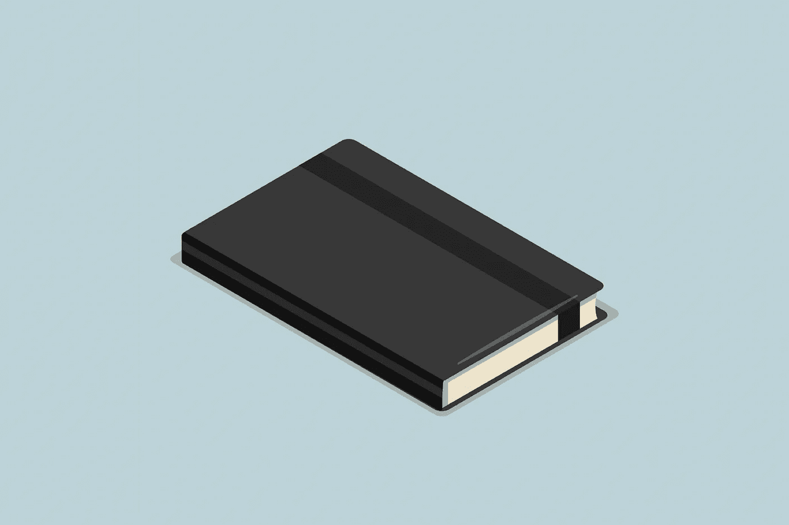

# 少读书的力量

> 原文：<https://medium.com/swlh/the-power-of-reading-less-b759dff36f15>

Image by [rawpixel.com](http://rawpixel.com/)

在过去的 12 个月里，我读了 53 本书(还写了一本)。

在信息时代，读书让我接触到了以前从未接触过的想法、技能和可能性。从中国古代哲学到最新的商业和营销技巧，书籍塑造了我的生活和思维方式。