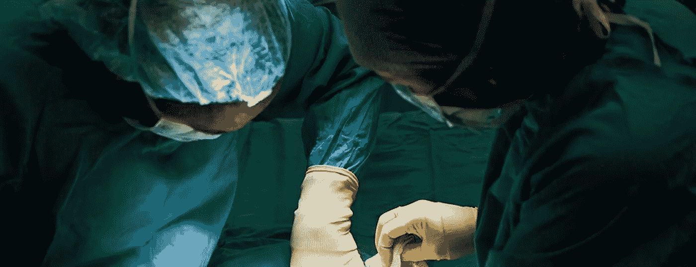

# 谵妄、现实和心灵轮廓:对我术后重症监护经历的反思

> 原文：<https://medium.com/swlh/the-power-of-the-mind-exploring-the-borders-between-reality-and-post-operative-delirium-5cb8dd8f2dd6>

今年一月心脏手术后，我发现自己正在斯特灵附近希尔弗茨山谷的一个舒适的疗养院里疗养。这是一次可爱的经历，工作人员非常友好，阳光灿烂地透过窗户照射进来——尽管我经常感到沮丧…