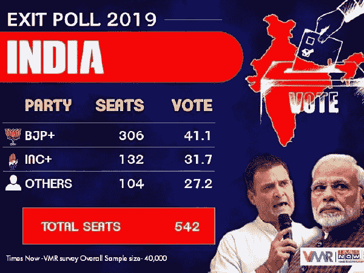

# 2019 年印度选举中“为什么”的力量

> 原文：<https://medium.com/swlh/the-power-of-why-in-the-indian-elections-2019-803af2ba5aca>

昨晚，随着 2019 年印度议会选举的最后一票投出，民意调查专家发起了一场“海啸”出口民调，约 12 项出口民调预测纳伦德拉·莫迪领导的全国民主联盟将明显获胜。现在，出口民调以前也出错过，所以应该持保留态度。但有一个趋势是显而易见的，那就是总理纳伦德拉·莫迪将会连任。

Times Now — VMR Poll Snapshot. From: timesnownews.com