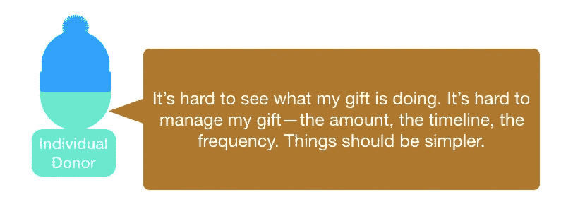
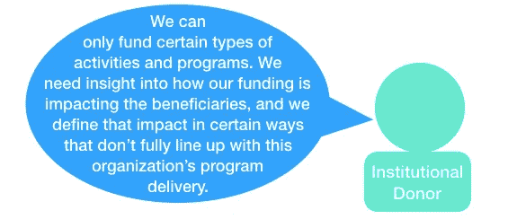
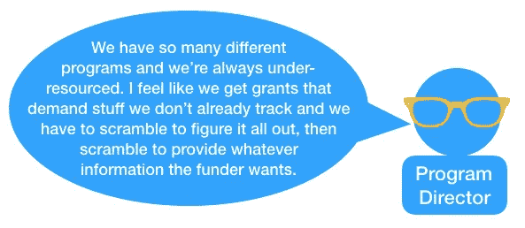
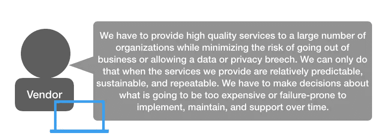

# 使技术人性化的力量

> 原文：<https://medium.com/swlh/the-power-to-humanize-technology-fe8b7d4b83fb>

A steel sculpture at the IIT campus in Chicago, Illinois. It is industrial, yet human scale, almost like signposts indicating different directions.

在之前的一篇文章中，我问数据系统如何人性化。一个人性化的系统在它的意图、目标和用途上是清晰的。它收集、解释和使用数据的方式是透明和可信的。它的设计和执行是公平的。它有潜力被广泛使用。

我认为，在我们能够采取任何其他步骤来创建人性化的数据系统之前，我们必须理解权力。虽然我们可能经常将权力与权威或控制混为一谈，但它也可能意味着影响和代理。未经审查的权力在我们的企业数据系统 [*](#ba12) 为什么经常不透明、不公平、不可信和具有掠夺性中起着决定性的作用。人性化数据系统的每一个元素——透明度、信任、公平——都基于所有利益相关者如何体验权力，以及如何使用权力来塑造数据系统的设计和持续活动。

# 电力和企业数据系统

[乔治·埃](/greater-good-studio/design-educations-big-gap-understanding-the-role-of-power-1ee1756b7f08)强调了“权力最小的人往往离问题最近”的观点这在技术系统和其他实践领域都是如此。

> “问题”可以有不同的定义，有时是相互矛盾的，这取决于视角。

当我们将这个想法付诸实践时，重要的是要意识到“问题”可以有不同的定义，有时甚至是冲突的定义，这取决于所采取的视角。未能检查关于“问题”的多种观点会在数字系统中造成重大麻烦，从疏远的用户到低采用率到不准确的数据(真实的或感知的)。以我的经验来看，技术对话最有成效的开始是明确“问题”到底是什么，谁有这个问题，以及与这个问题相关的其他问题。我认为这种方法可以推广，有助于建立可信和透明的公平制度。

**如何选择系统，由谁来选择系统**

企业技术中最明显的权力动态是谁来决定选择什么系统以及它们的用途。人们总是选择技术来解决问题。引入新技术时，很少会客观地破坏某些东西。更多情况下，“问题”是一种需求或希望:为了更好地了解工作，为了效率，为了改善与客户或资助者的沟通，为了法规遵从性，为了跟上不断变化的形势，以及这些和许多其他因素的任何组合。

A brushed steel wall, a round button, and a label that reads “Emergency Power.” I pressed the button but, alas, did not receive any emergency power that I am aware of.

一个不太明显的权力动态是首先由谁来定义“问题”。谁能说这是个问题，谁能决定这个问题需要解决？通常情况下，无论是谁声称某件事是个问题，他都有资格提出解决方案。在小型组织和初创企业中，完全有可能一个人负责执行一个给定的任务，因此能够选择最适合需求的软件。在更大更成熟的组织中，离日常任务越来越远的人倾向于选择工具。据我所知，在任何情况下，组织的客户或受益人都无权选择用于捕获其数据的技术。然而这些人也是最接近问题的人。

> 整个技术解决方案反映了组织内的实际权力动态和决策。

权力在企业技术中还有许多其他的表现方式。构建框架的力量叙述从陈述要解决的问题开始，并贯穿于系统的设计、实现、维护和治理。权力决定了以下问题的答案:

*   谁为如何获取、解释、报告、存储和分析数据制定规则和规范？谁觉得挑战、质疑、提出改变的需求或识别错误是安全的？谁受到影响但被排除在对话之外？
*   如何培训和支持人们使用他们的系统？是每个人都获得了适当的资源还是有些人被遗漏了？谁来决定培训内容和遗漏内容？
*   解决方案是如何设计和实现的？流程的哪些部分包含了谁的观点？谁的需求或问题陈述被优先考虑？是鼓励公开对话和设计，还是过程更受控制？流程是否透明？

从本质上讲，整个技术解决方案反映了组织内的实际权力动态和决策。业务决策是由有权决定和定义的人制定的，流程是由有权决定和定义的人定义的。这些决定和定义然后通过技术来实现和执行。

> 业务决策是由有权决定和定义的人制定的，流程是由有权决定和定义的人定义的。这些决定和定义然后通过技术来实现和执行。

在传统的技术实现中，技术专家很少考虑问题的框架。当一个问题被陈述给技术专家时，它通常是我们试图解决的唯一事情。事实上，这往往是我们唯一被允许解决的事情。设计和开发思维与敏捷和精益方法的集成有助于技术团队更加了解业务流程和用户需求。这些方法本身不能克服这样一个事实，即 IT 和开发遇到了一个问题，这个问题的解决方案是框架所固有的(并受到框架的限制)。为了解决这个问题，需要有人温和但无情地询问*谁* *所有*都是这项工作的服务对象，以及*他们*如何看待这些问题，然后协商达成一个整体解决方案所需的权衡。

**对“问题”的不同看法**

作为一个简单的例子，不同权力级别的人如何接近他们定义的“问题”，我想告诉你一个小故事，对于任何在非营利机构工作的人来说，这个故事应该是非常熟悉的。这是当您询问不同的利益相关方他们组织的最大数据需求时会发生的情况。

The CEO / Executive Director says “I can’t get timely data that helps me understand our financial performance in the context of the services we’re providing. How much more money do we have to raise to serve double the people? I have no idea and it’s terrifying.”

The Director of Development states the problem as “I know how much we’ve raised so far and what our targets are, but it’s really hard to get reliable data from program. This makes it hard to raise more funds, cultivate better relationships with our large donors or even tell our story and get the word out.”

The story from an individual donor is “It’s hard to see what my gift is doing. It’s hard to manage my gift — the amount, the timeline, the frequency. Things should be simpler.”

An institutional donor has different concerns: “We can only fund certain types of activities and programs. We need insight into how our funding is impacting the beneficiaries, and we define that impact in certain ways that don’t fully line up with this organization’s program delivery.”

The COO has concerns often shared by the CFO. “Our auditors like to trace fund use all the way down to the program activity level. But program staff operate on a different cycle than fundraising, which different again from our accounting process. It can be a nightmare to keep track of.”

The Program Director says that the problem is: “We have so many different programs and we’re always under-resourced. I feel like we get grants that demand stuff we don’t already track and we have to scramble to figure it all out, then scramble to provide whatever information the funder wants.”

From the program staff perspective: “I’m stretched so thin. I spend at least half of my time keying data into different databases, but I still need to serve the people who rely on me. Some of this stuff I have to ask feels pretty invasive so I either don’t ask or I wait until I have a better relationship with the client. I usually wind up working overtime to get it all done.”

A client of the program has this to say: “It’s like I have to prove I’m a deserving person every time I walk in the door, and I have to repeat my information over and over again. I’m the same person with the same story and I know these organizations all talk to each other. It always leaves me kind of upset, and most of this information I have to give them doesn’t change anything they’re doing for me. ”

甚至小贩也有故事要讲。供应商也是利益相关者，对于可以考虑什么样的解决方案以及如何构建、理解数据并将其转化为信息，拥有惊人的权力。

The vendor’s story: “We have to provide high quality services to a large number of organizations while minimizing the risk of going out of business or allowing a data or privacy breech. We can only do that when the services we provide are relatively predictable, sustainable, and repeatable. We have to make decisions about what is going to be too expensive or failure-prone to implement, maintain, and support over time.”

我们可以在教育环境中讲述同样的故事，用学生代替客户，用教师代替项目人员。我们可以将这个故事扩展到包括其他利益相关者，比如董事会，他们有着完全不同的需求和优先级。虽然我解释了这些答案，但它们都反映了我在探索组织的数据系统解决方案时听到的真实答案。

然而，大多数销售和解决方案工程只关注高管们喜欢的分析类型，很少考虑任何其他因素。就好像我们的整个学科已经忘记了数据必须由大量的人输入和使用，然后才能被管理者转换、分析和使用，或者对所有那些无聊的数据输入是如何出现在闪亮的图表和图形上的不太感兴趣。

权力集中在权力和金钱周围，技术解决方案通常是据此销售和设计的。

> 这就好像我们的整个学科已经忘记了数据必须由大量的人输入和使用，然后才能被转换、分析和供管理人员使用，或者对*所有那些无聊的数据输入是如何出现在闪亮的图表和图形上的*不太感兴趣。

权力决定了谁的故事会被听到，谁的故事不会被写出来。权力决定了谁的需求、安逸和舒适优先，谁的需求、安逸和舒适被忽略。回顾一下上面不同的视角和角色。当你阅读的时候，问问你自己你在现实生活中看到了什么关于权力和这些角色。

*   这些角色中哪一个最有权力决定解决方案的方向？
*   谁最有影响力？他们是同一个人吗？
*   谁对新系统是否被采用影响最大，或者最难获得支持？
*   谁管理的风险最大，也就是说，谁最有理由控制对话的某些部分？
*   在创建技术解决方案时，您见过哪些角色？通常或总是缺失的。

# 企业技术中不断变化的权力动态——挑战与建议

我不想暗示有简单的解决方法。正如故事所表明的，公平的解决方案要求考虑和解决各种合法的需求和问题。这有时在技术上具有挑战性，成本高昂，或者导致解决方案在不可持续的复杂性的重压下崩溃。然而，更经常的是，它需要一定程度的角色明确和管理能力，这可能很难实现，特别是在长期资源不足的社会部门组织中。这也可能是具有挑战性的。即使所有条件都是完美的，在听到许多不同声音的任何解决方案中，都要做出合理且非常困难的权衡。更容易将注意力集中在服务于一两个涉众的解决方案上，而且有时成本更低，更易维护。

我相信供应商有很大的力量来影响这些对话。毕竟，成为软件专家是技术专家的工作，而不是客户的工作。供应商与潜在客户讨论的是他们必须销售的产品，以及他们认为客户希望听到的产品。如果供应商花更多的时间教育决策者他们的软件如何服务于各种类型的利益相关者，包括组织的客户，会怎么样？当然，决策者必须对此持开放态度——有很多人只是想快速购买一些东西，而不是参与这种对话。

企业软件是基础设施。所涉及的成本包括初始购买、持续维护以及偶尔的大额意外支出。就像拥有一套房子一样，这些都是必须要规划和容纳的，不然基础设施就开始退化了。当拥有大量权力的人期望或要求那些相对权力较小的人在没有适当资源的情况下管理基础设施时，权力动态经常出现。这很少是恶意的；更常见的是，这是那些与维护基础架构问题最接近的人和那些与跨多个竞争优先级管理资源的不同问题最接近的人之间自然脱节的结果。我在资助者没有为关键数据系统的持续成本提供足够资金的情况下见过这种情况。我也看到组织停止支付许可费，切断自己的支持，并且在转移到另一个系统时几乎不可能(并且极其昂贵)提取数据。供应商比一线员工拥有更大的权力，他们可以帮助决策者设定对未来所需资源的适当预期。决策者，尤其是分配资源的决策者，可以为权力相对较小的人建立安全的渠道，以便更好地沟通资源需求。

立法者和资助者有权要求非营利、教育和公共部门的客户(或受益人、学生或委托人)提供数据，这是一个似乎无法弥合的鸿沟。我不得不相信，即使在这里，我们也能实现公平，但我也相信，这可能不会很快实现，需要付出大量努力。组织对如何以及何时收集数据考虑得越来越周到——只询问最少的所需信息，并随着信任关系的发展逐渐捕获某些数据元素。这使得客户能够更好地控制信息披露，并且在理想情况下，仅在他们感到足够安全时披露某些信息，而不是因为他们迫切需要获得服务而感到必须披露数据。即使组织很清楚服务不依赖于公开，客户过去的经历也会让他们相信这不是真的。显然，在任何涉及从客户处获取数据或使用数据为客户、关于客户或与客户一起做出决策的任务中，作为设计流程的一部分，倾听客户的声音至关重要。我的直觉是，我们需要做的还有很多。什么对你有效？你曾参与过哪些活动，让你觉得自己的声音被真正倾听并融入其中？

# **结论**

在我的大部分工作中，提供反映许多不同声音的故事的系统被证明是对所有利益相关者面临的问题的一个真实的，即使是渐进的改进。这就是为什么我认为自己首先是一名设计师，其次才是一名技术专家——由外向内、多种声音的方法确实为所有人创造了更多的价值。

我不确定我是否认为技术专家或设计师的角色就是转变权力。至少不在技术项目的典型范围内。但我确实相信，我们的职责是用我们自己的力量提升和放大那些面临被忽视风险的声音。我相信，在评估企业系统时，我们的职责是利用我们的知识和影响力来扩展什么是可能的，什么是理想的。意识到并批判性地反思我们所拥有的力量是我们的职责，因为是我们创造了系统，执行我们在其中编码的任何规则。

我没有任何答案。我有 20 年的观察，越来越迫切地感觉到企业技术不再局限于旧的方式，旧的方式使我们更难解决这些问题。所以我会留给你们更多的问题，如果你们想进一步探索这些问题，我鼓励你们[联系](https://www.deepwhydesign.com/contact-us)。

*   作为一名技术专家，你在哪些方面运用了自己的力量来设计一个让你引以为豪的解决方案？
*   你认为应该做些什么来改变权力在工作场所技术中的体现方式吗？如果有，是什么？如果没有，为什么没有？
*   当你把自己想象成政府系统的消费者时，你是否觉得你拥有自己提供的数据或有任何机构来影响变化？
*   您是选择或影响组织技术解决方案的决策者吗？选择技术时考虑生产线员工和客户有意义吗？你愿意把你的时间和注意力给一个试图让你参与这次对话的供应商吗？
*   你是资助者吗？在探索技术问题时，你认为自己拥有什么样的相对权力？
*   我们还必须改变什么来确保反映在我们企业技术系统中的权力结构是透明、公平和可信的？

如果你还没有，你可能想花点时间读一读乔治·埃的《[设计教育的巨大差距:理解权力的作用](/greater-good-studio/design-educations-big-gap-understanding-the-role-of-power-1ee1756b7f08)埃教授正在围绕设计师在承认和转移权力中的作用形成一些强有力的对话，我非常感谢他形成了我自己对这个主题的想法。

***定义:消费者诉企业技术***

我认识到许多人不知道这种区别。因为整篇文章都是关于企业技术的，所以我想提供一个快速的定义。

[消费技术](https://simplicable.com/new/consumer-technology)是我们作为个人，*选择*来为个人目标服务的东西。我在使用消费产品时捕获的大量数据以及在我不知情的情况下使用数据的所有方式(咳咳，谷歌和脸书)是大规模社会运动的主题，旨在提高“大数据”技术的隐私和透明度。

[企业技术](https://www.mitre.org/publications/systems-engineering-guide/enterprise-engineering/enterprise-technology-information-and-infrastructure)被其他人选择来服务于组织目标，我们经常被*要求*使用它。许多不得不在工作中使用这些系统的人把它简单地认为是“数据库”企业技术通常是“关键任务”，这意味着错误会导致金钱、时间的重大损失，甚至更糟。这些系统内部和之间的数据保护，以及如何使用和共享这些系统中存储的数据，是法律和法规的主题。这些系统中有许多对公众有直接影响(想想刑事司法算法、学校分配算法和其他算法)，因此我们看到社会运动越来越需要要求软件决策透明。