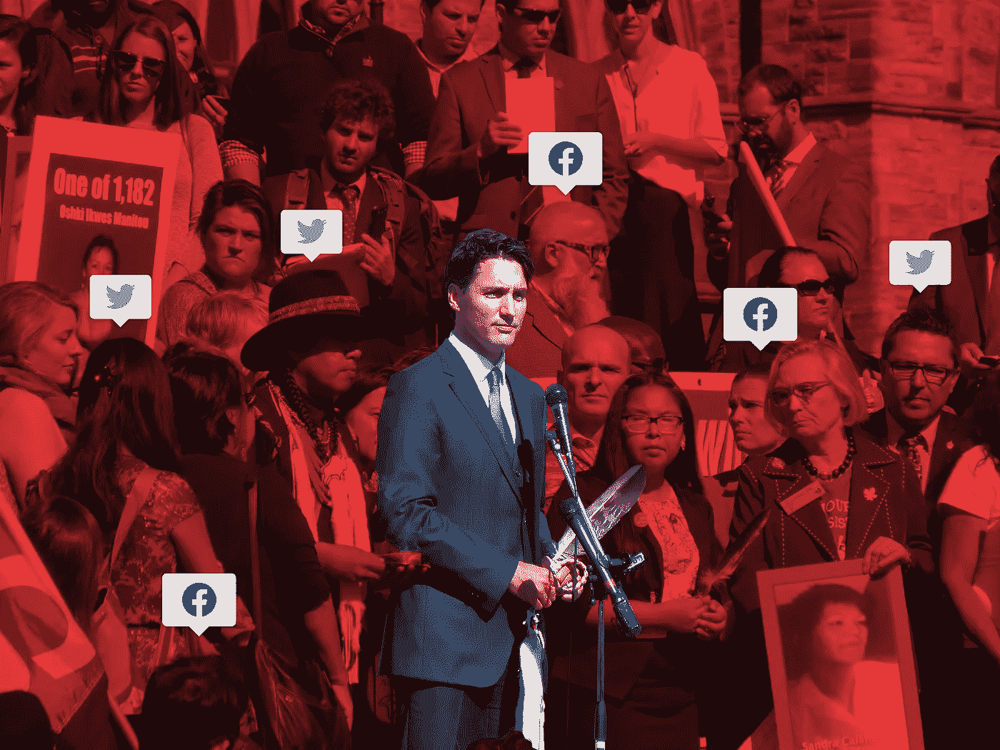

# 首相无视我的推特:

> 原文：<https://medium.com/swlh/the-prime-minister-is-ignoring-my-tweets-cda74c672323>

## **分析加拿大人和联邦政府之间的互动——以及我们能做些什么**

最近，我读了简·菲尔波特的一篇博文，她在文中称议会是她工作过的最“不正常”的地方。她特别提到了目前正在实施的流程，这些流程大大减少了…