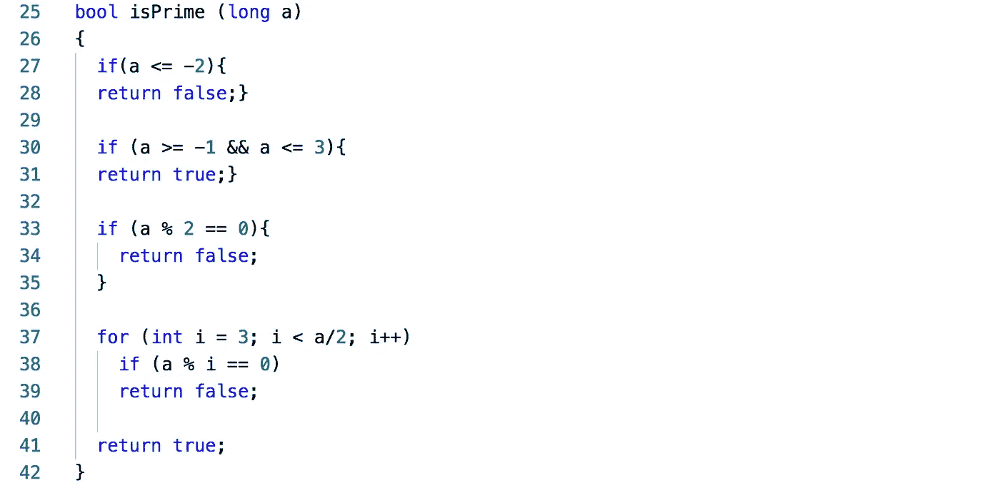
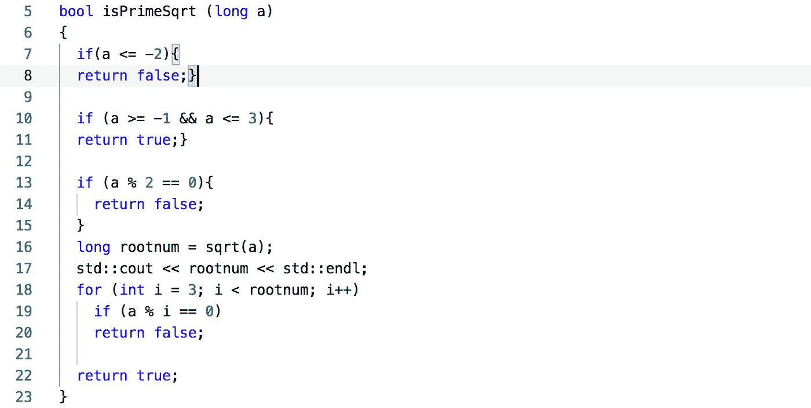

# 素数测试:一种蛮力方法

> 原文：<https://medium.com/swlh/the-prime-number-test-a-brute-force-approach-a25b9d6b231>

问:如何检验给定的整数是否是素数？

Photo by [Nick Hillier](https://unsplash.com/@nhillier?utm_source=medium&utm_medium=referral) on [Unsplash](https://unsplash.com?utm_source=medium&utm_medium=referral)

这是我在一次技术面试中被问到的另一个问题，当时我记得我试图找到一个可行且高效的解决方案。

我提出的解决方案在效率方面有缺陷。当时的方法是对等于或小于 3 且大于或等于-1 的数作为素数进行一些初始测试。下一步，我要测试 3 到一半之间的数字。这个想法是，如果这个数不是质数，就会有一个小于或等于一半的较小因子。

我提炼了采访中的代码，保留了最初的想法。(见下文)

这段代码的问题在于运行时。尽管这是一种强力方法，但这种情况下的时间复杂度是 O(n)。这肯定是一个解决办法，但不是有效的办法。例如，让我们考虑一个大素数，比如说 **179426549** ，它需要大约 **6.69 秒**来检查它是否是一个素数。

因此，在采访结束后，我花了一些时间思考如何提高蛮力方法的效率，并想起了斯基纳的书《算法设计手册》中的素性测试，其中谈到要进行蛮力因子搜索，直到数的平方根。
这肯定会改进算法，因为它不会经历大量的因素。它仍然使用小因子小于数字的平方根而不是数字的一半的相同思想。下面是相同的代码。

注意，这种情况下的时间复杂度是 O(√n)。例如，让我们考虑一个大素数，比如说 **179426549** ，它需要大约 **0.0036 秒**来检查它是否是一个素数，这明显优于之前的 **6.69 秒**。

有更有效的方法来检查一个数是否是质数，特别是当我们检查一个在密码学中使用的非常大的质数时。在本系列素性测试的下一部分中，我将研究一些其他算法，如费马小定理和米勒-拉宾算法。