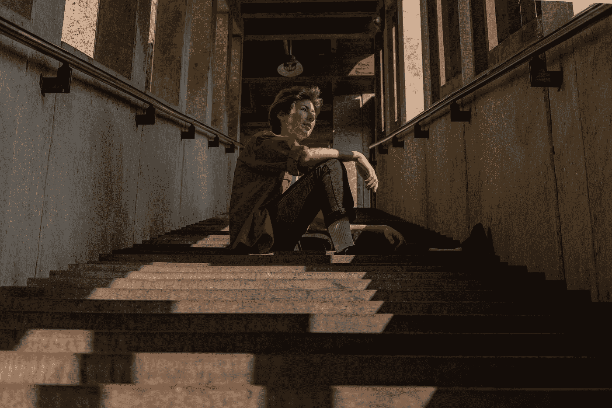

# 无限可能性的问题

> 原文：<https://medium.com/swlh/the-problem-of-infinite-possibility-ec3b9cede4f9>

Photo by [Caterina Berger](https://unsplash.com/@seagull_tree?utm_source=medium&utm_medium=referral) on [Unsplash](https://unsplash.com?utm_source=medium&utm_medium=referral)

## 为什么越多生命越渺小

最近，我和我的妻子已经把几个大箱子送到了 Goodwill。这不是我们第一次参与这种特殊的仪式。这些盒子里装满了美好的想法、适度的 T2 希望、几十个 T4 假设和很久以前的遗物，已经几乎不记得了。这并不是说我们被各种各样的东西淹没了。事实上，我们拥有的比我认识的大多数人都要少。我们也不是极简主义者。

那是什么？

好吧，这一切都可以归结为一个相当简单的想法，这个想法在过去的几年里逐渐扎根于我们的生活。事情是这样的…

没有时间做的，不能欣赏的，都只是噪音。

我说的噪音是什么意思？我的意思是，这只是一团干扰，让你无法专注于真正重要的事情。我不是在某种抽象的意义上说这个。你知道哪些事情丰富了你的生活，哪些事情感觉只是占据了时间和空间。更重要的是，你的某个部分知道你不可能追求你脑海中的每一个突发奇想，不管它看起来多么令人信服。

然而，我们设法把撬棒塞进那些微小的缝隙，在我们的想象中创造足够的空间，也许……也许*也许*……我们可以让它工作(*也许*)。

只是我们不…不是真的，或者至少不经常。

相反，我们藏起了遗憾，可能是为了躲避别人，但最主要的是躲避自己。为什么？因为这些东西对我们来说代表了一些东西。很可能它们是浪费金钱、浪费时间以及最重要的精力的象征。一旦这些东西没了，它们就没了。当然，将来你可能会有更多的钱、更多的时间和精力，但是钱、时间和精力已经一去不复返了。无论你用它来做什么，它都已经丢失了，而且再也不会回来了。

同样，当我们的生活充满可能性时，我们的时间会感觉越来越少。毕竟你不可能什么都做*，所以你必须*选择*关注什么，关注多少。只要特定的可能性还留在你的脑海中(或者就此而言，留在你的衣柜里)，你就会因为没有做或者没有做你认为应该做的事情而感到遗憾。*

*从这个意义上说，生活中选择越少，我们的经历就越丰富，如果每扇门都向我们敞开的话。因为我们把时间分配在更少的事情上，我们有更多的时间、精力、精力和快乐去做剩下的事情。*

*我想在这里非常清楚地说明，这不是生产率的咒语，而是*的意思*之一。举个例子，在过去的 6 周里，我坚持每天画画的习惯。从传统意义上来说，这并没有让我变得更有效率(也就是说，我并没有从中赚到任何钱)，但我喜欢这样，努力提高绘画水平的行为给了我一种其他事情很少能给我的*物质*的感觉。*

*所有这些都是为了几支铅笔和一些打印纸。*

*这些词对我试图描述的来说似乎太大了，但是在一个非常真实的意义上，这个持续在纸上做标记的简单行为*奠定了我是谁的基础*。*

*接地很重要。它让我们区分生活中什么适合什么不适合。当一个可能的自我版本在我们的脑海中上演时，它阻止我们匆忙行动。然而，这些小说很少受到任何程度的现实的影响。可能性会引发情感，而情感有一种将天平向一个方向或另一个方向倾斜的习惯。*

*想一想你每天都做些什么。一天内*真的能装下*多少？没有你想象的那么多，随着年龄的增长，也许会更少。*

*那你想怎么度过这段时间呢？*

*如果你追逐目标，总会有新的东西，曾经让你兴奋和充满欲望的东西会成为明天的垃圾。如果你为了金钱而追逐金钱，没有比这更清楚的证据表明你内心贫穷了。你可以买到某种安全感，你可以为自己提供某些可能性，但你买不到意义，或者就此而言，买不到感激。没有这些，世界上所有的钱对一个可怜的永远不知道生活是为了什么的生物来说只是一个空壳。*

*这里的共同主题是*过剩*之一。意思应该够明白了。当你身边的东西超出了你可能享受或利用的范围时，所有这些多余的东西都代表了生命中被浪费的一点点。原则上，暴食者与过度渴望任何其他东西的人没有什么不同，无论是财富、声望，甚至是经历。对事物的喜悦和感激会减少，我们所拥有的只是永远无法满足的饥饿感。*

*但是我们能用这个做什么呢？首先，给自己时间反思。我不能对生活中的每一种体验说话，也不敢尝试。这意味着适用性的重担落在了你有能力的肩上。然而，我能建议的是，如果我们能考虑到我们的*文化标准*不是确定什么是好的和值得追求的可靠指南的可能性，我们可能会开始看到以前不可能的事情。*

*也就是说，生命中真的有所谓的*富足*，当你欣赏它时，它就成了自己的盛宴……自己的**富足**。*