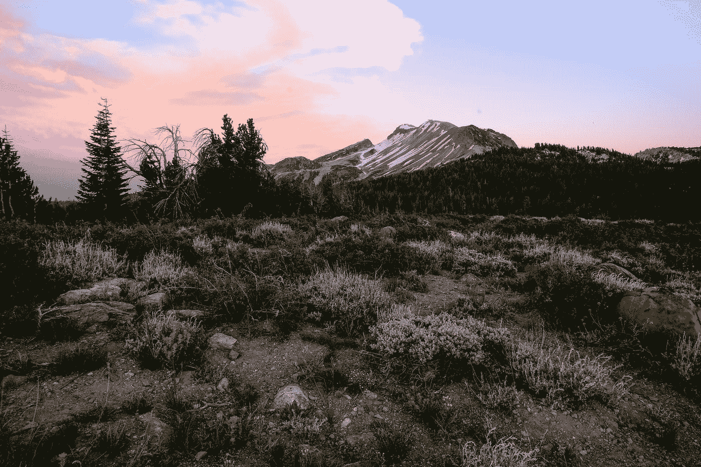

# 关注气候变化的问题是

> 原文：<https://medium.com/swlh/the-problem-with-focusing-on-climate-change-abed31cf8087>

Photo by [Emmanuel Maceda](https://unsplash.com/@bochie?utm_source=medium&utm_medium=referral) on [Unsplash](https://unsplash.com?utm_source=medium&utm_medium=referral)

气候变化是时事政治中的常见话题。问题是:为什么气候变化变成了一个政治化的问题？这是一个影响我们所有人的挑战，无论其政治倾向如何。尽管如此，气候变化已经成为一个政治化的问题。它与许多其他社会问题有关，但在这个问题上存在政治立场。我认为这在很大程度上是因为对气候变化的关注是全球性的和抽象的。这使人们无法将它与他们的日常生活经验联系起来，并阻止他们采取行动解决气候问题，而这些问题可以通过集体和个人行动来缓解。

# **气候变化问题**

气候变化引发了一系列问题。这些问题通常出现在全球范围内。提供这些信息的人可能会觉得，如果他们告诉人们这是一个影响全球的大问题，人们就更有可能做出回应。这可能不是一个准确的观点。

人际关系在让人们对问题做出反应方面很重要。当人们找不到与某个问题的个人联系时，他们就不太可能将这个问题内化为对他们重要的问题。这使得全球问题更加难以解决。

现实是，尽管气候变化是一个全球性问题，但它也是一个地方性问题。在加利福尼亚，通过泥石流、森林火灾和土壤侵蚀可以看到当地的影响。中西部面临土壤侵蚀、农作物歉收和受损以及洪水的挑战。沿海地区正在经历海平面上升、比以前更强、更具破坏性的超级风暴和飓风，以及对渔业、海滩和海洋生物/海鲜的影响。无论你往哪里看，对你当地的生态都有影响。

气候变化的影响超出了环境影响。我们看到粮食短缺和粮食浪费的挑战，养活无家可归和饥饿的人口，但也有肥胖流行病。所有这些都以微妙的方式与气候变化的挑战相关联。我还相信，我们日益增长的抑郁和焦虑与我们与土地和地球的联系减少有关。当我能够走出去，花时间在我的自然当地生态(徒步旅行，游荡，找到一个藏身之处阅读)，我发现自己更平静，更集中。我感觉和周围的世界有联系。破坏自然世界和美丽只会对我们的集体精神状态产生毁灭性的后果。

挑战在于以一种让人们看到问题的地方影响的方式来谈论气候变化。我是在看了 [*最大的小农场*电影](https://www.biggestlittlefarmmovie.com/)和[杏林农场的挑战](https://www.apricotlanefarms.com/)之后才真正开始看到这一点的。好消息是，电影中描绘的农民能够做出当地和个人的反应，在当地范围内扭转气候变化的影响。在这部一个半小时的电影中，你可以看到这些变化以及它们是如何影响当地生态的。

应对气候变化需要同时采取全球性和地方性措施。这是我们作为世界公民面临的最大挑战。为了同时将问题视为全球性和地方性，我们需要理解为什么人们如此抗拒改变。

# **人为什么不改变**

人们普遍难以置信地抵制变革。我们是习惯性的生物，我们会陷入日常事务中。要求一个人改变这些惯例和习惯是非常困难的。当你试图解决的问题在很大程度上是一个抽象的、全局的概念时，这个困难就变得更加复杂了。

气候变化是一个全球性的问题。我们可以看到局部影响，但我们通过全球视角讨论气候变化。这使得人们很难将气候变化等问题的影响联系起来。

当人们不能联系到一个问题时，他们不太可能改变导致这个问题的习惯和行为。这是你听到借口的时候，比如“我只是一个人”，“即使我改变了，其他人也不会，何必呢”，以及“我不能改变世界。”

仅仅一个人就能对他们周围的世界产生非凡的影响，如果你改变了，你就能激励其他人也改变，是的，你能改变世界！要做到这一点，我们需要让人们接受气候变化是对当地有影响的事情，并了解他们的行动和行为如何对当地范围内的变化产生巨大影响。

# **如何获得买入费**

一般来说，当人们看不到结果时，他们不善于改变自己的生活。当我们在应对气候变化这种规模的问题时，很难看到我们行动的结果。面临的挑战是找到一种方法，让人们做出改变，这种改变将总体上影响气候变化，但具有他们可以看到的更加个性化和地方性的影响。有三个策略会有所帮助:让它本地化，让它个性化，让人们觉得他们正在做出改变(并帮助他们看到这种改变)。

# **使其成为本地**

我们需要看到当地的影响，而不是把气候变化作为一个全球问题来关注。一个很好的例子可以在电影《最大的小农场》中看到。对他们耕作方式的小小改变增强了当地的生态环境，让大自然发挥它的作用。

让人们接受改变他们的行为、习惯和行动的需要的一个关键因素是让问题对他们来说是局部的。改变行为需要个人对问题的观察。我们需要了解它对我们当地的影响。我是否暴露在野火的烟雾中，或者可能失去我的家和生活方式？作为中西部的农民，洪水和水土流失会让我失去生计吗？解决办法不是提供补贴。解决办法是尝试更好地理解当地生态是如何运作的，让大自然在你的生活中发挥作用。

我住在一个气候相当炎热的小联排别墅里。我周围的地区到处都是“传统的”郊区草坪，长着进口的草。我们使用了大量的水和灌溉系统来保持草坪的健康，因为这些草在这种气候下并不适合茁壮成长。我想你明白我的意思了。我有一小部分地方生态是我的，我可以随心所欲地使用它——我的后院。我已经开始想办法让我的后院成为一个来自当地的可持续发展的绿洲，以健康的方式为我的当地生态做出贡献。我已经开始观察活跃的昆虫、鸟类、动物，我正在研究它们是如何协同工作的。我正在研究能吸引昆虫的植物，这些昆虫对我的院子有益，同时我还在研究如何在不需要过多浇水和灌溉的情况下，以一种能在当地环境中茁壮成长的方式建立我的花园。

我的问题的一个解决方案是——我已经开始堆肥了。我知道我扔进垃圾箱的东西需要一些时间来形成堆肥，所以我打算先从我们当地的花园商店买一些。花园商店有关于如何利用当地生态的课程，同时还能拥有你梦想中的花园。

我的小小的邮票后院可能是应对城市扩张和郊区化挑战的一个小小的贡献，但我觉得如果我从那里开始，我会得到灵感来扩展我所采取的步骤。对我来说，关键是把它变成一个地方性的挑战，而不是面对独自解决一个全球性问题的*压倒*。

# **个性化**

人们希望感觉他们正在改变周围的世界。当人们看不到自己行动的结果时，他们就不太可能采取行动。让人们接受并做出改变的一个很好的方法就是让改变对他们来说是个人的。如果人们能够看到他们的行为如何改变他们周围的世界，这些改变就更有可能持续下去。

我们如何让应对气候变化变得个性化？首先，说服人们建造可持续的花园。一旦一个人品尝了他们在可持续发展的花园中生产的产品，就很难再去吃加工食品或被运到全国各地或冷冻的产品。你能尝到不同之处。向人们展示他们的小改变对个人的影响。

下一步是向人们展示如何利用堆肥来肥沃土壤。这种肥沃的土壤改变了你种植的食物的味道。通过堆肥回收食品实际上会让你的食物味道更好！一旦你认识到这一点，你就很难吃到不是在富含堆肥的土壤中生长的食物。在营养丰富的土壤中生长的食物本身营养也更丰富。这有助于改善健康状况。说服企业农场使用堆肥技术来生产味道更好的营养丰富的产品是很困难的。说服一个人在他们的后院做这件事要容易得多。关键是让人们可以采取的应对环境问题的措施更加人性化。

# **让人们觉得他们可以有所作为**

最终，关键是要确保人们觉得他们可以有所作为。通过将气候变化与当地关注的问题联系起来，并使应对措施更加个性化，就更容易让人们相信他们的行动会带来变化。应对气候变化挑战的关键是使其个人化和地方化，并最终确保人们意识到他们的行动正在产生影响——地方和个人的影响。