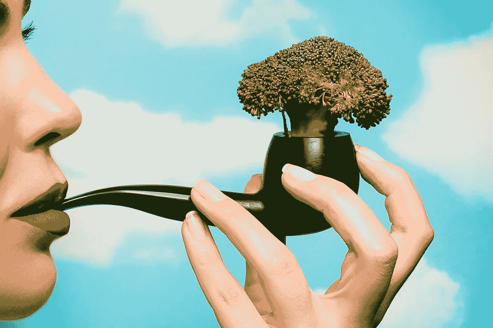

# 你的饮食有问题吗？这就是你所谓的食物

> 原文：<https://medium.com/swlh/the-problem-with-your-diet-its-what-you-call-your-food-3d1e00773624>

> 你不吃蔬菜是因为它们的名字都错了

Photo: Wei Ding

美国人的健康问题——我的，你的，每个人的——很大程度上归结于我们的饮食，我们吃进嘴里的东西。这并不奇怪。

那么，为什么*会做*我们吃什么就吃什么，即使*知道*肯定不会有好结果？