# 创业中的“产品”价值。

> 原文：<https://medium.com/swlh/the-product-value-in-a-startup-aa848983880e>

**🇪🇸第一。你想用西班牙语读这篇文章吗？** [**在这里勾选**](/startups-es/el-valor-del-producto-en-una-startup-ebb50012b780) **。**

让我们闭上眼睛一会儿，把自己放在情境中。

我们必须在城市中从 A 点移动到 B 点，(在这个行动中我们忽略出租车)我们进入**优步**或 **Cabify** ，选择目的地，然后我们就开始移动。

另一个例子，我们在公交车上，我们想听一些音乐来断开一点连接，我们打开 **Apple Music** 或 **Spotify** ，选择列表或我们想要的歌曲，就这样。

更多的例子，我们需要去巴黎旅行(工作或娱乐)，我们寻找一个住宿的地方，我们自动进入**预订**或 **Airbnb** ，在这次旅行中，我们拍了许多照片和回忆，希望与我们的朋友或粉丝分享，因为我们将使用 **Instagram** 或**脸书**(尽管后者已经失去了主要的精华)。

最后也是最重要的一点。我们需要和朋友、家人、夫妇等交流。我们打开 **WhatsApp** 就这样。“写作…”

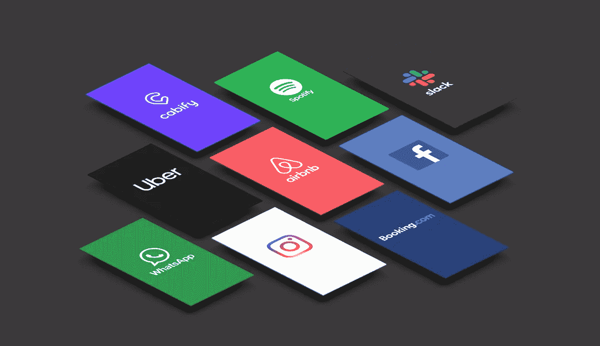

所有这些产品和服务都有一个共同点，那就是让这些产品有今天的地位。显然，数十万数百万的融资积累当然有所帮助，但如果我们必须权衡这些产品的每一条腿，它会是这样的:

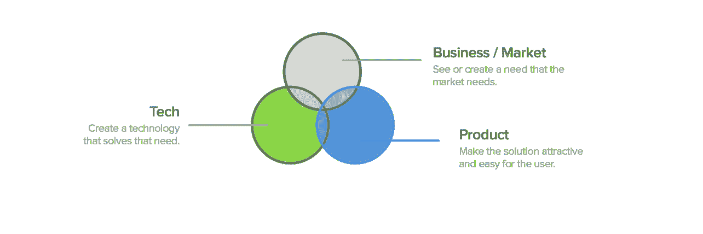

由此我们得出结论，所有的腿都同等重要。对吗？必须是平衡的东西。

## **“在创业公司的基础中，主要的支柱:业务、技术和产品是最基本的，它们从一开始就必须恰当地协调和平衡”**

面对这种情况，依靠我以前写的一篇文章。“ [**MVP 已死，长命到图**](/swlh/the-mvp-is-dead-long-life-to-the-map-minimum-awesome-product-404df90fef7f) ”，在一家新创业公司创立的最初阶段，控制住产品的一部分是至关重要的。

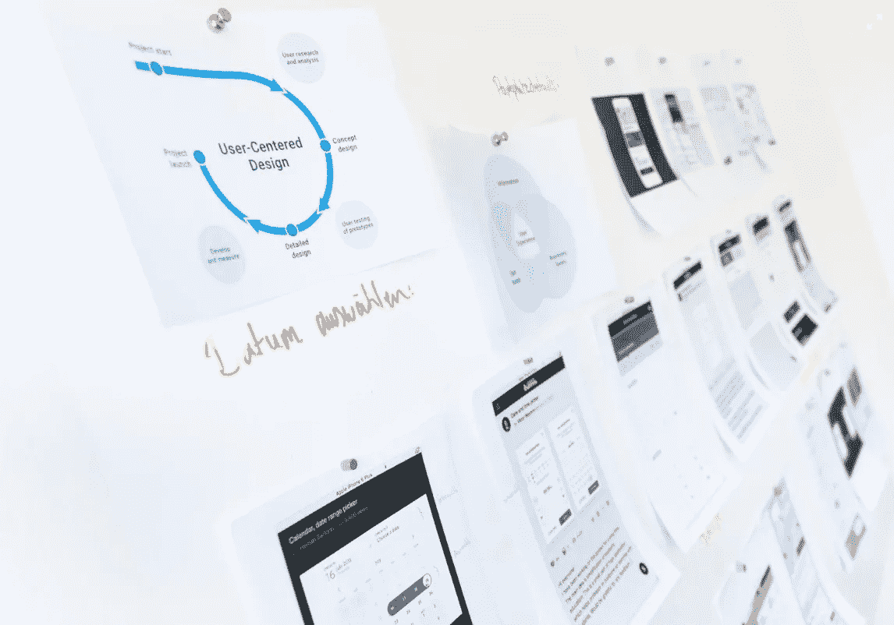

[Cris Busquets](https://medium.com/u/12562a4dd493) 在 [**UiFromMars**](https://www.uifrommars.com/cuando-debes-invertir-en-diseno/) 有一篇文章叫:**投资产品的最佳时机是什么时候？**

“在开发阶段解决一个错误的成本是在设计阶段的 10 倍，如果你想在一个已经发布的产品中解决这个问题，成本会增加 100 倍。”

## 我们从中可以推断出什么？投资产品永远是一个好的选择，而且在当前时代，这几乎是必须的。

显然，每个创业公司都有不同的资源、不同的设备、不同的时间，这意味着并不总是投资产品的时候，在上面的例子中，所有都是大公司，几乎所有的美国公司都有很大的经济能力，但是**这并不意味着我们不能在产品上与他们竞争。**

# **以产品为基础**

有一种方法被称为设计驱动，这是一种植根于股票市场大型上市公司的文化，在那里产品是你公司的一个基本部分，我们在这篇 [DMI 文章](https://www.dmi.org/page/2015DVIandOTW)中找到一个例子，它说**设计驱动的公司超过+ 200%的传统公司。**

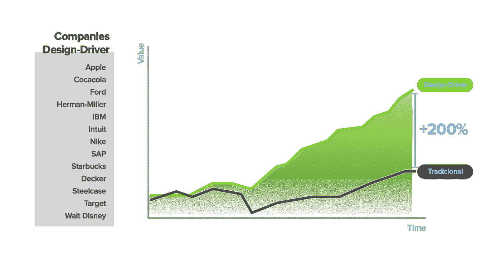

# 投资于产品的公司更有价值，从长远来看也更成功

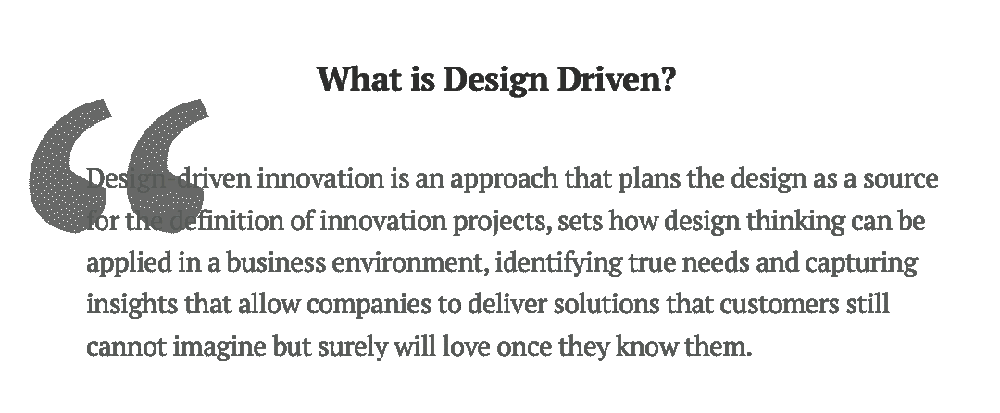

基本上，它是考虑市场和普通用户都期望或寻求的解决方案，以最佳方式设计它们。

正如我在 MVP vs MAP 文章中提到的，这将是未来的关键，因为应用/网络的创建正在普及，几乎任何人都可以启动一个普通的应用，**差异化将体现在产品、其愿景和形状上。**

**让我们举一些例子**，无论是西班牙的还是国外的，在这些地方，产品是关键，并使用**设计驱动**作为他们创业的基础。

# **机柜**

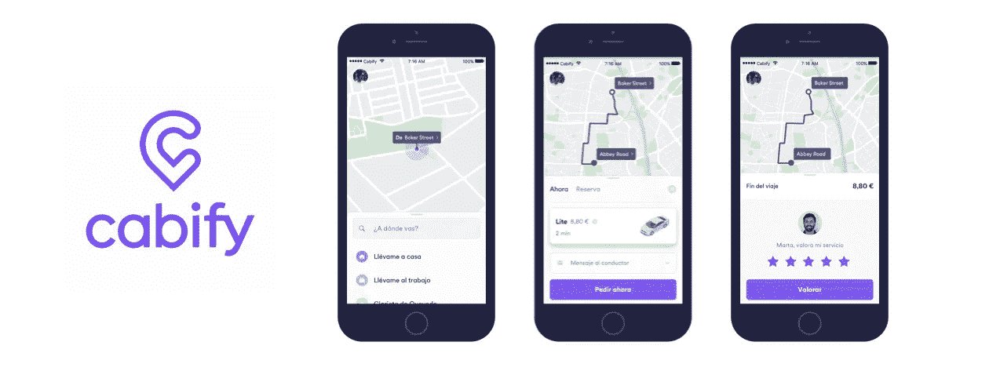

第一个是 Cabify，这是一个关于移动、交通、西班牙和拉丁美洲的优步竞赛的应用程序。一个清晰的业务，一个非常可持续和可靠的技术和一个非常好的产品。*(个人觉得比优步 App 好)。*

一个精彩产品的全部，一个不断增长的用户群，从一开始就把宝押在产品上。结果:

> **自 2012 年以来，在 8 轮融资中超过€4.4 亿英镑。**

据说短期内他们想上市…

# **巴蒂**

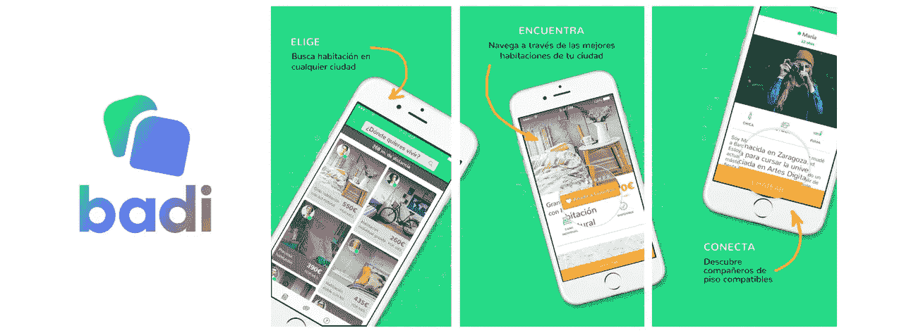

一个寻找室友或出租房间的应用程序，带有城市搜索引擎，与潜在租户聊天等。

一个精心制作的界面，非常接近 Airbnb 的体验，巴蒂试图在千禧一代和新 Z 一代中赢得一个找房子的位置。结果:

> **2015 年以来 5 轮融资超过€4400 万。**

# **三硼酸盐**

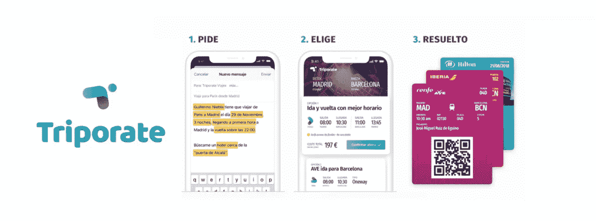

我们已经讨论了一些已经很成熟的公司，但是让我们举一个在市场上已经存在了几个月的例子。一个好的企业，一个简单的服务，但一个熟练的执行。 **Triporate** 提供的产品细致、做工精细。

产品投资回报率处于巅峰的例子，在短短几个月内(2019 年 2 月)结算，不断增长，并在[startup explore](http://www.startupxplore.com/)创下纪录。结果:

> 【2018 年以来两轮融资超过€ 33 万。

一家考虑并相信产品差异化的初创公司。

# **Revolut / N26**

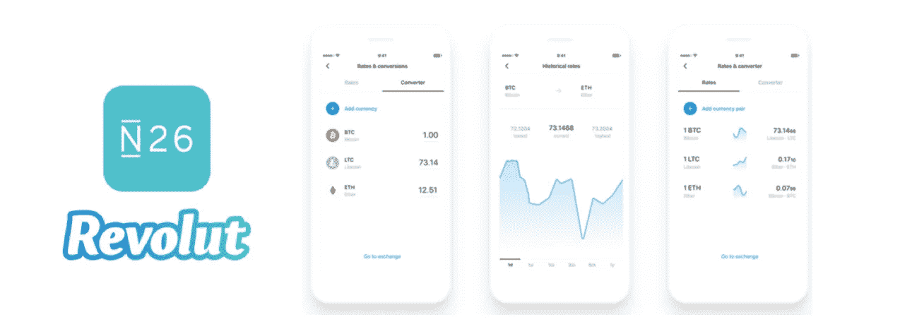

在这种情况下，这个例子对于 N26 和 Revolut 这两家初创公司来说是值得的，这两家移动银行巨头的整个战略都基于一个好的产品。传统银行业务(除了我认为的 BBVA)在服务、可用性和产品水平上是落后的，这是这两家银行看到的可能性，他们全力推出自己的产品。

通过将移动银行引入一个清晰而简单的概念，这两者实现了巨大的飞跃，它们的估值增加了数十亿美元。结果:

> **双方共进行了 16 轮融资，总计+€8.4 亿英镑。**

# **飞线**

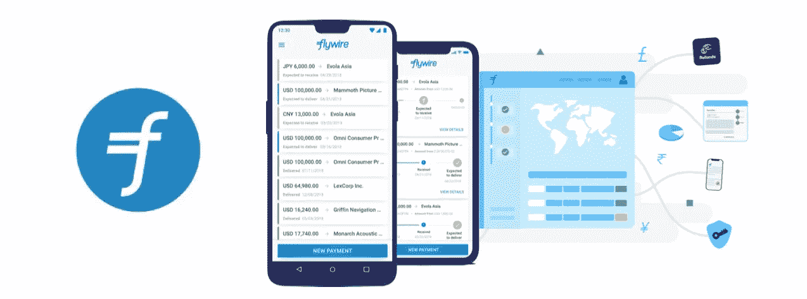

在其位于巴伦西亚和波士顿的办事处，Flywire 正在彻底改变国际支付方式。他们意识到传统的国际银行支付在延迟和供给方面存在很大的问题。

除了找到合适的位置，他们创造的解决方案非常直观且易于使用。又一个顶级产品。结果:

> **自 2010 年以来，在 7 轮融资中获得超过+€1.4 亿英镑。**

这些只是一些例子，我们可以再举 10 个或 100 个，伟大的创业公司，他们平衡了整个业务，技术和产品，提供他们能提供的最好的版本，总是创新，改进和投资于产品。成功伴随着他们所有人。

# **“投资于产品和投资于技术一样重要，你希望成千上万的用户使用你的应用，他们都会为你的产品增加价值。”**

**这些创业公司有什么共同点？**

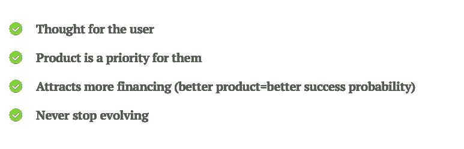

通过所有这些例子，我强调了在你已经想到或即将推出的产品上投入资源、时间和精力的重要性。显然，这不会是让你自动获得投资，并从第一分钟开始成为一家盈利公司的神奇钥匙，但是你将会把精力和关心放在用户从第一分钟开始就真正看到价值的事情上。

所以，如果你想让你的创业公司有一天达到 **Booking，WhatsApp，Instagram，Airbnb，Spotify，**……*【这里再添加 100 家顶级创业公司】*考虑投资产品。

# **投资产品的时刻总是“**

你喜欢邮报吗？

给我鼓掌！你可以给 clap 50 次，这样会有更多的人发现和知道这个帖子，当然，别忘了分享。

让我们看看掌声！

# 你可能感兴趣的其他文章…

 [## MVP 死了，长命到图。(最低牛逼产品)

### 如果你要做一个新产品，想想你的客户期望什么，并努力提供最好的体验…

medium.com](/swlh/the-mvp-is-dead-long-life-to-the-map-minimum-awesome-product-404df90fef7f)  [## “产品设计师”的工作及其在创业中的重要性

### 先去🇪🇸。你想用西班牙语读这篇文章吗？在这里检查一下。

uxdesign.cc](https://uxdesign.cc/the-job-of-the-product-designer-and-its-importance-in-a-startup-37f7235f5955)  [## UX 法律与实例。

### 先去🇪🇸。你想用西班牙语读这篇文章吗？在这里检查一下。

medium.com](/swlh/ux-laws-with-practical-examples-c418b4738d20)  [## 不同类型的“产品经理”:我是谁，我需要谁？

### 重要的事情先来！什么是产品经理？

medium.com](/@carlosbeneyto/types-of-product-manager-startup-3bb978f50d2f) 

## 这篇文章发表在 [The Startup](https://medium.com/swlh) 上，这是 Medium 最大的创业刊物，拥有+427，678 名读者。

## 在这里订阅接收[我们的头条新闻](https://growthsupply.com/the-startup-newsletter/)。

