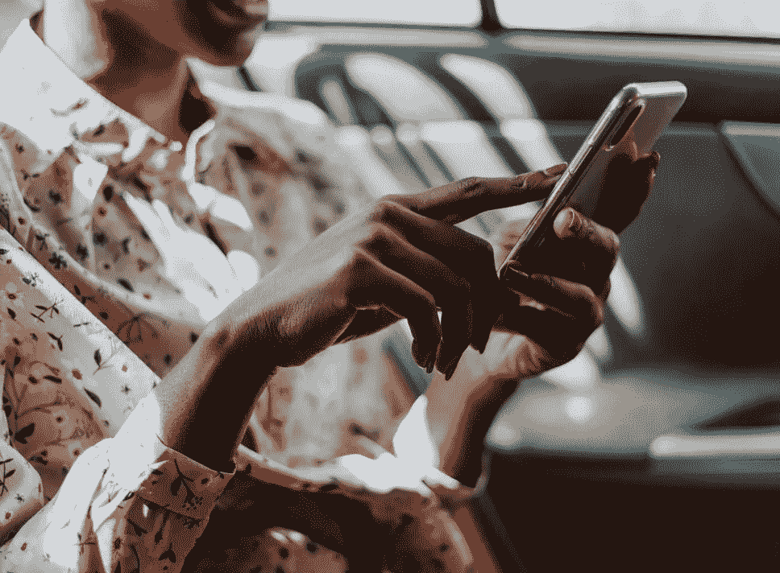

# 收视率心理学

> 原文：<https://medium.com/swlh/the-psychology-of-ratings-a2fbedcdc577>

2014 年，中国政府公布了一项社会信用体系计划，目标是到 2020 年运行。国家声誉系统背后的意图是根据公民的经济和社会行为来管理对他们的奖励或惩罚。处罚包括禁飞、被私立学校或有声望的工作拒之门外、互联网连接、被酒店拒之门外等等。

该评级系统让人想起了《黑镜》第一集“急转弯”，用户在五星评级系统上对在线和面对面的互动进行评级，这几乎影响了这个人生活中的所有事情。但是，正如 2019 年 6 月 *连线*的[所报道的，中国政府的理由是为了建立信任:“……由于保持信任得不到足够的回报，破坏信任的成本往往很低。”理论上，一个人通过值得信任和获得奖励来建立信用，当他们不值得信任时，就会失去信用——以及津贴或使用物品的权利。中国有私人和政府的社会信用项目，虽然有些反响可能看起来很极端，但整体概念并非如此。评级系统在美国和世界各地都是一种熟悉和常见的做法，从优步和 Airbnb 这样的市场，到 Yelp、亚马逊、YouTube 甚至网飞这样的评论平台或评论驱动的网站。虽然评级和评论可以建立消费者的信任，但评级不仅仅是一个好的或坏的体验。](https://www.wired.co.uk/article/china-social-credit-system-explained)

# 道德困境

如果我们以优步为例，每次你完成一次优步之旅，你会被要求给你的司机打一颗到五颗星的分数，反之亦然，你被认为是一名乘客。如果一名[车手的评分下降到 4.6](https://www.inc.com/minda-zetlin/uber-rider-ratings-deactivation-lyft-rideshare.html) 以下，他们的工作可以被终止，如果一名车手的评分很低，车手可以拒绝为他们服务。这鼓励司机和乘客表现出最好的行为——可以说，相信乘坐是安全的，乘客是守规矩的。然而，人们通常很难准确地评价他人。根据 NPR 社会科学记者 Shankar Vedantam 的说法，“人们不会因为不想伤害他人而对他人评头论足。作为一名乘客，你可能会不高兴，但你不想毁了一个人的生计。”

然而，假设你和一个糟糕的优步司机有一次危险的经历。为了避免可能毁掉一个人的生活而产生的社会负罪感，人们很容易将司机评价得比正常人高，但你也可能将未来的乘客置于危险之中。NPR 的 Vendantam 提醒我们，虽然给出准确评级的人会处理因给糟糕的司机低评级而立即产生的不适，但他们最终会为下一位驾驶者提供更好的信息。不幸的是，根据韦丹坦的说法，大多数人会放过糟糕的司机，或者决定根本不评级。

# 评级:全有或全无

评级的设计、文案、颜色和时机会影响我们与评级系统的互动方式，而且有这么多不同的[平台使用各种用户体验和游戏化](https://hackernoon.com/the-psychology-of-rating-systems-3103e26fddd8)的概念，评级系统对用户来说可能是一种负担。更令人困惑的是，[你的五星评级可能与我的五星评级有所不同。](https://twitter.com/intent/tweet?url=www.zendesk.com&text=We%27re%20often%20lazy%20when%20it%20comes%20to%20leaving%20ratings%20and%20reviews.%20Plus,%20your%20five-star%20rating%20might%20mean%20something%20different%20than%20my%20five-star%20rating.%20@ZendeskRelate%20https://zdsk.co/ratings)[spark Lin 的首席执行官 Himanshu Khanna](https://hackernoon.com/@sparklinguy) 提出了一个观点，即“个性、情绪、环境、需求的紧迫性以及最终的满足感”都会影响用户对某样东西的评价。在多个不同的平台上给出准确、标准的评级(尤其是在对人们或他们的行为进行评级时)需要时间，并且可能很困难——让我们面对现实吧，在评级和给出评论时，我们大多数人都很懒。

但是当用户*做*花时间去评价的时候，就像 [YouTube 发现](https://hackernoon.com/the-psychology-of-rating-systems-3103e26fddd8)一样，人们一般都是全有或者全无；用户倾向于做出极端的反应。YouTube 发现，视频要么被评为五星，要么被评为一星，而社区的其他人懒得做出反应或评级——这可能是 YouTube 从五星评级系统转向拇指向上、拇指向下系统的原因。虽然这种二元系统可能会减轻观众对视频的评级工作，但它仍然不等于准确的评级。

那么，什么可能会鼓励用户给出准确的评级呢？解释。《时代》杂志报道了[一项由加拿大营销学教授莎拉·摩尔完成的研究](http://healthland.time.com/2011/10/31/the-complex-psychology-of-a-yelp-review/)，在这项研究中，解释了他们积极消费体验的参与者最终比控制组和未解释组的人得分更低，解释了他们糟糕体验的人最终比未解释的人得分更高。

摩尔在一份声明中指出:“解释为什么巧克力蛋糕如此美味会让我们对蛋糕的喜爱程度降低，而解释为什么电影如此糟糕会让我们对电影的厌恶程度降低。”“理解积极或消极的事件能让我们感觉不那么强烈，并能得到更多温和、诚实的评价。

这似乎对 Yelp 有用，Yelp 是一个更可靠的众包评论论坛，它迫使用户对每个星级做出解释。话说回来，Yelp 上的人通常是那种不介意花时间留下评论的人，因为这是该平台的宗旨。

# 在我们信任的评级中

尽管有无数的评级系统——以及我们在准确反映我们的经历方面有多糟糕——评级和评论是有影响力的。[据福布斯](https://www.forbes.com/sites/ryanerskine/2018/05/15/you-just-got-attacked-by-fake-1-star-reviews-now-what/#39adfa3b1071)报道，我们非常重视收视率。85%的人对在线评论的信任程度不亚于个人推荐，每增加一颗星就能带来 5%到 9%的收入增长。在线评论也是谷歌算法中一个重要的排名信号。

评级系统不太可能消失，看起来我们会继续信任这些系统，但我们应该时常提醒自己对评级和评论持保留态度，同时努力给出更准确、诚实的评级和评论。对于企业来说，创造一个能产生更好、更可靠结果的评级环境也能收集到有价值的客户反馈。对人们进行评级可能不会让我们的良心好受些，但认为诚实、深思熟虑的评论可能会改善我们周围的评级系统确实有所帮助。无论我们是否追随中国，我们仍然需要能够相互信任。

—

原载于 relate.zendesk.com 的