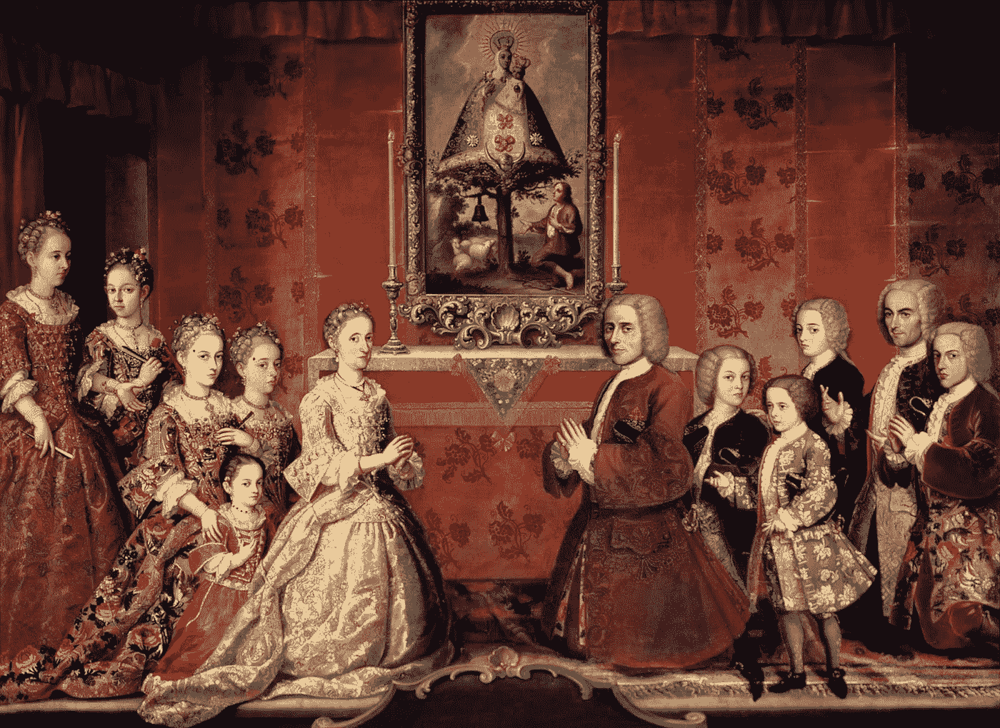

# 对权力的追求

> 原文：<https://medium.com/swlh/the-quest-for-power-44b545349e15>

[Family of the Fagoga Arozqueta, Painter Unknown / Public Domain](http://By 18th century Mexican Anonymous - http://portalacademico.cch.unam.mx/materiales/al/cont/hist/mex/mex1/histMexU4OA01/img/xhm1u4ap1p02e10.jpg.pagespeed.ic.6w3fZ6CD81.jpg, Public Domain, https://commons.wikimedia.org/w/index.php?curid=44861962)

# 人性中固有的是一种强烈的以自我为中心的获取权力和控制的需求。

纵观历史，帝国主义的追求一直伴随着种族灭绝、奴隶制和优生学。当前在全球范围内滥用权力的现象在给予大公司肆无忌惮地掠夺和掠夺的自由许可证中再明显不过了。