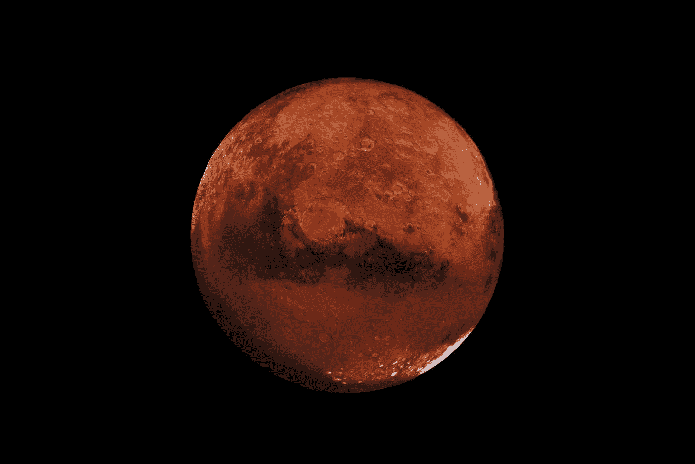
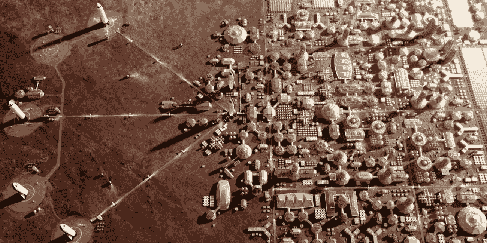
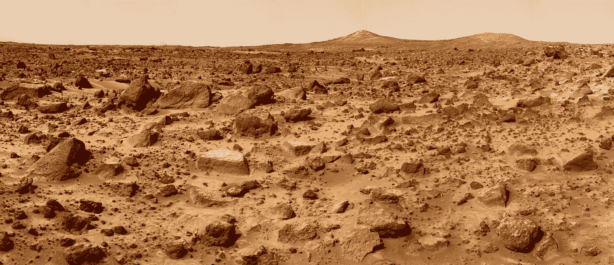
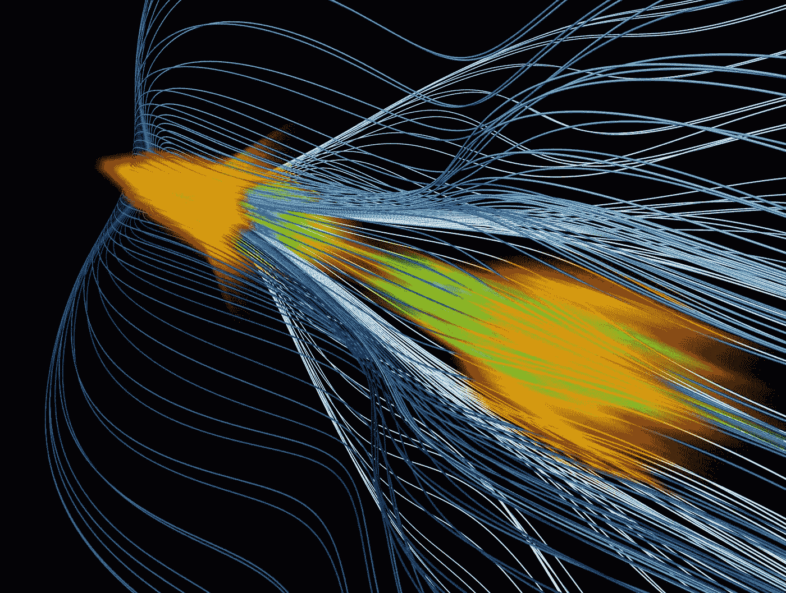
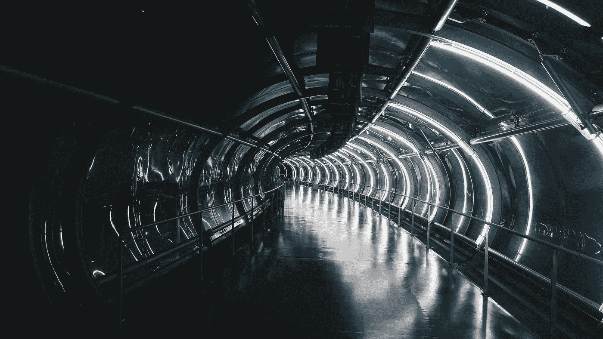

# 红岩赛跑

> 原文：<https://medium.com/swlh/the-race-to-the-red-rock-b7c9a1257ace>

## 火星任务将如何撕裂这个世界

Photo by NASA.

从今年到下一个十年，一批私营公司将开始一项自横贯大陆铁路问世以来最雄心勃勃的工业努力。目标是恒星系殖民化——从火星开始，然后是木星和土星的卫星。在众多组织中，SpaceX 是行动最快的。该项目由经验丰富的企业家埃隆·马斯克(Elon Musk)运营，由 7，000 名经验丰富的航空航天、化学和机械工程师组成，总部设在洛杉矶，现在在德克萨斯州和佛罗里达州新开设了发射和着陆设施。在开始最有可能失败的旅程超过 16 年后，SpaceX 即将建造第一个星际运输系统。

在所有这些快速变化的过程中，出现了更多古怪和投机的赌注。就在正式宣布将几千吨材料移动到红色星球表面的雄心之前，马斯克成立了一家名为 Neuralink 的小型生物技术公司，旨在将人类思维与人工智能联系起来。该产品旨在在没有第二个驱动力的情况下抢占奇点，但也在太空旅行中发挥作用。在 2018 年底的乔·罗根播客上，他让听众一瞥该公司的抱负。马斯克说:“[它将使任何想拥有超人认知的人都能够拥有超人的认知能力。“打不过就加入。”](https://youtu.be/ycPr5-27vSI?t=1629)

在过去的二十年里，到目前为止提到的技术直到最近才变得可行。结合纳米工程、新材料和更快的计算机处理速度，技术官僚们如此狂热追求的超人类伦理就要实现了。这些进步，再加上一小群想象力丰富、目光远大的未来学家，几乎为一个真正意义上的革命性时刻搭建了舞台。随着数百万探险者登上火星的可能性，将会有一些人希望像往常一样退出政治，与机器融合，并延长寿命。在早期，这种无拘无束的乐观主义可能会引起礼貌的笑声，但随着时间的推移，许多人越来越觉得这不再有趣。这对社会意味着什么是一个悬而未决的问题，一些人提出了并不总是吸引人的答案。

从一开始， [SpaceX 就设想了一个火星绿洲](https://www.youtube.com/watch?v=afZTrfvB2AQ)——这正是早期蓝图的标题，在 2003 年斯坦福大学的一次讨论中提到过。马斯克说:“我们会在火星表面放置一辆小型机器人路虎，上面有种子和脱水营养凝胶……[用于]生命支持系统。”。最初的想法萌发了，随着技术问题的解决，很快就变得至关重要的是，要将所需的吨数送入轨道，必须重新想象火箭的运行方式。

在美国宇航局航天飞机项目的整个生命周期中，每次发射的平均成本高达 15 亿美元。对于马斯克来说，要想从太空旅行中赚钱，这些数字需要比美国太空计划便宜一个数量级，或成本的十分之一，美国太空计划依赖于发射一次性火箭，这些火箭只能保留一次有用的发射。在摆弄了翻新的俄罗斯零件，并召集了一批硅谷投资者之后，很明显的是，SpaceX 要想从更高效的火箭中获利，他们必须实施每月商业杂志上经常出现的流行词“精神气质”。随着简历的涌入，从[垂直整合、扁平化管理到精益制造](https://www.airspacemag.com/space/is-spacex-changing-the-rocket-equation-132285884/?all)的一切都印在了招聘启事上。对可重复使用性和更便宜的结构的狂热推动了公司的一些部门，因为自信的工程师们满足于牺牲可回收性的更快的发射时间。许多人不理解更大的图景，这不仅仅是向我们附近的邻居扔几颗卫星，而是创造一个在深空运行的供应链。

Photo by SpaceX.

激发马斯克的动机可能是简单的经济上的，比如流行文化中的利润或名声。但在许多场合，这位南非出生的大亨经常指出科幻小说是他思想的来源。特别是，文学传奇艾萨克·阿西莫夫和他的*基金会系列*被吹捧为驱动 SpaceX 的基础的灵感。写于 1951 年的*基金会*是*基金会系列*故事三部曲中的第一部，在那里，人物哈里·谢顿的计划被制定出来，以减少先进帝国衰落后的痛苦。利用统计学和数学建模，心理史学出现了，向谢顿揭示了他的文明注定的未来和殖民边远星球特米斯的紧迫性。隐含的是另一个帝国，由科学家先驱在遥远的地方重新定居。继续该系列的书籍，如*基金会的边缘*和*基金会和地球*继续发展这个银河幻想，但它是*基金会*仍然是马斯克不懈目标实现的最令人信服的描述。寻找另一个家，远离地球上日益恶化的生活，被甲烷和冰冷的山峰包围。

在 SXSW 2018 上，[马斯克与乔纳森·诺兰](https://youtu.be/kzlUyrccbos?t=2403)——著名的电影《星际穿越》的作者和他的兄弟克里斯多夫——坐在一起讨论人工智能和火星如何影响他的想法，以及为什么太空任务仍然如此重要。“很可能会有另一个黑暗时代[……]特别是如果有另一个第三次世界大战，”马斯克在近一个小时的会议中说。“我们希望确保有足够多的我们，足够多的其他地方的文明的种子，来带回文明，或许缩短黑暗时代的长度。”马斯克继续通过概率的镜头来框定 SpaceX，就像哈里·谢顿用来计划他的迁移逃离的那些数学公式一样。这并不是说末日即将来临，而是我们仍然应该做好准备，否则我们可能会跟其他银河帝国一样，不管是真实的还是想象的。

截至今年，随着 SpaceX 继续签署卫星部署合同，偶尔飞往国际空间站，整体计划正在快速推进。无论是整体飞船的设计还是后勤工作，都在不断地变化。在几次主题演讲中，马斯克公开了每一次发射将如何进行，包括引擎内部的设计。甚至接近数百万的移民数字已经成为洛杉矶总部的口头禅，因为每两年将为一支前往火星的船队提供一个机会之窗，每艘船载有多达 200 人和 100 吨工业用品。从长远来看，在未来几十年内，SpaceX 将向地球轨道发射 100 到 1000 艘飞船，为每次任务进行补充和准备，届时每艘飞船都将步调一致。“火星殖民舰队将集体离开，”[马斯克在官方的 2016](https://youtu.be/H7Uyfqi_TE8?t=1390) SpaceX 技术更新中说道。"有点像[太空堡垒卡拉狄加](https://www.youtube.com/watch?v=Y1pSxVz-XYo)……有点像那样."

与轨道火箭开发和太阳帆相邻的是肉傀儡和机器之间更加一体化的体验的其他想法。生物界面初创公司已经开始在硅谷的贸易展会上出现，每个销售站都在推销产品，将我们的头盖骨湿件与闪闪发光的硅片连接起来。看到这一切，马斯克的 [Neuralink](https://www.neuralink.com/) 的起源变得更加有趣。为什么不买现成的这些技术呢？或者等待另一群创新型企业家将数万个工作小时投入到一个不受 SpaceX 束缚的项目中？答案可能看起来不透明，但正是空间遥测和大脑金属插件之间的融合促使一群行业专家接受了马斯克对人才的呼吁。但是，要理解言外之意，需要的不仅仅是对新闻稿的总体回顾。更有趣的问题是:为什么在零重力货运飞船或尘土飞扬的火星沙漠中需要高带宽的神经连接？

80 年代末，科幻小说作家[伊恩·班克斯](https://en.wikipedia.org/wiki/Iain_Banks)写了他的系列丛书[中的第一本](https://www.goodreads.com/series/49118-culture)，书名为*文化*。从 [*开始，想想弗利巴斯*](http://library.uniteddiversity.coop/More_Books_and_Reports/The_Culture_Novels-Iain_M_Bainks-Anarchist_Science_Fiction/iain%20m%20banks%20-%201987%20-%20consider%20phlebas/Iain%20M.%20Banks%20-%20Consider%20Phlebas%20v2.html) ，这个故事集探索了曾经被嘲笑的太空歌剧亚类中常见的主题。后稀缺经济学、准全能的人工智能、轨道星际飞船，一个广阔宇宙的所有元素，类似于乌托邦式的无政府状态，而不是普通的自由主义。班克斯确实在寻找一个保留其进步个性的平等主义世界，接近一个令人向往的技术驱动的梦境。

尽管班克传达的是政治和文化信息，但在 2015 年年中，该系列讲述中使用的更实用的装饰品引起了埃隆·马斯克的兴趣。一个焦点是一个叫做[神经花边](https://theculture.fandom.com/wiki/Neural_lace) (NL)的概念。对于银行和 T21 文化的居民来说，本地语言对于人工智能社会的运作至关重要。NL 最初是植入新生婴儿的大脑，它与受试者一起发展，为他们提供高带宽的数字连接。增强的荷尔蒙调节、虚拟的无所不在和无限的认知成为生物力学整合提供的优势。实际上，NL 有助于融合虚弱的人类和强大的超意识机器之间的差距，并通过可回放的记忆、远程沉浸式意识和精神超越来强化。

经过一个夏天的阅读，不出所料，一年后的 2016 年 7 月，Elon [推出了 Neuralink](https://www.crunchbase.com/organization/neuralink) 。选择加入该团队的联合创始人包括一群有头脑的人，从麻省理工学院的[神经外科到劳伦斯利弗莫尔国家实验室的](http://weillcornellbrainandspine.org/residents/benjamin-rapoport-md-phd)[生物材料工程。2017 年 8 月，Neuralink 获得了所需的资本，筹集了](https://www.linkedin.com/in/vanessatolosa/)[2700 万美元](https://www.bloomberg.com/news/articles/2017-08-25/elon-musk-s-neuralink-gets-27-million-to-build-brain-computers)用于扩大雇佣和收购开发所需的工具。这一愿景现在已经开始实施，并正在加速，开始工业化生产[脑机接口](https://en.wikipedia.org/wiki/Brain%E2%80%93computer_interface) (BMIs)，使用应用于智能手机微芯片的相同制造水平，并将其导向纳米级电极——或[神经灰尘](https://www.youtube.com/watch?v=oO0zy30n_jQ)——像牛排上的胡椒一样撒在人类皮层上。

Photo by the Human Connectome Project.

在初始资金投入后的另一年，马斯克的一条神秘推特或许揭示了 Neuralink 将指导 SpaceX 实现太空运输承诺的水平。“哦，顺便说一句，我正在制造一个机器人龙，”马斯克在早报上说。被超过 46 万人喜欢，被转发了 10.5 万次，潜在的信息对热情的追随者和新手来说都很清楚。“龙”显然是指 SpaceX 的[人类运载工具](https://www.spacex.com/dragon)，它正在为首次载人任务做准备。就像在班克的神经编织的宇宙戏剧中一样，SpaceX 轨道飞行器将包含迄今为止航空航天从业者仍难以捉摸的相同类型的机械接口。

开发和实现用于太空导航的 BMIs 只是火星任务的一小部分。成功地旅行到遥远的星球，并做必要的工作来建立一个原始殖民地，是马斯克和他的投资者所瞄准的宏大叙事的关键。与此同时，谜题的另一部分涉及那种将文化主角带到他们宇宙边缘的弧线。人工智能，无论是以[机器人仆人](https://futurism.com/this-is-the-holographic-ai-servant-of-your-dreams-or-maybe-your-nightmares/)还是[机器人上帝](https://www.wired.com/story/anthony-levandowski-artificial-intelligence-religion/)的形式，都是这些新的银河枪手骨干最珍贵的财产。从马斯克和他建造一个重新想象的[终点站](https://en.wikipedia.org/wiki/Terminus_%28planet%29)到 IBM 的机器人人工智能太空助理 [CIMON](https://www.space.com/41041-artificial-intelligence-cimon-space-exploration.html) ，在木星的欧罗巴或土星的泰坦的郊区没有未来，更不用说火星的冰冷沙漠了，除非首先[召唤恶魔](https://www.youtube.com/watch?v=_rfHNvHu8OE&t=33s)。

在危难或需要的时候召唤外星力量几乎是神话般的陈词滥调。阿兹特克建筑散布着从天空锻造的神，无论是太阳、月亮还是明亮的星星。同样，战神马尔斯现在是一个新领域的头衔。这种强烈的热情现在引发了一小群猎人的出现，他们的眼睛盯着遥远的地平线。火星殖民地发展奖现在要求[使用人工智能](http://marscolony.marssociety.org/)作为[首要原则](https://en.wikipedia.org/wiki/First_principle)的起点。游戏[模拟新的定居点](https://store.steampowered.com/app/464920/Surviving_Mars/)使用感知机器人作为核心机制，自动扩展资源采集者，因为他们在多风的高原搜寻金属矿石。

Photo by [NASA/JPL](https://commons.wikimedia.org/wiki/File:PIA02405.jpg).

艾作为一个文化和工业现象的地位是不无道理的。仅仅几年前，精神机器的概念还被认为是天真的一厢情愿的想法。认为惰性的电子晶体管可以用温暖和宽容的自我来填充他们冰冷的心，这相当于世俗的神秘主义。今天，离这个新千年的第 20 个年头只有几个月了，算法自学生物的存在不是一个例外，而是一个规律。谷歌的 DeepMind 即将在《星际争霸 2》中击败最有天赋和最先进的玩家，这是一款实时战略(RTS)游戏，其人类大师尚未输给一行代码。在一个反映太空探索和殖民故事的背景下，这部竞技经典可能会在战争的战术机动中很好地训练未来的人工智能，并将所有的知识，规则和策略融入 RTS 引擎。

在口头语言或书面文字出现之前，战争的不时出现就已经塑造了人类住区。人们曾经认为，随着现代性的出现，这种由无法解决的冲突带来的野蛮做法会在繁荣的科学面前消退。相反，正如 J. Robert Oppenheimer 在[看到核裂变的炫目光芒](https://www.youtube.com/watch?v=wki4hg9Om-k)布满新墨西哥的天空时所想的那样，“[【我们】变成了死亡，世界的毁灭者](https://www.youtube.com/watch?v=lb13ynu3Iac)”国家甚至街头帮派经常为了一块块的土地、闪亮的石头和航行的风而争斗；但是，随着可居住的土地越来越少，对我们受管制的生活方式的感激之情越来越少，坐在办公室隔间里浪费我们最好的时光在虚拟办公桌上推动数字文件，一个有趣的困境存在了:你会抓住机会永远改变一切吗？雨果·德·加里斯(Hugo De Garis)写的《艺术战争》(Artilect War)一书提出了这样一个问题，该书探讨了智能机器沿着宗教、政治、种族和意识形态的界限分裂全球社区的遥远可能性。一方面是宇宙学家，坚定不移地致力于建造人工智能；另一边是人族，好战的激进分子组织起来阻止有意识的机器；和电子人，他们与人造人的融合标志着超人类主义的洗礼。

Garis 论点的核心在于一系列在学术界之外不广为人知的科学和工程进展。这些深奥的理论经常被搁置在研究办公室积满灰尘的书架上，耐心地等待被应用。现成的技术最终会通过优质手机的闪亮反光或 Siri 回答的轻声背诵找到市场。[进化工程](https://ssbss2019.icas.xyz/)、[人工胚胎学](https://www.youtube.com/watch?v=dt7twXzNEsQ)，甚至[神经修复术](https://www.the-scientist.com/features/neuroprosthetics-36510)只是现在需要世界[著名科学机构关注的前沿领域中的几个](http://fortune.com/2019/03/02/us-tech-race-china/)。最激进的支持形式可能来自民主国家影响之外的地区。尽管许多国际主权国家都是《外层空间条约》的签署国，但无法阻止脱离出去的公司在其他星球及其卫星的表面上形成自给自足的领土。这种可能性正是一些人所期待的。

距离我们的淡蓝色星球 5500 万光年，一个超大质量黑洞的视界永远燃烧着，它在一个遥远星系的中心旋转，这个星系的质量超过 60 亿个太阳。它的发现和[摄影图像](https://www.nytimes.com/2019/04/10/science/black-hole-picture.html?ribbon-ad-idx=2&rref=science/space&module=Ribbon&version=context&region=Header&action=click&contentCollection=Space%20%26%20Cosmos&pgtype=article)证实了 1998 年由索尔·珀尔马特、布莱恩·施米特和亚当·里斯提交给诺贝尔奖委员会的宏大的[宇宙理论。他们对科学的贡献是记录了超新星划过夜空时的远距离爆炸。他们看到的不仅仅是在寒冷的真空空间中燃烧的物质，而是从遥远的过去到达我们眼前的光，是从褪色时速度更快的物体发出的光。当他们完成香槟和夏敦埃酒的计算时，他们捕捉到的一瞥更加令人困惑，因为他们看到的宇宙既不是在不断运动，也不是朝着稳定的方向发展。相反，我们暴力而古老的宇宙正在加速，加速，并朝着一个令人困惑的黑暗未来倾斜。](https://www.nytimes.com/2011/10/05/science/space/05nobel.html)

五年前，在智利塞罗托洛洛天文台(Perlmutter 和他的同事们发表获奖论文的地方)数千英里之外，一位被麻醉的哲学教授提出了一个类似的猜想，但属于形而上学领域。尼克·兰德，一位投机现实主义艺术的理论家，在他昏暗的校园办公室里创造了——或者说重新想象了——加速主义**的概念。但他并没有描述恒星的撕裂，而是描述了灵魂撕裂的细节。在一个被称为控制论文化研究单位( [CCRU](http://ccru.net/syzygy.htm) )的大学俱乐部的范围内，兰德和其他人一起冒险进入了一个实验空间，在那里，部分自我被升级、机械化和网络化，成为超越任何被安全地认为是人类的东西；追踪生命，因为它慢慢流入耐心凝视的机器。技术进步令人恐惧。**

> **"在不久的将来，没有任何人类能够生存下来."**
> 
> **—尼克·兰德**

**在一次药物引起的精神病和他混乱的学术生涯之后，他逃到了大都市上海。尽管如此，他将异化资本主义的缺陷现实与网络文化的控制论回响相结合的风格还是吸引了一批追随者。已故的朋友和 CCRU 成员马克·菲舍尔与拉博利亚·库博尼克斯集体试图将兰德的边缘虚无主义转化为解放意义上的有用的东西，也许有些不成功。[左加速主义](http://criticallegalthinking.com/2013/05/14/accelerate-manifesto-for-an-accelerationist-politics/)和[排外女权主义](http://www.laboriacuboniks.net/)作为最初兰迪安预测的答案出现了，即人类应该掌控一切，让机器的目的解放出来，而不是增加资本主义变革力量的速度，让汽车从悬崖上冲向技术奇点。**

****

**Photo by *SLAC National Accelerator Laboratory.***

**加速主义*的投机模式*之间的这种紧张在减速主义*的色彩中也有对应。泰德·卡钦斯基(Ted Kaczynski)类似于卢德主义(ludditism)，或者花时间在“松树”上游荡的僧侣，他是一个更臭名昭著的支持者，支持减缓技术进步，甚至可能逆转技术进步。大约在 CCRU 提出速度和机械化图灵警察的同时，卡钦斯基在《工业革命及其后果对人类来说是一场灾难》一文中明确陈述了他对 [*工业社会及其未来*](http://editions-hache.com/essais/pdf/kaczynski2.pdf) 的形势分析预见到人类自由的终结和个人的社会监禁，卡钦斯基斥责意识形态颠覆是技术的不良社会影响的一种症状。也许是因为参与了不道德的药物实验，或者是因为厌倦了没有爱和感情的生活，驱使这位数学家成为炸弹客的恐惧是对机械的深深厌恶。卡钦斯基想象的地狱不是一个宗教幻想，而是那些愿意踏入技术神的深渊的人的真实命运。***

*更多的当代减速论者把彭蒂·林科拉(Pentti Linkola)这样的人算在他们的行列中，他的《深层生态学》系列与《地球第一》系列齐头并进！和其他无政府原始主义者。像来自另一个时代的将民主抛在一边的其他激进分子一样，林科拉有一个坚定的信念，即它将采取勇敢和无情的领导人的行动来减轻绝对的生态恐怖，他说:*

> *“任何独裁都比现代民主好。不可能有一个如此无能的独裁者会比大多数人表现出更多的愚蠢。最好的独裁统治应该是人头攒动，政府阻止任何经济增长。”*
> 
> *彭蒂·林科拉*

*林科拉不是环境边缘的一员，事实上，他是一个有着广泛知识面的辩论家，影响着新形成的活动家和政治家领域。他在 2011 年出版了一本名为 [*的书，名为《生命能获胜吗？*](https://www.goodreads.com/book/show/6397542-can-life-prevail) 不闪烁其词，也不违背美学推理，而是呼吁面对技术加速的革命行动，从彻底灭绝的可怕力量中解放出来。*

*2007 年，当软件工程师出身的政治理论家 Curtis Yarvin(笔名孟子霉虫)发表了一篇形式主义博客时，加速主义的幽灵再次席卷了整个场景。雅文通过天主教仪式和新教伦理的隐喻来批判资本主义的大厦，提出了拼凑的想法，即围绕企业城邦而不是启蒙运动类型的国家来重塑国家职能。首席执行官是总裁，股东是选民，浮动地铁延伸到广阔的蓝色海洋。退出法国大革命；退出全球共识；新自由主义大教堂的出口。*

**

*Photo by [Maxime Lebrun](https://unsplash.com/@flub?utm_source=medium&utm_medium=referral) on [Unsplash](https://unsplash.com?utm_source=medium&utm_medium=referral)*

*在雅文建立了一小群硅谷自由主义者之后的几年，他的一个更有影响力的追随者，彼得·泰尔，开始将 Neoreaction (NRx)的一些核心成分融入他的公开演讲和评论中。在 2009 年一篇名为*的论文中，彼得·泰尔阐述了面对日益增加的选民选举权和福利扩张主义，自由市场的收缩限制了创造性破坏的速度。在这三个建议中，泰尔认为外层空间是一个理想的未被发现的国家，商业化的时机已经成熟，具有无限的可能性。一年多前，泰尔向 SpaceX 注入了超过[2000 万美元的投资资本](https://venturebeat.com/2008/08/06/private-rocket-company-spacex-gets-20m-from-the-founders-fund/)，该公司由他在 PayPal 的前合伙人埃隆·马斯克(Elon Musk)运营。两年后，马斯克为猎鹰 9 号 v1.0 进行了首次试飞，这是最终为猎鹰重型提供动力的助推器，现在正在重新原型化，以建造超级重型，即火星任务火箭。**

> **"我不再相信自由和民主是相容的。"**
> 
> **—彼得·泰尔**

**正如马斯克和泰尔重申的那样，成功实现多行星飞行不仅仅需要火箭。需要对人体进行重新设计。基因编辑，曾经被认为是幻想的附属品，现在是科学探索的新兴领域。让旅行者更能抵抗辐射是第一步，也是显而易见的一步。为此目的操纵我们的遗传物质并没有失去泰尔。在 2018 年末，泰尔的创始人基金领导了对 Synthego 的 1 . 1 亿美元投资，开创了 CRISPR 工具领域。一年多以前，Synthego 向那些成功创造合成 RNA 的临床医生授予了补助金，以提高辐射敏感性，减少用于去除癌细胞的化疗的毒性作用。**

**将 CRISPR 用于基因定制将不限于辐射对人类皮肤的损害。2019 年 4 月，中国科学家对困扰英国人的同样的伦理和道德抱怨没有任何疑虑，他们对猕猴的智力进行了转基因。利用在人类 DNA 中发现的独特标记，昆明动物研究所的遗传学家成功制造了一只转基因动物，它的所有评估都有了显着改善。不仅仅是昆明研究所的工作正在取得进展，还有一长串的国际医学专业人员，他们正在寻求在一个曾经以马克思主义哲学闻名的国家定居，这个国家现在开始显示出*高科技资本主义的迹象*。**

**对金钱的追逐以及逃避监管的强烈愿望，正处于一个多世纪以来最大胆的工业行动的边缘。帮助这些尝试的将是人工智能的剩余进步，包括使用基因工程来强化人类的太空旅行。在新反动的亿万富翁和受科幻启发的技术专家的支持下，新的权力形式正在形成，远远超出了人文主义文学中经常引用的传统概念。诸如生物能源、社会正义和解放政治等概念都不了了之，无法解决百万吨级推进器的音爆问题。**

**说许多人将努力接受这种支持是一种严重的保守说法。无政府主义者和卡钦斯基派，包括倾向于野性的个人主义者和其他人，致力于摧毁这些新的杠杆中心。ITTW 尤其坚信“[灰色粘质](https://en.wikipedia.org/wiki/Grey_goo)”假说等情景，并坚信结束彼得·泰尔和奥布里·德·格里[等人的生命是一种道德和伦理责任，他们正处于一种新兴的超人类和后人类思潮的边缘。这些只是传言。一旦窗口打开，马斯克向火星绿洲派出他的舰队，正如他所说的那样，如果公平运动没有认真地试图抓住历史的车轮，转向那些迄今为止激励其发展的规则，它还能自称为一个运动吗？](https://onlinelibrary.wiley.com/doi/abs/10.1111/j.1467-9744.2012.01289.x)**

**很难想象几十年后真正的赌注是什么。绝大多数气候科学家可能不同意很多，但他们确实预见到大多数面向海洋的城市中心将遭遇永久性洪水。此外，平均季节温度的不稳定将显著改变全球农业模式；这并不保证会发生国际冲突，但会增加这种争端成为零和游戏的可能性。即使是美国军方也在为非洲的饥荒做准备，如果目前的人道主义努力被中断，饥荒将威胁到数千万人的生命。**

**这并不是说有办法减轻这些挑战，但成千上万的船只离开地球前往更红的牧场的可怕景象会灌输一种人一生中可能只会遇到一次的愤怒。如果不仅仅是通过人类的自主神经系统和对危险的逃跑反应，这怎么能不激励数百万的政治行动者呢？他们知道，无论如何，拯救他们或他们所爱的人的生命的唯一方法就是登上那些船。如果不加入控制论增强，转基因旅行者的船员，他们走向新的世界，阻止他们在他们的轨道上，所以他们可能会遭受同样的那些被困和等待。**

**在 1979 年出版的《T2 银河系漫游指南》一书中，作者道格拉斯·亚当斯使用了短语“[不要惊慌](https://i.imgur.com/onOWqdX.jpg)！”鼓励读者，也许是全人类，在极度危险的时候，当你知道你的生命可能结束的时候，控制那种恐惧的感觉。在猎鹰重型的[首次发射中——正是由彼得·泰尔资助的引擎配置种子，将被修改以发射火星任务货运飞船——埃隆·马斯克包括一辆特斯拉跑车，在它的 LCD 甲板上写着“](https://www.youtube.com/watch?v=A0FZIwabctw)[不要惊慌！](https://amp.businessinsider.com/images/5a7a2e38136ec51f038b4931-1536-894.png)”作为对他科幻诚意的颂歌。当时间到了，每个人都冲向出口时，记住这句话是个好主意。超越嵌入每个人边缘神经的生物逻辑中的命运宁静。不要慌，真的不要慌。**

****

**Photo by SpaceX.**