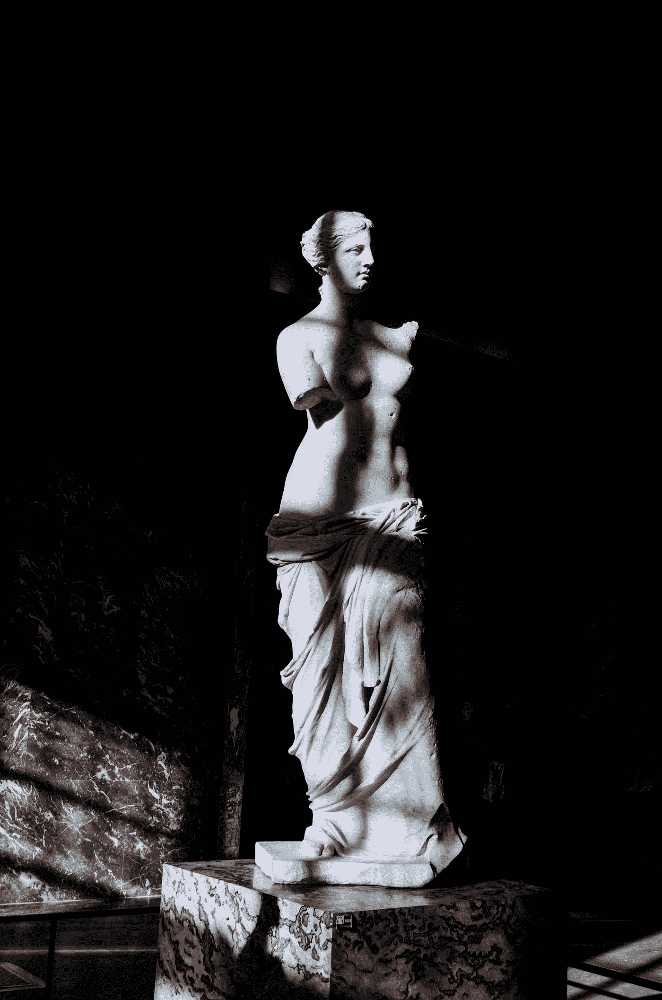

# 稀有而美丽:

> 原文：<https://medium.com/swlh/the-rare-and-the-beautiful-fcad8ee9b2b5>

Photo by [Tanya Prodan](https://unsplash.com/@tannnpro?utm_source=medium&utm_medium=referral) on [Unsplash](https://unsplash.com?utm_source=medium&utm_medium=referral)

如何不跟伴侣发脾气？

今天凌晨 4 点左右，在去机场的路上，我接到了我的好伙伴 BJJ 神童和杰出的营养学家[马尔科·帕普科夫斯基](https://medium.com/u/94f36cbde493?source=post_page-----fcad8ee9b2b5--------------------------------)的电话。他说，“我很难对我的伴侣有耐心。”

因为我是一个作家，不是一个正常人，我无法进行正常的对话，所以我告诉他我会回复他。这是我的…