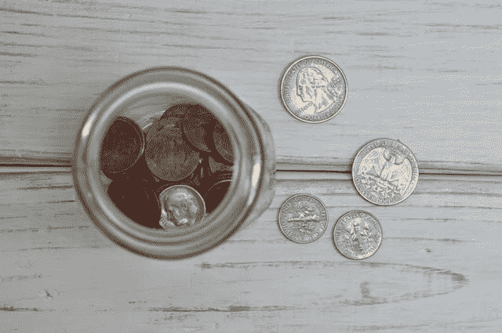

# 罕见的理性资产管理器——价值股票指南

> 原文：<https://medium.com/swlh/the-rare-rational-asset-manager-value-stock-guide-a66a86b807f1>

让我们想象一下你正在考虑收购的一项资产。你知道在不久的将来，资产的价格很有可能会比现在更低。

你是今天就投资，还是等到价格更低的时候再投资？

或者，也许资产很贵，但受到强烈推荐。你会去买它吗…