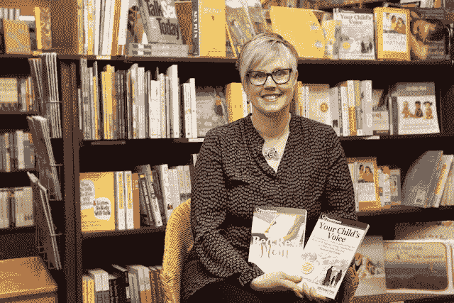

# 成为一名出版作家的真正困难

> 原文：<https://medium.com/swlh/the-real-struggles-of-being-a-published-author-da30d90c91a7>

我很幸运属于那 1%的人，他们推销了一本书，最终签下了出版合同。在我的案例中，闪电击中了两次——我在 2018 年出版了两本非小说宣传书籍。虽然成为一名出版作家很酷，但要让你的书受到关注却很难。

我不是 J.K .罗琳，但我充满激情。我很会讲故事。

读过我的书的人喜欢我给的实用而简单的建议，关于[如何为有特殊需要的孩子辩护](http://www.yourchildsvoice.com/)或者[如何度过高危妊娠](http://www.bedrestmom.com/)。他们喜欢我从父母、医疗服务提供者和教育工作者那里分享的故事。写作风格是可理解的，书也足够短，让压力最大的父母也能读懂。

根据积极的反馈，你会认为这些书正在热销。但事实并非如此(我终于承认了我黑暗的秘密)。

# 竞争领域

即使我已经在公共关系部门工作了 20 多年，并获得了国家、省和地方媒体的报道，这仍然是一场斗争。为什么？有这么多书可供选择，一个不知名的作家很难在书架上找到一本书(不到 1%的机会)。

当然，我的书可以在亚马逊或者谷歌上找到，但是除非人们知道你的书存在，否则很难找到。这意味着作者需要不断推广他们的书。

我(艰难地)认识到研究和写这本书是容易的部分。持续的促销是最难的部分。

# 对金钱的热情

我写书的动机是帮助其他父母和照顾者克服我和其他人所经历的挣扎。我想通过给他们一个路线图来帮助他们导航旅程，从而帮助他们消除一些障碍。

作为一名大学教师，我希望护理专业的学生、医学专业的学生、社会工作者、教师以及任何在教育或医疗系统工作或打算工作的人都能阅读这些书。这将有助于他们理解抚养有特殊需求的孩子或高危孕妇的挑战和现实。

# 继续运输

虽然我最近的一本书版税支票有点打击我的肚子，我流了几滴眼泪，但我正在重新组合，寻找新的方式来推广我的书。我预约了更多的演讲和宣传研讨会，并继续在 T2 写宣传博客。

虽然我知道我不会靠我的书赚到几百万，但我仍然致力于分享我的故事，希望能帮助别人。我还想带走一点作为一个出版作者的神秘感，并揭示出将一本书送到读者手中的真正困难。

是的，它仍然很酷，我为自己是那 1%的人而自豪，但现在我知道为什么一本书平均每年卖不到 250 本，一生只卖 3000 本。

对于任何希望出版的作家来说，我写这篇文章不是为了吓唬你(好吧，可能有点)，而是为了让你了解作为一个出版作家的世界。自我出版的作者的世界更令人望而生畏。

下一次你拿起一本书(希望是你买的，因为我们需要你的支持)，你会对把它拿到手里所付出的血汗和泪水有更多的欣赏。在某个地方，一个作者正在高兴地跳舞，因为他们的书被发现了。

这个故事也作为一篇博客文章出现在[如何沟通](https://howtocommunications.com/blog/)上。