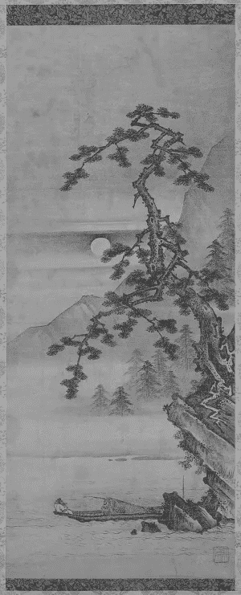

# 希望的革命:埃里希·弗洛姆的实践哲学

> 原文：<https://medium.com/swlh/the-revolution-of-hope-the-practical-philosophy-of-erich-fromm-5b7be96a9fd>

“存在的每一刻都让我们面临复活或死亡的选择；每一刻我们都给出答案。”

哲学是一种试图将世界联系起来、理解并赋予其意义和价值的尝试。虽然科学帮助我们理解宇宙及其内容的“存在”，即事物和过程的性质和构成，但哲学试图超越唯物主义的数据积累。科学回答“是什么”、“何时”和“何处”，哲学试图回答“为什么”，并传授伦理和其他价值观:存在的本质是什么？我们应该怎样生活？什么是“美好的生活？”*为什么？*

From archive.org, CC0 1.0 Universal (CC0 1.0)

与流行的理解相反，哲学不一定是抽象的。事实上，当哲学有实际意义时，它往往是最令人兴奋的——生活的方式和指南，辨别是非；简而言之，经过反思和审视的生活是值得活下去的。正是因为这个原因，我想介绍一下埃里希·弗洛姆的著作，以及他对存在的问题和疑问的一些“回答”。

[埃里希·弗洛姆](https://en.wikipedia.org/wiki/Erich_Fromm)(1900–1980)是一位杰出的[精神分析学家](https://en.wikipedia.org/wiki/Humanistic_psychology)、哲学家，也是[社会研究所](https://en.wikipedia.org/wiki/Frankfurt_School)(法兰克福学派)的成员，他的工作跨越了至少五十年。他最著名的作品是《爱的艺术》(1956 年)和《逃离自由》(1941 年)，他孜孜不倦地在他所贡献的几个学科中创造了人文主义的影响。

## 希望的革命

在他的《希望的革命:走向人性化的技术》(1968)中，弗洛姆流畅地从个人或个体转向社会——一个有意识地充满希望的人，个人受益于对更大活力的定位，可以和其他人一起参加充满希望的社会活动。

正如[亚里斯多德](https://en.wikipedia.org/wiki/Aristotle)将他的[美德](https://en.wikipedia.org/wiki/Virtue#Aristotelian_virtue)视为对立两极之间的 [*黄金手段*](https://en.wikipedia.org/wiki/Golden_mean_(philosophy))——例如，*勇敢的美德*是懦弱和有勇无谋之间的一种手段——弗洛姆也是如此看待*希望:*

> “希望是矛盾的。它既不是被动的等待，也不是对不可能发生的情况的不切实际的强迫。希望意味着每时每刻都为尚未诞生的事物做好准备，但如果在我们有生之年没有诞生，也不要绝望。希望已经存在的东西或者不可能存在的东西是没有意义的。那些希望渺茫的人满足于安逸或暴力；那些有强烈希望的人看到并珍惜所有新生命的迹象，并时刻准备着帮助即将诞生的生命的诞生”(第 9 页)。

在个人和社会的生活中，希望是一种生产性的导向，一种积极的准备和一种潜在的革命性的纪律。希望是一种对*潜力的看法，随之而来的是对人类能动性的重新发现，以及对个人和社会产生影响的能力。*

弗洛姆用*信念、*和*无畏这几个相互关联(巧合的是头韵)的概念继续他对希望的讨论。*

对弗洛姆来说，信念与希望紧密相连:

> “……信念是对尚未证实的事物的确信，对真实可能性的了解，对怀孕的意识。当信仰指的是对真实但尚未出生的事物的认识时，它就是理性的……我们不需要对科学上可预测的事物的信仰，也不需要对不可能的事物的信仰。信仰是基于我们生活的经验，是改变我们自己的经验。相信别人可以改变是我可以改变的经历的结果”(第 13-14 页)。

这种对信仰的理解为某种[理想主义](https://en.wikipedia.org/wiki/Idealism)对实用主义的超越开辟了道路。这种信仰有助于区分可以想象并在逻辑上和实践中产生的东西(如个人的发展或获得一个解放、平等、生态的社会)和可以想象但在逻辑上或实践中不能产生的东西(如独角兽、龙或方形圈)。

弗洛姆的信仰区分了希腊的“εὖ"-topia(“好地方”)和“οὐ"-topia(“没有地方”)。的确，这样一种理性的信仰抛弃了那些永远不可能在“乌托邦”中找到实用和科学的东西。在这里，我想到了“科学的”和“乌托邦的”社会主义的传统类别的错误二分法，以及历史上对一个更美好世界的愿景的贬损，认为它在逻辑上不可能等同于独角兽。当唯一的障碍在于目前存在的态度、制度和生产方式本身是可变的时，我们可以对所谓的“乌托邦”社会的实现抱有信心。

弗洛姆解释说，希望和信念是通过[斯宾诺莎](https://en.wikipedia.org/wiki/Baruch_Spinoza)的*刚毅*(或勇气)概念维系的，其中*无畏*是一个不可或缺的部分:“刚毅是抵制诱惑的能力，通过将希望和信念转化为——从而摧毁它们——空洞的乐观主义或无理性的信念”(第 15 页)。弗洛姆指出了几种无畏感中的三种，我们关注的是第三种，即:

> “……存在于充分发展的人身上，他安于现状，热爱生活。克服了贪婪的人不会执着于任何偶像或任何事物，因此不会失去任何东西:他富有是因为他空虚，他强大是因为他不是欲望的奴隶。如果他朝着这个目标前进却没有到达，他的无畏也是不完整的。但是任何试图走向完全自我状态的人都知道，每当向无畏迈出新的一步，一种力量和喜悦的感觉就会被唤醒，这是不会错的。他觉得好像生活的新阶段已经开始了……(第 15 至 16 页)。

这种无畏，作为坚韧(或勇气)的一种功能，通过自我和社会发展实现，维持和保持希望和信念，防止它们退化为被动和非理性。

## 有与无的张力

这场讨论中我想强调的最后一点也许是最重要的，也是最有助于理解存在的本质和问题的——即*是*和*无*之间、存在和潜力之间、物质和理想之间的辩证张力。从这种基本的紧张或矛盾中产生的动力推动了所有的发展。

令人想起[赫拉克利特](https://en.wikipedia.org/wiki/Heraclitus)，他的不断变化的概念导致西方概念*变成*(“一个人永远不会两次踏进同一条河”)，弗洛姆引入了一个二元的生命概念，要么不断重申其活力，要么走向死亡，这具有革命性的意义:

> “希望和信念，作为生活的基本品质，就其本质而言，正朝着超越个人和社会现状的方向前进。所有生命的特性之一就是它处于不断的变化过程中，不会在任何给定的时刻保持不变。停滞的生命往往会死亡；如果停滞是完全的，死亡已经发生…我们变得更强或更弱，更聪明或更愚蠢，更勇敢或更懦弱。每一秒都是决定的时刻，是好是坏。我们喂养我们的懒惰、贪婪或仇恨，或者让它挨饿。我们越喂它，它就长得越壮；我们越让它挨饿，它就变得越虚弱。对个人适用的东西对社会也适用。通常，我们，个人或组成社会的人，都有一种错觉，认为我们可以静止不动，不能从一个或另一个方向改变既定的情况。当我们静止不动时，我们就开始腐烂”(第 16 页)。

这一观点体现在已故的霍华德·津恩的声明中，“在行驶的火车上，你不可能保持中立。”冷漠和弃权是不可能的，因为每一个不作为实际上都是在支持现状、停滞和死亡。换句话说，被动本身就是一种主动的选择。

弗洛姆在这里的表述，即生命不断地需要对非生物(或不存在)重申自己，给了黑格尔[*的《精神现象学》*](https://en.wikipedia.org/wiki/The_Phenomenology_of_Spirit)*(1807)*:*中的那段著名引文额外的洞察力*

> *“……灵魂的生命不是在死亡面前退缩并保持自身不受毁灭影响的生命，而是忍受死亡并在死亡中保持自身的生命。只有当它发现自己完全被肢解时，它才赢得了真理。正是这种力量，而不是作为某种积极的东西，对消极的东西视而不见，就像当我们谈到某样东西时，说它什么也不是或者是假的，然后，做完了这件事，就把目光转向别的东西；相反，只有正视消极的一面，并与之相处，精神才是这种力量。这种与消极的停留是将消极转化为存在的神奇力量。”*

*最后，弗洛姆敦促我们运用我们对希望、信仰以及生命和社会的革命本质的新理解来重申自己，并超越现状——T21，将我们对复活的概念重新定义为:*

> *“……不是在*这个*生命的现实之后*另一个现实*的创造，而是*这个*现实朝着更有活力的方向的转变。此时此刻，在希望和信念的作用下，人类和社会每时每刻都在复活；每一个爱、觉知、同情的行为都是复活；每一个懒惰、贪婪和自私的行为都是死亡。存在的每一刻都让我们面临复活或死亡的选择；我们每时每刻都在给出答案。这个答案不在于我们说了什么或想了什么，而在于我们是什么，我们如何行动，我们向何处去”(第 17 页)。*

*这种对希望的简短讨论，以及它对生命本质和生存斗争的洞察，可以为个人发展和社会运动的出现提供急需的指导，在这个冷漠、不相信变化和人类作用以及即将发生的生态崩溃的时期。*

*生命因有与无的辩证张力而充满活力。消极的拉力，生活只有通过不断的、积极的克服才能生存。这样，生活本身就是革命性的，因为它停留在并否定现状(否定否定……)。这也有助于解释否定的力量和人类能动性在生命本身延续中的重要性。这种有与无的二分法是最基本的，绝对是一切的基础——从大爆炸(物质的存在和潜在的实现)到之前发生的事情(在齐泽克看来是一个“带正电荷的虚空”什么都没有，但有潜力)，对一切现有的和一切设想。*