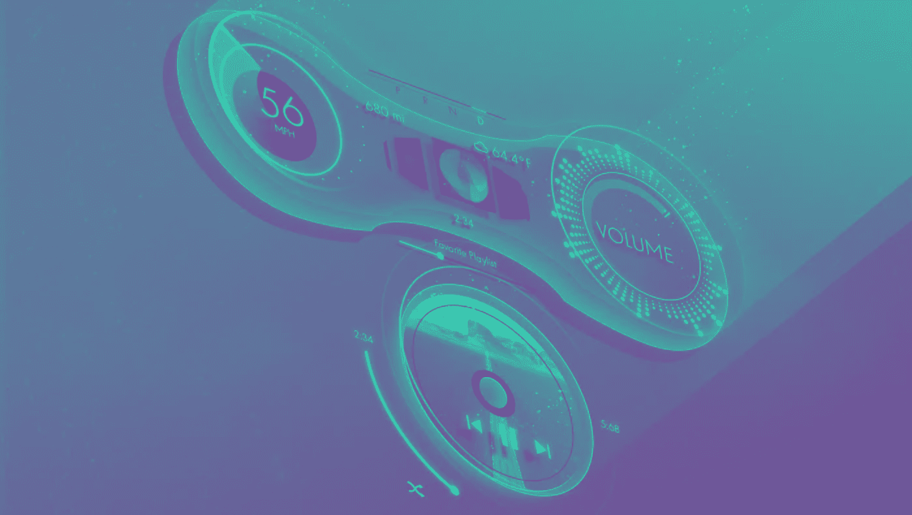

# 音乐物联网的兴起

> 原文：<https://medium.com/swlh/the-rise-of-internet-of-musical-things-ce9495770209>

## **物联网如何革新音乐**

物联网(IoT)在相对较短的时间内从一个崇高的概念发展成为一个普遍的现实。物联网技术为连接到互联网的对象和设备带来了智能，几乎改变了我们个人和商业活动的方方面面。从联网汽车和智能恒温器到微波炉…