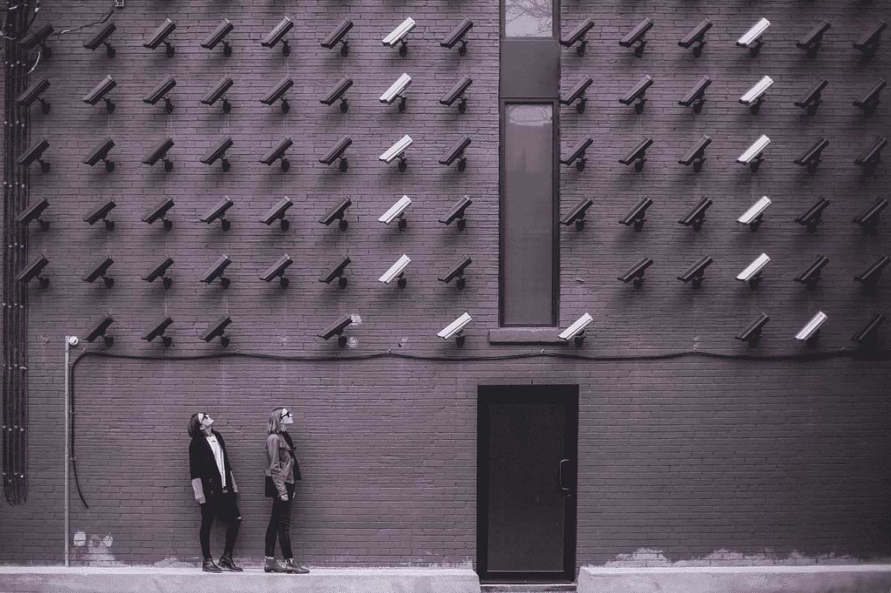

# 监视资本主义的兴起

> 原文：<https://medium.com/swlh/the-rise-of-surveillance-capitalism-5ec90f046f82>

社会正被他们的数字体验所控制，这就是它是如何发生的。

数字时代催生了尖端技术，这些技术超越了我的理解，每天都让我着迷，但它也达到了令人担忧的不适程度。

企业已经不仅仅是试图了解他们的消费者；他们的目标—预测和…