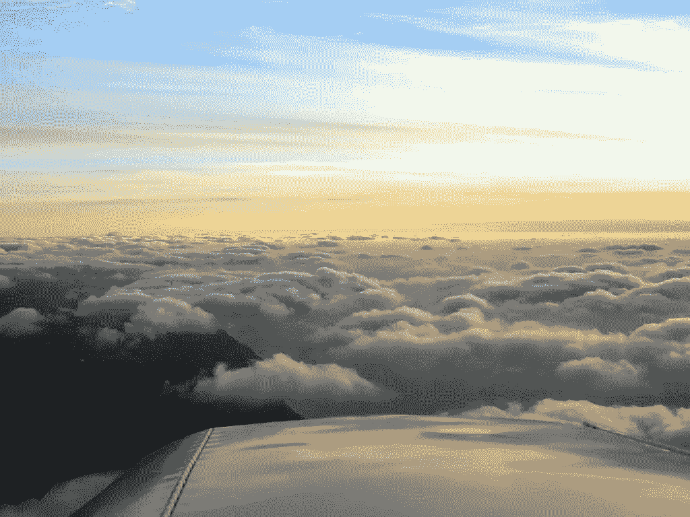

# 匆忙

> 原文：<https://medium.com/swlh/the-rush-2a50c0be347b>

“酷。明天在文华东方酒店的大厅。”

他按下“发送”按钮，心想，“相比之下，跳伞算不了什么。”

他清楚地记得那种感觉。当他爬上飞机的小踏板，在离地面 11000 英尺的高空，以每小时 80 英里的速度穿越中西部清新的空气时，那种感觉油然而生。有人称之为肾上腺素激增，但可能不止如此…