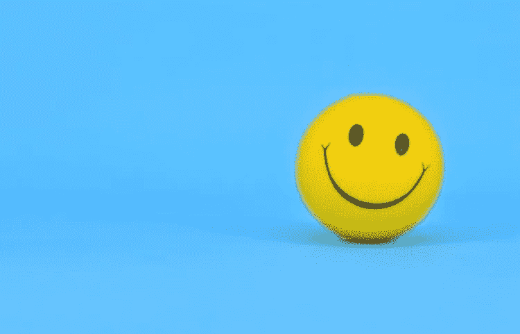

# 幸福的科学

> 原文：<https://medium.com/swlh/the-science-of-happiness-1a01fd31c015>

可以毫不夸张地说，我们对幸福的渴望也许超过了其他任何东西。无论我们做什么，都有某种积极回报的期望，以某种方式回报我们。显然，快乐是一种主观的东西，我无法忍受看棒球，但对一些人来说，这给他们带来了巨大的快乐。我看不到编织的价值，但我肯定有人把这种活动视为逃避日常生活中不可避免的苦难。像这样的例子随处可见。有些人通过运动找到快乐，有些人通过音乐找到快乐，有些人喜欢阅读，无论你能想到什么，都可能有人从中找到快乐。虽然这看起来像是对显而易见的事物的反哺，但重要的是认识到让我们快乐的事情的动机，而不仅仅是它们是否快乐。当谈到幸福时，有很多不同的因素在起作用，驱动这种良好感觉的往往是区分美好生活和悲惨生活的因素。

尽管有想要快乐的自然倾向，但经常没有足够的科学研究来分析是什么让我们快乐。这就是心理学教授蒂姆·凯瑟的工作发挥作用的地方。几十年来，Kasser 一直在研究幸福，并利用他对我们生活中唯物主义概念的研究来说明是什么给了我们幸福的生活。换句话说，最快乐的人身上有哪些明显的价值观？这项研究表明，某些趋势与物质消费交织在一起，导致我们过上更幸福或更沮丧的生活。

本质上，做任何事情都有两个动机:内在动机和外在动机。内在动机是一种来自我们内心的做某事的理由。外在动机是一种相反的动机，它源于外部因素。为了更好地解释这一点，想象你喜欢唱歌。你每天都唱歌，因为你喜欢这样做。你在洗澡的时候唱歌，你在上班的路上唱歌，这只是一些让你感觉很好的事情。它给你带来快乐，是一种真正激发你积极情绪的疗法。它只是让你感觉很好。这种源于歌唱的自然乐趣是内在动机。

现在想象一下，你唱歌不是因为你喜欢这样做，而是因为你在你讨厌的酒吧工作，你的工作就是唱歌来娱乐顾客。也许你的父母想象你成为一名歌手，并强迫你一辈子唱歌和上课，因为这是他们对你应该如何生活的想法。也许有一个女人你想给她留下深刻印象，你唱歌的原因更多的是给她留下深刻印象，而不是唱歌的实际乐趣。不管怎样，所有这些都是外在动机的例子。你唱歌不是因为在这种活动中你能找到一些自然的快乐，而是因为你想从中获得一些东西，无论是金钱、父母的认可还是女人的关注。然而，你不是在唱歌，因为那是你真正喜欢做的事情，而是动机来自于期望的外化。

现在，重要的是要明白我们是两者的混合体。内在和外在的动机总是相互结合，在我们选择的任何追求背后形成我们的推理。然而，让 Kasser 教授的研究如此有趣的是这两种不同类型动机的结果。外在动机，即来自于获得某种东西的动机，似乎与不满和抑郁有关。我们越是被这些外部因素驱使，通常就越不快乐。相反，研究表明，我们的决定越是受到内在动机的驱动，那种仅仅因为让我们快乐而做某事的动机，我们通常看起来就越快乐。虽然这可能看起来微不足道，但值得注意的是，不仅拥有这些内在动机，而且不让外在动机战胜它们变得越来越困难。

根据世界幸福报告，芬兰是世界上最幸福的国家。紧随芬兰之后的是其他欧洲和北欧国家，如丹麦、荷兰和挪威。就社会安全网而言，可持续治理指标组织将芬兰排在非常靠前的位置。人们有权享受四周的带薪假期，子女在 7 岁或 7 岁以下的家庭可以免费享受儿童保育服务。在《世界幸福报告》的调查结果中，美国排在前 10 名之外，但它没有带薪休假的固定规定。儿童保育通常非常昂贵，是一种负担，尤其是在工资多年停滞不前的情况下。在这些其他国家的许多情况下，提供这些东西(包括教育或医疗保健)的经济压力较小。工作的想法与其说被视为生存的必要之恶，不如说是一种为社会进步做贡献的内在良好感觉。

这些统计数据的目的不是简单地给美国蒙上阴影，而是重新审视那些延续做某事的内在或外在动机的文化价值观，这些价值观反过来对我们生活中的满意度和幸福感有着深远的影响。在我们的文化中，似乎有太多的动机是外在的。我们工作只是为了从中获得一些东西。我们工作不是出于任何内在动机，而是因为在经济上我们需要付出和担心如此多的其他因素，以至于我们仅仅为了快乐而做的事情不再以令人尊敬的速度发生。这可能看起来像一个幼稚的抱怨，毕竟，没有人不劳而获，但问题在于没有足够的强化这些内在的激励因素。这不仅仅是一个经济或政府问题，在文化上，已经发生的一些事情驱使我们去追求这些看似空洞的外在动机。

以社交媒体为例，说明这种通过外在手段追求幸福的方式。Instagram 和 Snapchat 可能是外部动机导致不快乐的最好例子。最好的解释可能是那些过度使用 Snapchat 拍摄整场演唱会的人。有成百上千个质量更好的视频，比你低劣的手机质量和角度捕捉到的瞬间更清晰。那么，为什么我们经常这样做呢？这不可能是因为一些内在的动机，我不知道有谁会通过在手机上记录事情而真正感到快乐。他们甚至不是用眼睛看着表演者，而是通过相机的镜头。他们根本没有体验到这一刻。事实上，很多时候，一旦我们在社交媒体上发布了一些演唱会视频，我们就再也不会看了。在我看来，在社交媒体上发布这样的东西不是由内在价值驱动的，而是根据研究导致较少幸福的外在价值。我们发帖不是因为它让我们感觉良好，我们这样做是为了获得某种嫉妒。似乎我们不再做那些让我们开心的事情，而是去做，因为它向其他人显示我们过得很开心。这种外在优先于内在的观念似乎是我们不快乐的核心。

这种对嫉妒的迷恋不仅对个人有害，而且显然对他人也有深远的影响。你不仅没有活在当下，没有经历这种体验，而且你本质上是在延续嫉妒，你创造了一种环境，你会说:“嘿，看看我的生活，太棒了！你拿你的干什么？”这不仅给了你一个错误的形象，因为科学表明这样的事情不会带来真正的幸福，而且你还增加了一种文化，这种文化优先考虑对某次经历的嫉妒，而不是在经历那次特殊经历时感受到的内在快乐。

这不仅仅是关于社交媒体，由我们激进的消费文化驱动的唯物主义思想也带来了这些看似不愉快的结果。想想在我们的社会中我们盲目崇拜的物质。我们看衣服、鞋子、珠宝等。常常给我们带来欢乐。然而，当我们出于必要的心理状态购买这些东西时，我们是带着这种外在的动机因素这样做的。我们购买这些过于昂贵的东西，并不是因为它们本身能给我们带来快乐，就像有人发现唱歌或画画能给他们带来快乐一样，而是因为有这种外部因素在起作用，比如我们一直沉迷于他人的嫉妒。换句话说，我们的幸福不是来自于任何内在或内在的理想，而是被他人的接受和羡慕所驱使，因此也依赖于他人的接受和羡慕。

接下来要做的是重新评估经济政策、个人选择和消费文化。随着抑郁、焦虑和自杀率的增加，重新审视我们的动机，无论是内在的还是外在的，似乎都会对我们有很大帮助。这不是说永远不要购买昂贵的东西或品牌，或永远不要在社交媒体上发帖，而是重新分配我们内在和外在动机之间的比例，以达到更平衡的平衡。目的是找到内在动机，并以此为基础。在不考虑外在因素的情况下，找到带给你快乐的东西。对我来说，这就是踢足球，这是我喜欢做的事情，不管有没有外在的东西。我只是享受此刻，享受踢足球。我很高兴在我的前院玩杂耍球，当我玩的时候体验这种内在的平静感。

解决方案的很大一部分来自于我们设定的优先级。想想那些躺在病床上的人，我很怀疑他们会想到他们买的跑车，或者他们在社交媒体上发布旅行信息时获得的关注度。他们关心的是他们是否从本质上享受这些经历。他们对事物有这些内在的热情吗？他们多久做一次？他们与家人和朋友建立了他们想要的那种联系吗？其他的事情要么根本不会被考虑，要么至少会被放在最重要的事情的最底层。如果所有这些事情在我们死后都很重要，那么在我们还能做这些事情的时候，它们就不应该重要吗？

我们现在都有这些我们喜欢做的事情。现在，显然我们生活的经济体系需要改变，以帮助更容易地做出这些决定，但这确实要从问我们自己开始:如果钱不是问题，什么会让我快乐？当你做某件事的时候，它会在你内心产生什么样的好的振动？去吧。如果可以的话，每天至少做一次。不要太在意别人的意见，最重要的是相信你自己，不知何故，你内心深处已经知道你想做什么。幸福就像任何其他人类情感一样，是我们为之努力的东西，但正如中国哲学家孔子曾经说过的那样:做你喜欢做的事情，你一生中就不会有一天是在工作。

来源/参考:

[http://www.sgi-network.org/2017/Finland/Social_Policies](http://www.sgi-network.org/2017/Finland/Social_Policies)

【https://truecostmovie.com/tim-kasser-interview/ 号

[https://journals . sage pub . com/doi/ABS/10.1177/0146167213484586](https://journals.sagepub.com/doi/abs/10.1177/0146167213484586)

[https://worldhappiness.report/ed/2019/#read](https://worldhappiness.report/ed/2019/#read)