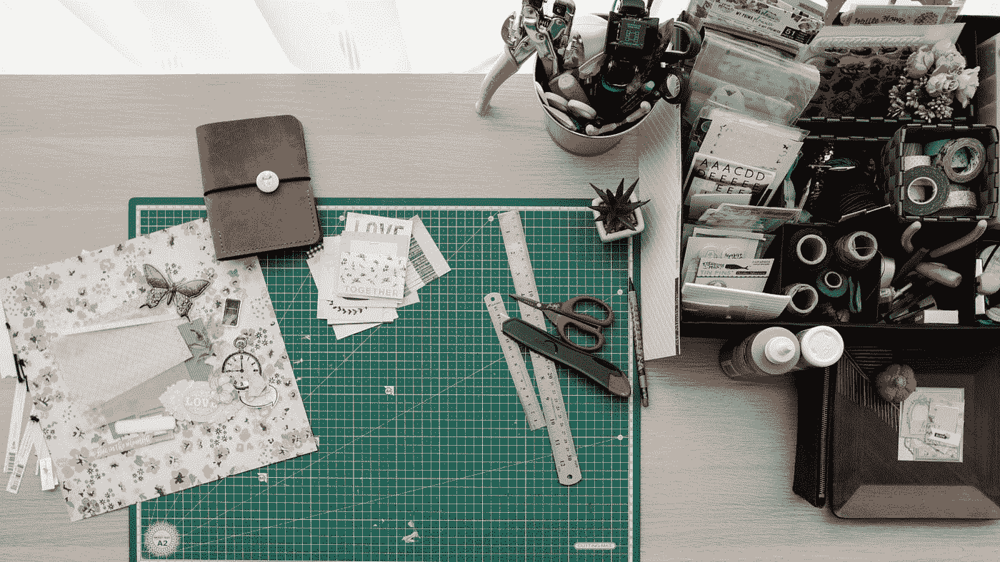

# 按需产生想法的科学方法

> 原文：<https://medium.com/swlh/the-scientific-way-to-generate-ideas-on-demand-fc94e0609282>

## 为什么好主意只会在洗澡的时候出现？

Photo by [Vladimir Proskurovskiy](https://unsplash.com/@proskurovskiy?utm_source=medium&utm_medium=referral) on [Unsplash](https://unsplash.com?utm_source=medium&utm_medium=referral)

你是否曾经坐下来，手里拿着铅笔，准备想出一个难以置信的故事和文章想法的完整列表，却发现自己正盯着一张白纸？我有。

我最好的想法*从来不会在我等待的时候出现。他们总是不请自来…*