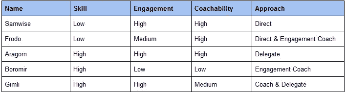
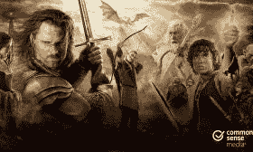

# SEC 教练模式

> 原文：<https://medium.com/swlh/the-sec-coaching-model-97fe81205888>

Photo by [Annie Spratt](https://unsplash.com/photos/sggw4-qDD54?utm_source=unsplash&utm_medium=referral&utm_content=creditCopyText) on [Unsplash](https://unsplash.com/search/photos/team?utm_source=unsplash&utm_medium=referral&utm_content=creditCopyText)

# 概述和一般概念

你团队中的每个员工都是独一无二的。这意味着，每次你接近员工提供反馈或指导时，你都需要确保你在量身定制你的指导。为每位员工量身定制您的辅导将增加收到反馈并采取行动的可能性。

[SEC 教练模型](https://thejoygroup.com/services)(由[比尔·乔伊](https://twitter.com/BillJoyGroup)开发)提供了一个灵活的框架，你可以用它作为定制教练的第一步。它基于三个因素，每个因素都与一个简单的问题相关:

*   **S** 杀人——这个员工的技术如何？
*   参与度——该员工的参与度如何？
*   **C** 可接近性——我对该员工的可接受程度如何？

回答这三个问题，你就能决定如何对待你的员工。根据 SEC 模型，您可以采用四种常规方法进行指导对话:

*   **指导** —指导是最实用的辅导方法。指导时，你告诉你的员工需要做什么以及如何去做。指挥*可能*看起来像微观管理，但是——在适当的情况下使用——它实际上是一种积极的、有益的方式来指导和领导你的团队。
*   蔻驰:教练就像它听起来的那样。考虑一个 NBA 教练。他们和不需要微观管理的职业运动员一起工作。相反，他们的重点是提供反馈、鼓励和战略方向，以帮助玩家(和团队)实现他们的目标。同样，当你指导你的员工时，你可能仍然会不时地提供反馈和指导，但他们是主要的行动者，你在那里帮助他们实现他们的目标。
*   **敬业度蔻驰** —敬业度辅导专注于员工敬业度。这可能是最困难的辅导类型，因为“正确的”方法可能很难掌握。在敬业度辅导中，你的目标是找出员工敬业度低的原因，以及如何帮助提高他们的敬业度。要做到这一点，你的重点应该是问很多开放式的问题，让你的员工说更多的话。
*   委托**—委托是一种众所周知的策略。虽然你可以提供一些指导方针和组织结构，但授权的本质是你相信你的员工拥有这项工作/项目。**

**让我们看一个虚构的例子，看看这在实践中是如何工作的。**

# **付诸实践**

**使用 SEC 模型的第一步是根据您对员工技能、敬业度和可辅导性的看法对他们进行评分。有几件重要的事情需要注意:**

*   **这是基于你的感知。虽然你可能有数据来支持某些判断，但请记住，你会犯错误，会有偏见，这意味着你的判断不一定 100%准确**
*   **为了保持一致性，我建议使用低/中/高分量表。如果不确定，你可以混合类别(例如“低/中”或“中/高”)，但尽可能保持它们的清晰和不同。当有疑问时，相信你的第一印象。**
*   **你不一定要向你的员工展示你的得分。这是你在接触他人提供指导之前的一次个人准备练习。分享的一个例外可能是你在所有类别中得分“高”的员工。适当分享这些信息，可能会给高绩效员工带来巨大的鼓舞。**

**下面是一个样本表格，用 SEC 模型给中土世界的几个可爱成员打分:**

****

**虽然你可能不同意这个评分(每个人都不同意)，但以下是我使用的逻辑和我推荐采用的辅导方法:**

## **山姆卫斯**

**乍看之下，没有人会认为山姆卫斯是团队中最有价值的成员(除非你说的是烹饪)。他没有任何战士或冒险家的经验，他从夏尔舒适的生活到更广阔的中土世界的转变是艰难的。尽管如此，山姆仍然是一个高参与度的完美例子——他 100%致力于支持和照顾他的主人，即使这意味着跟随他进入末日火山的深处。**

**山姆也是一个非常容易训练的霍比特人，当他在旅途中遇到新的经历和角色时，他会学习和进化。我们在山姆卫斯的旅程结束时看到的勇敢而坚强的山姆卫斯，与我们最初见到的温柔的霍比特人大不相同。**

**鉴于山姆的低技能、高参与度和高指导能力，指导他的正确方法可能是**指导。** Sam 渴望学习并做好本职工作，他乐于接受反馈和意见，这将有助于他尽快成为团队中更有价值的一员。为此，不要害怕给 Sam 过多的反馈或冒犯他。他*需要*你的投入和指导，如果他想作为团契的一员生存并茁壮成长。**

## **佛罗多**

**佛罗多和山姆很像(很多霍比特人也是)。他似乎没有带来多少有价值的技能，尽管他愿意带着魔戒去魔多也算有价值(尽管他甚至不认识路……)。**

**不像山姆，佛罗多的婚约是复杂的。这不是佛罗多的错。这主要是因为当他接近魔多时戒指的重量。躲避索伦的火焰之眼对最顽强的战士来说都是一个挑战，对这个小霍比特人来说更是一项艰巨的任务。尽管困难重重，也有软弱的时候，佛罗多表现出顽强的决心，继续前进。**

**类似于山姆，佛罗多也是高度易受训练的(也许更是如此)。他花时间在瑞文戴尔研究地图，为未来的旅程做准备，这清楚地表明了他学习和参与的愿望。他也表现出对来自更明智的成员，也就是甘道夫和阿拉贡的持续渴望。**

**考虑到所有这些因素，对弗罗多来说，正确的方法可能是将**导演**和**参与辅导**结合起来。由于缺乏经验，佛罗多需要导演。没有方向，他就不会为需要自己闯荡的时刻做好准备。然而，同样重要的是，佛罗多周围的人要认识到他对魔戒的挑战，并给予倾听和支持，以帮助他承担他的负担。**

## **阿拉贡**

**艾丽莎。漫游者。阿拉贡。刚铎的国王。**

**不管你喜欢他的什么名字，阿拉贡是中土世界几乎所有优点的典型代表。虽然他还是人类，但他一直展示着他的技能和智慧。虽然他知道这条路并不容易——尤其是死亡之路——但他已经为这一刻准备了很多年，并准备好迎接正面的挑战。**

**尽管有他的血统、头衔和对团队的价值，阿拉贡也表现出了谦逊，这使他易于训练。他认识到像埃尔隆德和甘道夫这样的人的明智建议的价值，他经常服从他们的智慧和决定。**

**阿拉贡的高技能、高参与度和高指导能力意味着指导他的正确方法是**授权**。如果你想找人带领你穿越洛汗平原或与兽人大军战斗，你可以把任务交给阿拉贡，不用担心他会让你失望。**

## **博罗米尔**

**博罗米尔是中土世界最复杂、最有趣的角色之一。在与大多数员工互动时，他是一个值得记住的好榜样，因为他是一个非常混杂的人(我们不都是吗？).**

**毫无疑问，博罗米尔给伙伴公司带来了大量的技能。他是个优秀的战士，曾独自在野外旅行数月。他的生活经历使他非常适合这项任务，这使他能够在莫莉亚和卡拉德拉山产生立竿见影的影响。**

**但是即使是迪耐瑟的长子仍然有他的挣扎。他的敬业度和执教能力都是团契所有成员中最低的。虽然他默认了议会将魔戒带到魔多的计划，但他不断地表达自己的疑虑，并挑战组织的领导者。当他被自己的欲望所征服，试图从佛罗多那里偷走魔戒并利用它来达到自己的目的时，这种情况达到了顶点。作为刚铎管家的儿子，博罗米尔也一贯表现出极大的骄傲和固执，这让他变得相对难教。**

**虽然这很难考虑，但指导博罗米尔的正确方法可能是将**参与式指导**和可能在组织外管理他结合起来。他是一个非常有价值的团队成员，失去他会很痛苦，所以从敬业度辅导开始，试着用权威和团队前进的方向抓住他问题的核心。他在帮助联谊会和回国保卫祖国之间左右为难，所以他的挣扎是可以理解的。用正确的关心和接触，你也许能突破他。如果没有，可能是时候考虑把博罗米尔搬出去了。**

## **吉姆利**

**矮人经常被低估(可能是因为他们身材矮小)。尽管个头很大，格洛因的儿子吉姆利可不是好惹的。从团契之旅的一开始，他就通过他的幽默和力量证明了自己的价值。吉姆利能够一击砍下兽人的头颅，并能在洛汗平原上奔跑数日，是任何团队中的可靠成员。**

**吉姆利对他的战友的爱，以及穿越中土世界追捕兽人以拯救他的哈比人朋友的意愿，表明了他对这一事业的高度投入。然而不幸的是，吉姆利面临着一个巨大的挑战:他的执教能力。**

**我相信你已经知道了，矮人的固执是出了名的。在伙伴之旅的开始，吉姆利挣扎着上船，面临着与莱格拉斯和博罗米尔的紧张关系。对中土世界来说幸运的是，吉姆利能够克服这个挑战，并且在事件结束时，全心全意地为国王和事业服务。**

**考虑到这些因素，指导吉姆利的正确方法可能很简单**指导**和**委派**。吉姆利可能需要偶尔的反馈——特别是在改善与队友的关系方面——但如果你试图超越和指导他太多，他肯定会反抗。**

# **结论**

**在考虑了我们团队(或伙伴关系)的每个成员后，我们现在可以使用推荐的方法来指导每个团队成员，从而完成上表:**

****

**我希望这些例子有助于了解 SEC 教练模式的实际情况。虽然它不能告诉你所有的事情，但它是一个非常有用的工具，可以帮助你了解团队中每个成员的现状，并形成你的方法来帮助他们发展和提高。**

**记住，教练是一种技能。就像其他技能一样，随着时间的推移，你可以提高自己的教练能力。利用上面的框架，花几分钟时间准备教练对话，你一定会很快看到好处。**

****

**Image from Common Sense Media**