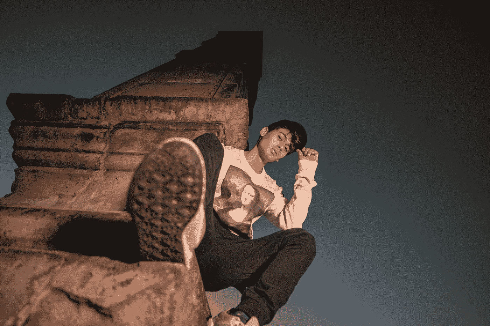

# 成功艺术家的秘密和成为艺术家的 8 个步骤

> 原文：<https://medium.com/swlh/the-secret-of-successful-artists-and-the-7-steps-to-become-one-b332daf8d36a>

Photo by [Jezael Melgoza](https://unsplash.com/@jezael?utm_source=medium&utm_medium=referral) on [Unsplash](https://unsplash.com?utm_source=medium&utm_medium=referral)

## 成为一名成功的艺术家或企业家所需要知道的一切。

列奥纳多·达·芬奇生于 15 世纪的意大利，他是个私生子，这被证明是塞翁失马，焉知非福。

由于生来就是“私生子”，他的父亲无法提供他的中上阶层同龄人所能得到的正规教育。

结果，**列奥纳多将被迫自学**。

事实证明，没有人比列奥纳多更有天赋，更能感受到大自然的神奇。

他如饥似渴的学习和永不满足的好奇心使他成为一位大师级艺术家的学徒。

这给了列奥纳多利用现实世界的经验来教育自己的机会，使他的知识获得如此强大。

在被他的高眉毛的同辈“文人”嘲笑后，列奥纳多嘲笑道:

> “我完全意识到，不是一个文人某些放肆的人会认为他们可能合理地责备我；声称我不是一个文人。愚蠢的人们！难道他们不知道，我可能会像马吕斯对罗马贵族那样反驳说:那些以别人的劳动来装饰自己的人，不会允许我拥有自己的劳动。他们会说，我没有文学技巧，不能恰当地表达我想要治疗的，但他们不知道我的主题是通过经验而不是文字来处理；经验一直是那些写得好的人的情妇。所以，作为情妇，我会在所有情况下引用她。”

列奥纳多将继续创作一些世界上有史以来最伟大的艺术作品，并作为有史以来最伟大的艺术家之一留下遗产。

这里是列奥纳多和其他大师给你的成为真正的艺术家的 8 条经验。

# 1.模仿最好的，并以精通为目标

列奥纳多并没有专注于成功，相反，他专注于这门手艺本身——并通过与一位大师合作而成为大师。

跟一个大师学艺是学习和发展你自己的最好环境，让你成为你正在练习的手艺中的佼佼者。

竞争激烈的市场就在你面前。

装运的最后期限就在你面前。

商业是中心。

正是在这种背景下，你获得了深刻的经验，也就是说，你学到了真正重要的交易技巧。

# 2.知识什么都不是

> "只有通过经验，我们才能学到任何东西。"—莱昂纳多·达芬奇

你不可能真正学到东西，除非它很重要，而且风险很高。你就是不会。

上下文不存在。

压力不存在。

这些东西能给你深刻的经验来掌握任何东西。

Benjamin Hardy 是 Medium 的头号作家，现在是 bluechip 的出版作家和市场领先的领导力顾问，他正在克莱姆森大学攻读博士学位。作为一名有抱负的作家，他会因为写“流行心理学”文章而受到那些眉毛更高的博士同行的抨击。

与此同时，他们在阅读和撰写内部评论的技术论文，而没有了解外部市场和最重要的东西——营销。

事实证明，成为一名伟大的心理学家的秘密在于能够很快地写出并发表伟大的作品。

事实证明，赚大钱、获得图书交易和大型咨询合同的秘诀在于拥有一个庞大的电子邮件列表。

他的同龄人不知道，但他知道。最重要的是，他知道如何获得这些东西并付诸实施。

他现在赚了几百万，我敢打赌，他的同龄人远远比不上他。

在市场竞争中学习——其他一切都只是知识，知识什么都不是。

# 3.产品

> “创始人/市场契合是产品/市场契合的先决条件。”—李尚义，风险投资家

你，你自己，创始人都是产品。你越是把自己当成你正在制作的东西，越是体验你的艺术或手艺，你就会学得越多并成为大师。

你的能力取决于你愿意投入的程度。

问问你自己:“我需要成为什么样的人才能用我的产品服务他人？”。

如果你只是刚刚开始，随着你的发展和变得更有价值，带着人们踏上你的个人旅程。

首先想想你要服务的人，认识到你需要树立的榜样，以及你需要比任何人都更好地为他们服务的经验。

你的“混乱”就是你的信息。

例如，防弹公司的戴夫·阿斯普雷是饮食和锻炼方面的权威人士之一。

众所周知，他本着探究和学习的精神采取了极端的措施。

他开始是一个超重和不健康的人，坚持不懈地尝试一切来克服他的身体疾病。在去西藏山区的旅途中，他发现了牦牛酥油茶，这给了当地人能量，现在著名的防弹咖啡就这样诞生了。

这也为你提供了持久的力量来度过混乱的旅程。

一个很好的问题是:“如果钱不是问题，我会免费做这个吗？”

# 4.市场

> “如果你能做出 100 个人都喜欢的东西，你就有了一家企业。”Airbnb 首席执行官布莱恩·切斯基

你不是在为一个市场服务，你是在为组成市场的个人服务。专注于人，一次一个。

通过了解个人和他们的问题，一次一个地创造属于你自己的个人市场。

这就是你需要做的一切。

从一个特定“类型”的人开始。这将成为你的‘利基’。利基可以是解决问题的特定方式，也可以是一群人本身。

例如，本杰明·哈代在帮助人们改善生活方面的“定位”就是身份。而我认识的一位营销顾问专门帮助会计师拓展业务。

找到你的定位，专注于它。

# 5.网络

人们是你最重要的资产，他们愿意把你介绍给他们认识的人才是最重要的。

列奥纳多·达·芬奇第一次被介绍给他的著名导师，他的父亲是他的学徒。自然，如果你没有家人或者像家人一样亲密友好的人，你就必须找一个导师。

一个对你感兴趣的超级亲密导师比一百个认识你但不愿公开姓名的“弱关系”联系人更有效。

当然，确保你值得担保是你的工作。

我最亲密的导师就是那个我从未有过的父亲，我和他建立关系是因为我们对网球有共同的兴趣。这个人已经并将永远把我介绍给任何我需要的人。他把我介绍给了每个人，从拉尔夫·劳伦的董事长兼总裁到沃达丰的首席执行官。

这花了几年时间来开发，非常值得。

通过做人们需要做的事情来为他们创造价值。

通过了解人们喜欢什么来与他们联系。

# 6.出售

你的利润和财富取决于你每天的出价数量。由你来设定一个目标，即你向别人出价购买你的产品和/或你出售的东西的频率。

如果金钱是你的首要任务，这就是你需要关注的全部。

销售时，通过提问和倾听来关注顾客。

当你问一个问题时，留下来保持沉默并倾听。用问题突出他们的问题。

他们会透露他们在寻找什么，而你将处于一个知情的位置，将你自己或你的产品定位为他们问题的解决方案。

如果你试图在了解这些知识之前推销你自己或你的产品，你将会把一个方钉子卡在一个圆孔里。

不要这样。

# 7.营销

> “没有艺术这种东西，只有营销产品。好莱坞是一个营销行业。”传奇电影老师多夫·西门子

没有营销的艺术什么都不是。

没有伟大艺术的营销一开始就卖不出去。

伟大的艺术和伟大的产品现在只是先决条件。

这是你需要了解的最重要的平衡之一。

如果没有人看到你所拥有的，那就毫无意义。同样，正如多夫·西门子所说，如果你没钱拍电影，你就没有电影，你什么都没有。

然而，有效地营销某样东西不仅需要好的艺术，还需要伟大的艺术。

伟大是先决条件。伟大是一种商品。外面有很多伟大的人。

重要的是在合适的时间，在特定的领域进行创新，以伟大的艺术和伟大的发行创造市场。

这是你工作成功的原因。

推销你的伟大艺术。

# 8.烟囱

销售漏斗是你如何系统地营销你的产品。漏斗有不同的阶段，从顶部开始，你把人们带进来。

这真的很简单，当他们通过你的销售/营销周期时，他们通过漏斗，直到他们有希望在最后成为客户。

# 结论

当你学会了这些技巧，艺术就成了你成功方程式中容易的部分。你将能够选择你想练习的艺术，并将其投入市场并从中获利。你可以决定你想卖多少或者你想免费赠送什么。有些人想放弃一切，只是为了建立大众影响力。硅谷经常采取这种方式。

其他人想要一套合适的产品，他们可以从第一天开始销售。

没有哪一个比另一个更好，因为最终你需要为那些愿意付钱给你或信任你的人创造很多价值。

一个著名的 Youtube 明星 makes 不收一分钱，做了从发布视频到一对一指导客户的所有事情，全部免费。当他们拥有大约 75，000 名订户时，他们推出了他们的第一款产品。另一家公司做的正好相反，他们提供的内容从第一天起就吸引人们进入他们的漏斗。

这将取决于你。

重要的是你创作你的艺术，因为创作的感觉很好。

重要的是你表达了你的声音，因为表达你的声音影响了人们，发展了你这个人。

影响他人和服务他人会给你带来超越自我的更高目标，最终，当你意识到你已经并一直拥有你所需要的一切时，创造事物和服务他人就是生活能给你的最高奖赏。

所以，制作你的艺术和产品，并把它们拿出来。

> 点击并接收我个人用来赢得一天的晨间例行电子表格和愿景板。多年来我一直在改进它，它改变了我的生活。每周日早上你还会收到我的最佳每周文章。

## 这篇文章发表在[《创业](https://medium.com/swlh)》上，这是 Medium 最大的创业刊物，有+421，678 人关注。

## 订阅接收[我们的头条新闻](https://growthsupply.com/the-startup-newsletter/)。

