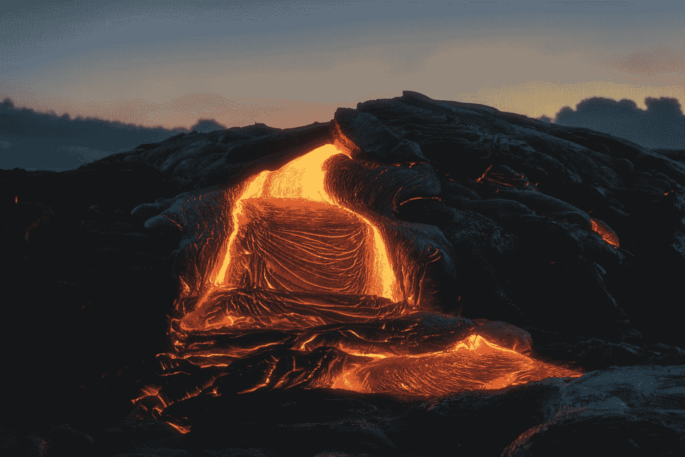

# 超级火山的秘密

> 原文：<https://medium.com/swlh/the-secret-of-the-supervolcanoes-8d27ac2d7538>

## 超级火山的破坏力比普通火山大很多倍。它们是沉睡的怪物，很少有人知道它们的存在。

Photo by [Julien Millet](https://unsplash.com/@julographie?utm_source=medium&utm_medium=referral) on [Unsplash](https://unsplash.com?utm_source=medium&utm_medium=referral)

超级火山的爆发通常会带来毁灭性的后果。典型的火山爆发，如 1980 年的圣海伦斯火山，喷出岩浆…