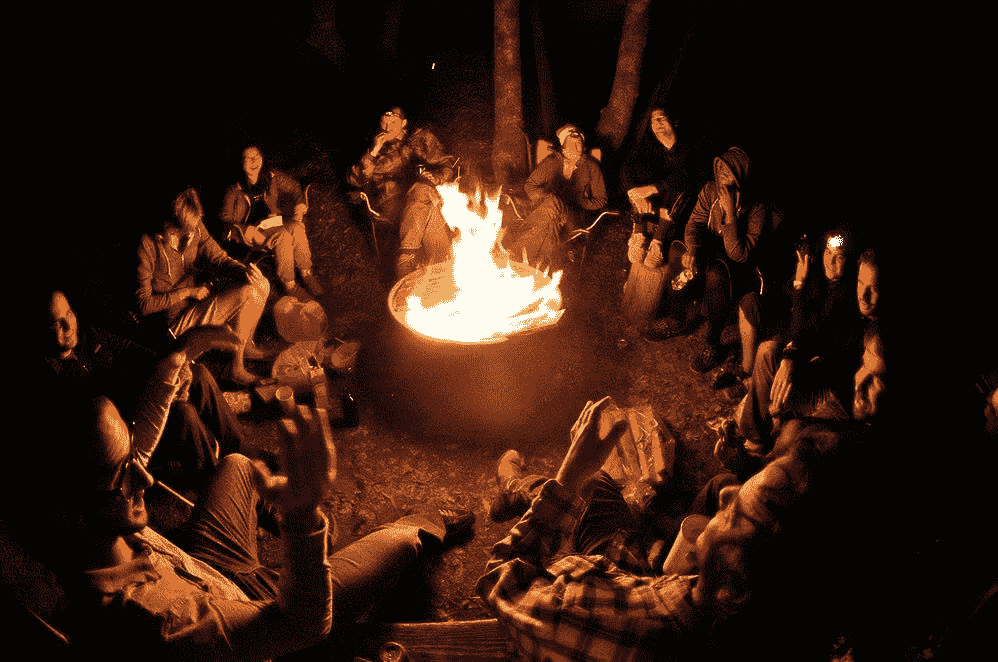
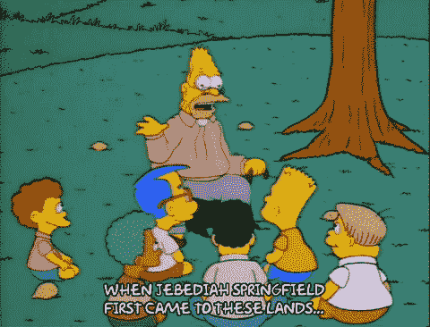

# 讲故事中经常被遗忘的秘密步骤。

> 原文：<https://medium.com/swlh/the-secret-step-in-storytelling-that-is-so-often-forgotten-3db951cca285>

## 关于讲故事的讨论可以像三大男高音。他们几乎总是只关注表演的两个部分。

1.我们告诉人们的关于我们自己的故事。

2.他们将告诉别人的关于我们的故事。

但是还有同样重要的第三部分，我们越能有效地认识到这一点，我们就越能有效地利用讲故事来激励人们采取行动。

3.认识到故事人物本身——他们的[世界观](https://www.google.com.au/amp/s/www.collinsdictionary.com/amp/english/world-view)——并理解这些将如何影响前两点。

我们都有这样一个亲戚(通常是一个叔叔),他在每张桌子上都讲着同样的不恰当的故事，有时是热门，有时是灾难。为什么？

这是因为讲故事的重点往往是围绕一致性(第 1 页)，以及加深和/或拓宽联系(第 2 页)，但同样重要的是背景(第 3 页)。观众是谁？

这就是为什么最优秀的故事讲述者在开始讲述故事之前，往往会花更少的时间“讲”，而花更多的时间“听”，阅读“房间”,这也是为什么音盲叔叔仍然是一颗定时炸弹，最好放在一个本地化的环境中。

这位大叔的内部叙述很简单。他是真理不可动摇的代言人。

> “我不为任何人改变，我只是实话实说。”

对一些人来说，这种风格引起了共鸣，对另一些人来说，这种风格令人生厌。为什么这种方法如此两极分化？

当我们听一个故事时，我们会下意识地考虑支持我们被告知的内容是否会强化或抵触我们自己的世界观。这有助于我们决定如何应对。

简而言之，我们试图弄清楚“人们是否像我们一样，做这样的事情。”

如果答案是否定的，我们可能会反抗、报复或撤退。当我们看到不一致的地方，我们甚至可以重新评估我们还支持了什么，还有谁支持这些观点，以及我们经常会影响信任的地方。

这个过程是我们不断做的事情，因为我们将事情分类成组，寻找与我们有相似世界观的其他人，并寻找机会来加强我们在这些部落中的地位。

## **那么，我们如何更好地识别人们的世界观，以及他们自己讲述的故事呢？**

在理解我们周围的人时，最重要的技能是同理心和真正的参与(真正的倾听、好奇的提问和真正参与对话)。)

问问你自己，这个人(或群体)如何看待这个世界，以及他们在其中的角色。他们的驱动力是什么，他们的目的是什么，这将如何影响我塑造我将要分享的故事的方式？

对于叔叔来说，这是一个一刀切的方法，但有一个更强大和有效的方法。

**找到张力。**

经常围绕讲故事的讨论仅仅关注联系，但是我们都在卖东西，那么讲故事如何帮助我们把我们联系的人变成行动呢？

当你理解别人是如何看待自己的世界时，讲故事可以帮助你制造一个人行动所需的紧张感。

自诩为“强有力的冲动型决策者”的人需要与“深思熟虑者”截然不同的叙述，后者需要感觉自己在行动前评估了所有事实。不喜欢错过机会的便宜货购物者可能比两者都更感到时间压力。所有人都有自己的世界观和内在叙事，对同一个故事会有非常不同的反应，所以考虑一下你可以如何利用他们的世界观来塑造你的起点。

**沉默以封印。**

战略沉默是你的秘密武器。实践它，玩它，[重新构建你对它的恐惧](https://itsyourturnblog.com/overcoming-the-terror-of-silence-eb73cccce1c0)，因为这是讲故事的最后一步，也是你用讲故事来推动行动的最有力的工具。问问题。听着。坐下。等他们开口。

最终走出你的舒适区，去练习。

[我很乐意与](https://www.linkedin.com/in/heathevans/)联系，成为你讲故事之旅的一部分，所以请联系并分享你的反馈、建议和经验，感谢你花时间阅读这篇文章。祝你好运！

## 这篇文章发表在 [The Startup](https://medium.com/swlh) 上，这是 Medium 最大的创业刊物，拥有+438，678 读者。

## 订阅接收[我们的头条新闻](https://growthsupply.com/the-startup-newsletter/)。

