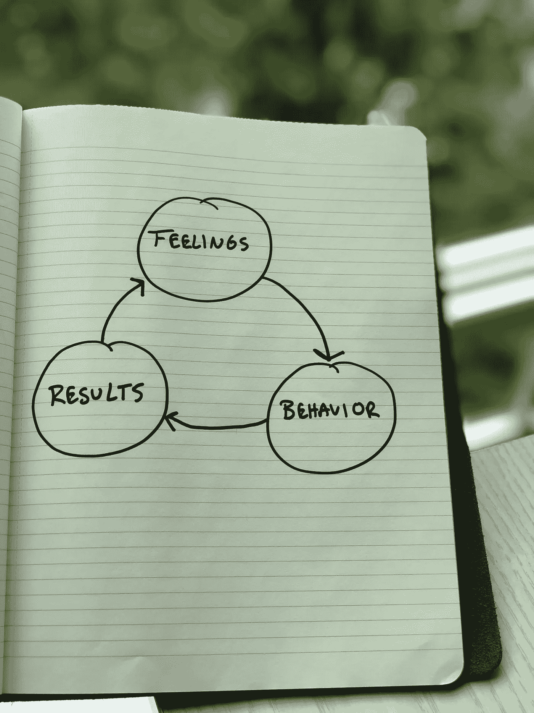

# 给我们的生活带来积极变化的秘密

> 原文：<https://medium.com/swlh/the-secret-to-effecting-positive-change-in-our-lives-4e5b5352ccf3>

Photo by [Jukan Tateisi](https://unsplash.com/@tateisimikito?utm_source=unsplash&utm_medium=referral&utm_content=creditCopyText) on [Unsplash](https://unsplash.com/?utm_source=unsplash&utm_medium=referral&utm_content=creditCopyText)

你从哪里开始改正一个坏习惯？

如果你像我一样，你的直觉可能会集中精力改变你的行为。这似乎是一个简单的等式；改变行为以达到不同的结果。但是为什么改掉坏习惯这么难呢？当我们知道这对我们不好的时候，为什么还要从罐子里拿第二块(第三块)饼干呢？

这里还有别的东西在起作用。通常，我们不明白我们行为的来源。如果我们能理解我们行为的来源，我们就能洞察为什么我们会表现出这些行为；这给了我们一个更好的机会来影响我们生活的长期变化，并实现我们希望和渴望的事情。

关注我行为的根源是我花了很长时间才学会的一课。我的许多坏习惯花了很多年才改掉。当我回顾我生活中的重大转变时，我可以观察到导致长期变化的模式。

两年前我被诊断出患有慢性髋关节肌腱炎。这也被称为*舞女臀*，只会让病情更加尴尬和讽刺。*我很可能是有史以来最差的舞者之一。虽然我只有 25 岁，但我看起来像我爷爷，需要我多次尝试才能从沙发上站起来——我的脸因为疼痛而畏缩。简单的任务不再那么简单了，比如穿上袜子或者伸手去拿冰箱里的牛奶。某些位置会触发我的臀部锁定，并使我的腿部和背部感到剧痛。*

我认为这只是运气不好。我希望并祈祷疼痛会消失。我向我能想到的各种专家寻求帮助，比如脊医、理疗师、针灸师和整形外科医生。我希望有人告诉我我到底怎么了，并治好我。我接受了多次类固醇注射。我做了核磁共振。我拿走了我能拿到的所有诺科。我每天晚上都喝几杯啤酒，只是为了放松一下，哪怕只是一小会儿。我相信，一旦我感到疼痛减轻，我将能够开始更多的锻炼，并再次变得健康。但是舞者的臀部恶化了。

直到我专注于我行为的根源，我才能够实现持久的改变——我的健康状况有了显著的改善。

> 我的伤并不是阻碍我的主要原因；正是我对自己受伤的感觉阻碍了我前进。

## **我们的感受是我们取得成果的最大预测因素。**

我觉得自己像个受害者。我感到无能为力。我觉得我无法控制自己。

这些感觉让我寄希望于医生或药物来治愈我。当这些东西不起作用的时候，它只是强化了无助感。我的感觉导致我表现出一些行为，随着时间的推移，这些行为形成了不健康的习惯，比如依赖止痛药和情绪化进食。结果体重增加了 45 磅。这是一个毁灭的循环。我增加的体重越多，我的臀部承受的压力就越大，我的状况就变得越痛苦。

感情比行为更难改变。感情很乱，很复杂，很难理解，但却是转化行为的关键。

> 感觉驱动行为。行为决定结果。结果强化或挑战感觉。

直到我改变了对自己臀部状况的看法，我才开始看到转型的变化。

这不是一蹴而就的，也不是一蹴而就的，但渐渐的，我的感受从无力转向了被赋权。我从觉得自己是受害者变成了拥有自己的感情。我不再试图寻找快速缓解疼痛的方法，而是专注于我知道我可以控制的东西——我的饮食。我专注于一次减掉两磅。我制定了一个规则，不再试图用食物和酒精来治愈我的感情。我不再独自饮酒。果然，我减的越多，我就越有活力。我开始越走越多，这导致了慢跑。在我减掉最初的 20 磅后，我注意到我的身体因为锻炼而感觉好多了。额外重量给我的关节带来的压力和紧张减少了，这导致了更多的灵活性和力量的增加。即使我仍然有髋关节疼痛，我不会让它阻碍我的进步。我在谷歌上搜索了患有臀部肌腱炎的跑步，发现了一个在锻炼中帮助支撑臀部的压缩支架的链接。我在亚马逊上订购的，效果非常好。当我开始每周跑 5 英里，每周跑 10 英里，每周跑 25 英里时，接下来的 20 磅比最初的 20 磅下降得更快。

我现在有了动力，就像一块滚下山坡的巨石。我做了几个月的明智选择，这些选择带来了更好的选择。我的感受不一样，所以我的行为也不一样，导致我取得了不一样的结果。

你想做出什么改变？你想改掉什么习惯？

**在试图改变行为之前，关注行为背后的感觉。**