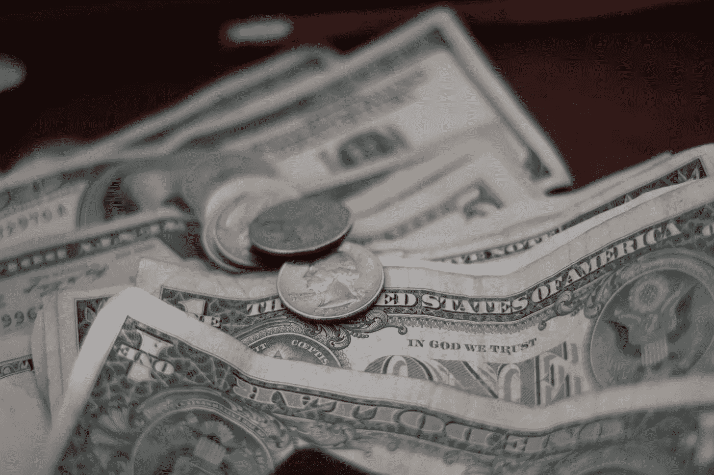

# 金融混乱的耻辱

> 原文：<https://medium.com/swlh/the-shame-of-financial-messiness-5e50c679917b>

Photo by [Mathieu Turle](https://unsplash.com/@nbmat?utm_source=unsplash&utm_medium=referral&utm_content=creditCopyText) on [Unsplash](https://unsplash.com/search/photos/money?utm_source=unsplash&utm_medium=referral&utm_content=creditCopyText)

M oney 是美国人痴迷却也谈得不够的话题。这很奇怪，因为这是我们最大的压力源之一。它是我们用来把食物放在桌子上并给自己体验的工具。它让我们能够获得医疗保健、新闻，甚至彼此交流。

我过去对钱的态度非常不好，主要是因为我对自己的经济状况感到羞耻。几年前…