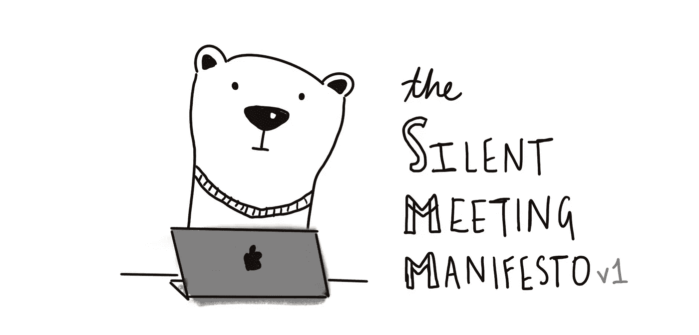
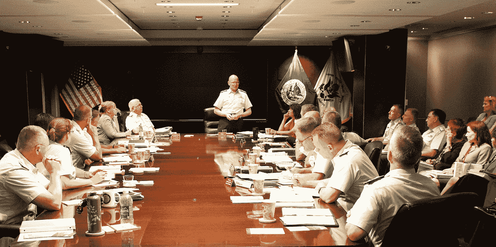
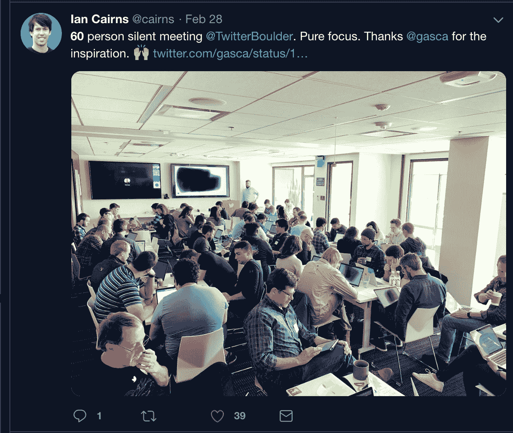
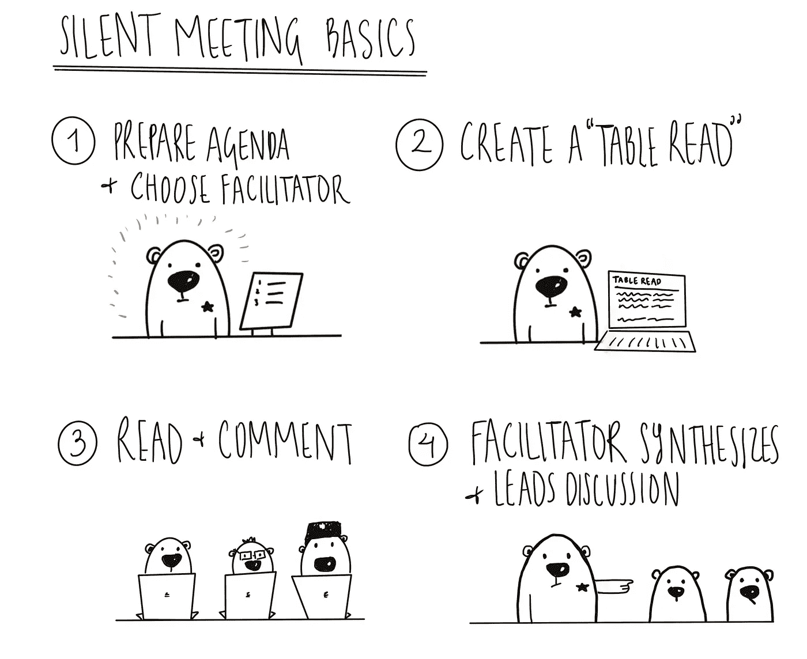

# 无声会议宣言 v1:让会议少一点糟糕

> 原文：<https://medium.com/swlh/the-silent-meeting-manifesto-v1-189e9e3487eb>

The Silent Meeting Manifesto v1: Making meeting suck a little less

会议糟透了。这是公认的真理。

我在这里告诉你，他们不必。我以传教士的热情写作，以阻止可怕的会议。发现静默会议后，我改变了看法。

这篇文章是要派上用场的。一部分是工作手册，一部分是指南。这是我关于这个话题的 6800 多字的扩展，但是有更多的细节。这是为了在你自己练习静默会议时重读。

**(只有 1 分钟:** [**先看这个更短的版本**](https://link.medium.com/avPYaGqqE3) **)**

这里是提纲:在一个[宽泛的介绍](/p/189e9e3487eb#335f)之后，我们将进入[喧闹的会议今天提出的问题](/p/189e9e3487eb#197c)。然后，我们将深入探讨[无声会议的基本要素](/p/189e9e3487eb#babd):议程、主持人、创建表格、阅读、评论和讨论。我们将跟进[何时以及何时不使用静默会议](/p/189e9e3487eb#a29e)。我们还将深入探讨[如何做好会议桌阅读](/p/189e9e3487eb#ae16)，并以[无声会议的常见陷阱](/p/189e9e3487eb#846c)结束。根据 Medium，这是一个大约 20 分钟的阅读，所以让我们开始吧。

【2023 更新:如果你对这类帖子感兴趣，[你可以在这里订阅我的简讯](https://birddog500.substack.com/)。]

# 1.介绍

让我带你进入一个常见的公司场景:你被邀请参加一个会议，讨论一些重要的事情。你和其他 10 个聪明的同事坐在会议室里。你对你们可能一起完成的事情很乐观。你的乐观很快就会消失。在房间的前面，会议组织者用制作拙劣的幻灯片喋喋不休地讲述着房间里大多数人已经知道的东西。下一张幻灯片。会议开始 20 分钟后，大多数人都被关了门。演示者继续他们的幻灯片，无视房间的一半被检查。下一张幻灯片。现在是 60 分钟会议的第 55 分钟，你终于有时间问你最初来这里讨论的两个问题了。然而，在你这样做之前，有人举手问了一个不同的问题。这会占用会议的剩余时间。这个问题只回答了一半，但是已经到了规定时间的末尾，所以到此为止。你走出去的时候比以前更讨厌开会。

这就是典型会议失败的地方:几乎没有与会者的专业知识被以任何方式使用。浪费了 60 分钟，几乎没有交换意见。难怪会议的名声这么差…

进入静默会议。

“沉默会议”是指大部分时间都花在思考和讨论手头的话题上的会议。从功能上来说，它们是基于一种“桌上阅读”的，与会的每个人都默默地阅读，发表意见，然后进行讨论。一名指定的主持人负责意见综合和讨论，以确保会议有价值。(如果你渴望了解更多细节，请跳到第 3 部分。)

是 100%静音吗？不完全是。有时候可以 95%无声。有时更少。一个很好的经验法则是，当超过 50%的时间是在沉默中度过的，而非沉默的时间是在无法通过文档中的注释解决的主题上度过的(例如，协调问题、困难的对话)，则会议是“沉默的”。

静默会议之所以有价值，主要是因为它们让与会者集中在一个共享的背景下(表读)。这份文件集中了讨论，切断了大多数导致典型大声会议误入歧途的渠道。

无声会议也带来了全新的工作方式。例如，在一个典型的会议环境中，你实际上没有多对多的交互:有演讲者，然后是观众。这种关系基本上是静态的:一个人说，其他人听。在沉默的会议中，有原始表格的创建者和听众，他们通过自己的评论成为创建者。这种动态支持会议中的创建，而不仅仅是信息传播。会议可以成为一个论坛，通过它来开展工作，而不是公司的协调开销。

但是沉默的会议有用吗？从个人经验来看，我可以说，他们绝对有。大约一年前，我学会了如何在 Twitter 上使用静默会议，这是一种解放:大多数与会者都会在会议中提问。讨论涉及细微差别和细节。会议提前结束。有更好的远程参与者参与。而且(通常情况下)我们不会勉强出席。并非所有的静默会议都是灵丹妙药(毕竟它仍然有效)，但会议突然可以成为一个富有成效的创作论坛，而不是一对多的广播，让人想起糟糕的小学时代。

静默会议最早始于亚马逊。2004 年，随着亚马逊规模的扩大，杰夫·贝索斯的领导团队(S-Team)发现他们没有足够的时间做出高质量的决策。在爱德华·塔夫特的建议下，他们开始尝试替代方法，并选定了“叙事”——6 页长的文本文档——作为主要的交流工具。禁止使用 Powerpoint。因为没有人有时间阅读预读，所以在会议期间文件会被安静地阅读。于是无声会议诞生了。

沉默会议随后在亚马逊散居地传播开来，其中包括在亚马逊工作了 8 年的亚马逊网络服务前副总裁艾丽莎·亨利。当 Alyssa 搬到旧金山的 Square 工作时，她带来了静默会议。截至发稿时，她是 Square 销售和开发业务部门及基础设施工程的负责人，在 Square，沉默会议已成为惯例。

杰克·多西，作为 Square 和 Twitter 的 CEO，然后把火蔓延到了 Twitter，我在那里担任产品经理。在过去的几年里，Twitter 的技术已经发生了变化。我为我的团队扩展了静默会议，使之成为我们的默认方式。我们用它来举行小型和大型会议——周期性的和特殊的活动。我使用静默会议的最大的论坛是一整天 70 人的计划会议，但我也经常使用静默会议召开 4 到 40 人的会议。

为了有助于形象化区别，下面是一个典型的大声会议的样子:根据我的计算，在这张图片中至少有 25 个与会者和一个发言人。我的猜测是，鉴于每个人似乎都很专注，这次会议可能会比平均水平更好。然而，这种会议的一对多性质使得与该小组通过静默会议所能达到的效果相比，这极有可能是对与会者时间的不良利用。

U.S. Coast Guard photo by Petty Officer 1st Class Timothy Tamargo (Licensed for reuse with modification) [https://coastguard.dodlive.mil/2013/06/coast-guard-senior-leaders-discuss-strategic-approach-to-leadership-issues/adm-papp-addresses-flag-and-ses-meeting/](https://coastguard.dodlive.mil/2013/06/coast-guard-senior-leaders-discuss-strategic-approach-to-leadership-issues/adm-papp-addresses-flag-and-ses-meeting/)

作为比较，这里有一个在@TwitterBoulder 的静默会议。有 60 人出席。每个人都在协同工作。有电脑，有 iPads。没有演示者。房间前面的那个人正在促进讨论。这次会议不仅仅是听一个报告，而是一个工作的载体。大多数与会者后来表示，这是对他们时间的极大利用。

足够的背景，让我们深入了解为什么传统会议很糟糕。

# 2.今天会议的问题

如果你正在读这篇文章，你可能已经参加了很多会议。如果你在一家大公司工作，这可能是你一天中大部分时间都在“做”的事情。概率表明，这些会议中的大多数很可能是对你时间的非常糟糕的利用。

我们大多数人讨厌参加会议。这是把我们团结在一起的东西。

典型的“大声开会”是不好的，原因有很多:

1.  没有议程:喧闹的会议通常有模糊的议程。召开一个没有明确目的的大型会议并不少见。这种缺乏准备的情况经常会导致会议漫无目的，没有明确的结果。
2.  **整个团队没有共享的阅读材料**:会议通常只有一个响亮的演示，只有演示者才能看到。观众不能按照自己的节奏进行，也不能回头重读他们错过的任何内容。如果一个与会者不参加会议，就没有办法赶上。
3.  **不平等分时:**往往会议中少数人的发言比大多数听众多。因此，大多数与会者没有机会发表评论并提供他们的想法。
4.  糟糕的演示——太慢、太快、不连贯::当有人向一群人演示内容时，这通常是对时间的浪费，因为大多数人都是糟糕的演示者。即使在共享阅读材料的最佳情况下，当演讲者决定大声朗读材料时，对于一些观众(例如，有上下文的观众)来说，演示会进行得太慢，而对于另一些观众(对主题不熟悉的观众)来说，演示会进行得太快。
5.  大多数与会者不会发表评论:因为举手打断发言人看起来像是一种强有力的行为，所以与会者在会议上花一个小时什么也不说是很常见的，尤其是在大型会议上。对于内向的与会者或公司层级较低的与会者来说尤其如此。结果，大声的会议没有利用听众的专业知识。
6.  **读比听快:**大多数与会者读的速度可能比听的速度快。这意味着口头传达信息的会议效率较低。
7.  **偏爱母语人士:**以演示语言为母语的与会者通常会更快地插话，并且比非母语人士更好地跟随演示者。这可能会使许多与会者处于不利地位，并限制他们的参与。
8.  **对远程与会者不利:**喧闹的会议对现场与会者更有利，因为他们可以经常看到演示者，并且可以非言语地插话。远程与会者需要更大声地插话，并且通常会议体验较差。
9.  **漫无边际的问题:**在喧闹的会议中，一次只能有一个人大声发言。这意味着一个漫无边际的，曲折的问题可以绑架小组的时间，直到说话者意识到他们正在这样做(这是不常见的)，或者有人打断(这也是不常见的)。沉默的会议允许同时提问，从而避免了这种行为。
10.  **来自会议的评论经常丢失，并且没有被任何文档捕获:**在喧闹会议的最佳情况下，指定的笔记记录者可以转录会议并记录讨论。然而，最常见的情况是，这种情况不会发生，这使得无法参加会议的人很难跟上。

静默会议解决了所有这些问题。有一些简短的干预构成了“沉默的会议”，最终会产生很大的影响:

1.  **准备议程并选择主持人**:会议准备的这一步是有意识的决定，以确保会议值得召开。议程和分配的角色要求会议准备者考虑会议的后勤、小组的需求和目标。
2.  **创造“桌读”:**这是无声会议的关键。这份文档，或者被误称为“预读”，为会议创建了一个共享的工件，成为讨论、评论和反思的主要来源。
3.  **阅读并评论表格中的内容阅读:**阅读是无声会议的主要活动。这一变化改变了会议的动态，因为与会者现在可以按照自己的速度阅读，点击链接，参考其他材料，并思考。这为非母语人士和远程与会者创造了公平的竞争环境。借助协作文档(如 Google Docs、Figma)的魔力，与会者可以根据需要在表格中添加评论。这确保了所有与会者都有机会发表自己的想法。它还有一个额外的好处，就是把问题放在评论者的原始语言中，并限制漫无边际的问题偏离讨论的能力。
4.  **主持人帮助综合评论并引导讨论:**会议主持人是静默会议发挥作用的润滑剂。虽然会议可以在没有主持人的情况下进行，但是一个好的主持人会把一个很好的会议变成一个很棒的会议。

有这四个组成部分的会议构成了无声会议。让我们更深入地了解每一步。

# 3.无声会议基础

无声会议有四个基本步骤:

## 第一步。准备议程并选择一名辅导员

几分钟的准备对使会议更成功大有帮助。这是超越沉默会议的普遍真理。一条经验法则是，会议组织者应该至少花和会议本身一样多的时间来组织会议。我发现这条规则对于现代企业工作场所的现实来说有点令人向往，但总的来说是成立的——如果你召集会议占用了每个人的时间，那么尊重并珍惜这段时间。

开会前，制定一个基本议程，包括:

*   会议目标(你希望会议达成什么目标？)
*   满足非目标(什么不在会议范围内？)
*   会议流程(对于 30 分钟的会议，可能是“默读文档 20 分钟，然后讨论 10 分钟”)
*   指定的主持人(谁在主持讨论？)
*   指定的记录员(这是可选的，但如果是一个非常大的会议，这通常很好)

有了这个高层次的计划，我们就可以进入“餐桌阅读”，这是无声的会议主菜。

## 第二步。创建“读表”

你可能听说过“预读”，每个人都渴望在会议前发送的独角兽文件。我们经常听到这样的话，“这个会议应该有一个预读本，我们都可以在开会前阅读。”在这片神秘的土地上，有人提前一两天向与会者发出一份全面的文件，每个人都通读一遍，然后像参加大学研讨会一样准备好参加讨论。事实上，没有人有时间。

这就是为什么静默会议不依赖于预先阅读任何东西。由于会议期间主要文件是在会议桌上阅读的，我们称之为“桌上阅读”。[正如杰夫·贝索斯所说](https://www.inc.com/justin-bariso/jeff-bezos-knows-how-to-run-a-meeting-here-are-his-three-simple-rules.html):

*“所以，你必须真正抽出时间来阅读备忘录——这就是会议前半小时的目的。然后每个人都真的读过备忘录，他们不只是假装读过备忘录。”*

从预读到表读的变化通过一个共享的工件为讨论创造了共同的知识。静默会议中的每个人都有所需的所有背景。所有需要的事实都在文档中，所以每个人都是平等的。这有助于促成富有成效的对话。

## 第三步。阅读并评论表格中的内容

一旦您阅读了表格，并召集了会议，每个人都会阅读文档并发表评论。这是无声会议的主要内容。

为了开始会议，主持人或会议组织者应该让每个人都遵循议程中概述的流程。对于默读部分，主要步骤是:

1.  根据分配的时间量阅读表格
2.  读者应该在文档中有问题或评论的地方留下评论
3.  一旦读者完成了对文档的第一遍阅读，他们应该回到开头阅读其他人留下的评论。读者应该在需要的地方回应他人。

虽然这个过程一开始看起来很奇怪，但它最终会成为习惯，让你很难回到正常、喧闹的会议中。

这部分无声的会议经常导致键盘敲击的安静噪音。对于有远程参与者的会议，最好在此期间将麦克风静音。

阅读和评论时，重要的是要注意文档中的评论应该是未解决的:在此期间不要删除或解决他人的评论。与会者通常受益于看到其他人留下的评论，并解决这个过程中过早的捷径。会后，主持人或表格阅读负责人可以根据需要阅读和解决意见。

## 第四步。主持人帮助综合评论并引导讨论

当与会者阅读表格时，主持人正在梳理表格中的评论，并确保正确的人始终被标记。例如，假设有一个关于文档中提到的统计数据的问题。主持人将找到评论并标记最有能力回答问题的人(例如，在 Google Docs 术语“+PersonToAnswerQuestion”)。

浏览评论还能让主持人了解与会者的主要问题以及最重要的讨论主题。一旦阅读和评论阶段结束，辅导员就可以让每个人关注这些话题。

例如，如果主持人看到两个关键主题，他们可以通过说“我在评论中看到两个主题”来开始讨论。我还看到一些意见和问题，我们可以在会议之外讨论，包括主题 X，这需要一个完全独立的会议。对于今天的讨论，我们应该讨论的主题是主题 1 和主题 2。对于主题 1，我们来看一下第 1 名参与者的评论……”

虽然讨论问题偶尔会列在表格中，但这种由主持人引导的方法可以让会议集中在最需要与会者意见的领域。在这里，主持人可以大放异彩，将一场安静的会议变成一场精彩的会议。

最后一点:主持人也拥有时钟。如果会议快结束时，主持人应该尝试“着陆”，并根据需要确定明确的后续步骤，留出足够的时间来完成。

# 4.何时以及何时不使用沉默会议

沉默的会议是强大的。做得好的话，他们可以改变公司文化，把会议变成富有成效的会面，从而真正产生价值。也就是说，有些时候它们并不合适。

## 当沉默会议起作用时

对于任何需要深思熟虑的复杂决策来说，无声会议的经验法则是非常有用的。例如，假设你正在制定一个战略决策，比如你的公司下一步应该进入哪个国家。这是一次大型会议，有 20-30 名代表不同职能部门的与会者参加。在一次典型的会议中，你很可能会以许多关于税收考虑或其他细节话题的附带谈话结束。在静默会议中，所有这些对话都可以在评论中进行，这样就不会分散其他人的注意力。表格阅读为复杂的主题提供了细微差别，并为与会者提供了思考的空间。同时，讨论可以集中在需要小组讨论的最重要的主题上。

这适用于小型和大型团体。

我发现在有 40、60 或更多与会者的大型会议中使用静默会议是成功的。表格阅读成为评论的杰作，有时会变得令人不知所措，但你在短时间内进行的思考和联系是值得的。

对于 6-10 人的会议，静默会议非常有效。这是一个小组，所以你不会有太多的评论，但它允许深入关注选定的主题，然后进行深入的讨论。

对于更小的会议也是如此。即使是具有重复议程的一对一文档也能从默读中受益，因为参与者可以快速完成后勤项目，并将大部分时间花在需要口头讨论的重要主题上。由于大多数人读的比说的快，这使得通常 30 分钟的快速会议比没有明确议程的大声会议更有成效。

## 什么时候不应该使用静默会议？

有几个很好的理由不使用静默会议。

第一个问题是，会议的目的是发展团队关系还是讨论困难的、情绪化的话题。这个不需要读表。你可能也不想为此开一个典型的会议——你只需要坐下来，在人的层面上了解人们，进行一次真正的对话。

不使用静默会议的第二个原因是当会议意在激励时。我称之为 TED 启发法:在这种情况下 TED 演讲合适吗？如果是的话，不要做沉默的会议。让人们做梦需要讲故事——讲故事最好的方式是大声说话，停顿，非语言手势，适当的语调等等。

适合 TED 演讲的例子包括大型会议。假设你正在展示你多年工作的发现——你想通过一个紧凑的故事弧线来展示你的工作，但你并不真的想要观众的反馈。在这种情况下，保持大声的会议形式，花时间完善你的演示文稿和幻灯片。

最后，有一些大型聚会，聚会的目的比仅仅讨论特定的话题更广泛、更有目的。例如，大型会议、公司全员活动、社交活动和各种仪式。目标是纪念和连接人与人之间。沉默的会议在这里大多不适用。

另一个领域是头脑风暴会议。头脑风暴的最佳形式是人们独立思考，然后聚在一起共同完善。换句话说，它们看起来很像沉默的会议！主要的区别在于，在头脑风暴会议中，花在沉默上的总时间百分比更倾向于谈话而不是阅读，并且经常涉及更多的创造。(做好头脑风暴会议是一门完整的艺术，这是另一篇文章。)

## 沉默的会议解决不了什么

虽然我相信静默会议是一种很棒的形式，可以解决很多会议问题，但归根结底，它们并不能解决破碎的流程和破碎的文化。以下是他们无法解决的问题的简短列表:

你真的需要这个会议吗？有很多很多情况下，你其实根本不需要开会。题目可以异步解决吗？那就不要召集会议。唯一的例外是当会议本身也有社交元素时(即会议更像是一个“家庭活动室”)。这方面的一个例子是团队“每日站立”，每个人都检查他们在做什么。同步召开这些会议是有价值的，但是使用静默会议的元素可以使会议更有效率。

**你需要所有这些人吗？**会议的一个大缺点是耗费大量时间。和 20 个人开一个小时的会是 20 个小时的时间。尽量把会议开得小一些。如果你不能让它们小，那就尽量让它们短。如果你两样都做不到，那就花点力气让他们更有效率。

**有明确的决策过程吗？想象一下:会议即将结束。一个有利弊的明确决定摆在桌面上。不清楚是谁做的决定。每个人都困惑地环顾四周，会议含糊地结束了。我希望我可以说，沉默的会议解决了这个问题，但是，唉，他们没有。沉默的会议更清楚地表明，缺乏明确的决策过程，但他们不会为你解决这个问题。**

既然我已经说服了大家安静的会议有多棒，那么让我们来谈谈核心的神器:一个好的会议桌。

# 5.如何做好“读表”

餐桌上宣读的是沉默会议的主菜。这是每个人都会阅读和评论的文件。它包含主要的讨论点和与会者需要参与的上下文。那么，什么样的表格才是好的呢？

## 垂直文档不是水平的

先说格式。一个好的“表格阅读器”是一个垂直的文档。我的意思是你上下滚动，而不是横向滚动。这意味着**没有 PowerPoint、keynote 或其他形式的演示**。陈述有其作用(见上一章)，但在大多数会议中，陈述会分散严肃讨论的注意力。杰夫·贝索斯在 2004 年发给亚马逊的这封电子邮件中阐述了为什么:

*“结构良好的叙事文本是我们所追求的，而不仅仅是文本。如果有人在 Word 中建立一个项目符号列表，那就和 powerpoint 一样糟糕。*

写一份 4 页的备忘录比“写”一份 20 页的 powerpoint 更难的原因是，一份好的备忘录的叙述结构迫使人们更好地思考和理解什么比什么更重要，以及事情是如何关联的。

Powerpoint 风格的演示在某种程度上允许掩盖想法，消除任何相对重要性的感觉，并忽略想法的相互联系。”

最重要的是，powerpoint 还会分散会议的注意力，因为人们花在格式化演示文稿上的时间通常比他们花在内容上的时间要多。格式会导致妥协:如果内容不适合幻灯片，它通常会被丢弃。这就是细微差别消亡的地方。

你想用来代替幻灯片的主要工具是某种形式的垂直文档，最好也是协作文档——我推荐谷歌文档。

(旁注:我知道微软现在有一些不错的选择，但我已经深陷谷歌套件了。对于设计师来说，我认为 Figma 可以达到类似的目的。)

## 表读取结构

表格阅读器是一个灵活文档。你可以调整它来适应你的需要。

下面是一个粗略基于亚马逊叙事(6 页备忘录)结构的表格阅读概要示例。请注意，这只是一个示例，您可以根据会议类型修改表格的结构。例如，如果您经常查看定价决策或用户研究结果，您可以进行适合这些主题的表读取。

一个常见的战略叙述表通常包括混合和匹配以下内容:

1.  **会议议程:**本文件和本次会议的目的是什么？会议流程是怎样的？
2.  **背景**:我们今天在这里讨论什么？我们试图解决的问题是什么，我们需要知道的背景信息是什么？
3.  **原理:**解决问题的参数是什么？我们是否有需要确保牢记在心的核心公司、团队或产品原则？
4.  **确定的可以解决问题的选项**:我们可以解决问题的潜在方法是什么，它们的优缺点是什么？
5.  **建议:**团队对解决问题的建议是什么，为什么？这意味着接下来的步骤是什么？
6.  **讨论问题**:我们想把讨论的重点放在哪里？是否有我们想要做出的明确决定或我们想要具体输入的领域？
7.  **常见问题:**这里记录了常见问题。我将在下面详细说明，但这一部分是你可以放入与部分受众相关的细节的地方。
8.  **附录:**在这里写下你想以后记录的，但不需要观众在会议上阅读的内容。一些典型的例子包括，研究细节，数据表，词汇表等。

如果你想复制它作为模板，我还在这个 Google 文档中加入了一个[示例表。这只是一个示例格式，您应该根据自己的特定需求创建新模板。](https://docs.google.com/document/d/1-NLvzg5iYIoXjnRxfvh_HnZYbENg1wSC0U2RmuZTyr4)

最后一点:如果你正在进行的想法或会议是全新的，你不知道该把什么放在一个表格中阅读，使用会议的开始作为创建文件的论坛。例如，主持人可以根据会议中的与会者设置主要标题(例如，“财务”、“会计”、“税务”)，然后在整个会议中填写文档。之后，你就有了一个新的模板，用于将来与这个小组或这个主题的静默会议。

## 《天使歌唱的清澈》

从所读表格中可以得出什么样的预期结果？让我们回到亚马逊的源头。以下是杰夫·贝索斯在亚马逊 2017 年致股东信中谈到亚马逊的“六页叙事”:

> *我们在亚马逊不做 PowerPoint(或任何其他面向幻灯片的)演示。相反，我们会写六页的记叙文。我们在一个类似“自习室”的地方，在每次会议开始时默读一篇文章。毫不奇怪，这些备忘录的质量参差不齐。有些有天使歌唱般的清澈。他们才华横溢，深思熟虑，为高质量的讨论奠定了基础。有时他们会出现在光谱的另一端。*
> 
> 一份优秀的备忘录和一份普通的备忘录之间的区别要小得多。写下构成一份伟大备忘录的详细要求是极其困难的。然而，我发现很多时候，读者对伟大的备忘录的反应非常相似。他们一看就知道。标准就在那里，它是真实的，即使它不容易描述。
> 
> 这是我们已经弄清楚的。通常，当一份备忘录不是很好时，并不是作者不能认识到高标准，而是对范围的错误期望:他们错误地认为一份高标准、六页的备忘录可以在一两天甚至几个小时内完成，而实际上可能需要一周或更长时间！[……]*伟大的备忘录被写了又写，与被要求改进工作的同事分享，搁置几天，然后用新鲜的头脑再次编辑。它们根本不可能在一两天内完成。这里的关键点是，你可以通过教授范围的简单行为来改善结果——一份好的备忘录可能需要一周或更长时间。*【强调是后加的】

让一个好的表读起来是什么样子的？实际上如何做到这一点？

关键是迭代。

表格阅读作者需要获得多轮反馈，然后将它们合并到文档中。其中大部分可以异步进行，或者在小型的集中会议中进行。当作者收集反馈时，接下来的挑战是如何整合所有的反馈。这就是评论和 FAQ 的艺术。

## 评论和常见问题的艺术

当你准备表格阅读时，你很可能会直接从文档中或通过其他对话间接从某人那里获得反馈。你得到的每一个问题都是一份礼物:它们是指引你找到 doc 热点问题的线索，它们告诉你哪些部分不清楚，它们展示了通往成功的道路。

*处理问题和评论的主要策略是要么把它们合并到主文档中，要么把它们添加到 FAQ 中。*

虽然这听起来很简单，但处理评论是有艺术的，尤其是在会议期间，评论会积累得非常快。对评论进行分类的主要方式是通过类型。

一些评论是关于细节的:“你有这个数据的链接吗？这个缩写是什么意思？我可以找谁了解这句话的更多信息？”这些评论可以直接回答，并最终通过添加链接或脚注合并到主文档中。

另一类评论更有策略:“你为什么相信 X 是这样的？我不同意你对这个数据的解释。这是个坏主意。”这些评论都是热点话题。它们是你在沉默会议的非沉默部分应该进行的重要讨论的路标。一旦问题得到解决，它们应该被记录到主文档中(例如，“在进一步讨论后，这就是为什么我们认为这是一个好主意”)或者直接添加到 FAQ 中(例如，“为什么我们相信 X 是这样的？{以下是我们讨论的摘要})。

最后一种评论更加离题:“这个提议与 Y 有什么关系？Z 的成本呢？”这些问题，虽然与主表有关，但对于要包含在文档中的主叙述来说不够重要。但是，随着时间的推移，将它们添加到 FAQ 中进行跟踪是很重要的。如果它们不相关，可以直接删除。

频繁的评论管理让表读性更强。

## 好的读表的参数是什么？

表读取通常有以下经验法则:

**它们不太长:**表读应在分配的会议时间内在⅓–进行。如果您预计会议上会有很多评论，请将此值调整到较低的范围。例如，30 分钟的会议需要 10 分钟来阅读一份表格。如果有很多评论，这份表格很可能会占据 20 分钟。如果这是一个有争议的话题，或者对于评论者来说是一个新的领域，预算更多的时间。

**对于一个复杂的主题来说，6 页就足够了**:亚马逊阅读表格的经验法则是，书面文本应该少于 6 页(不包括附录)。假设阅读的表格是关于一个有很多讨论的战略主题，那么 6 页的表格适合于一个 1 小时的会议，其中大约有 15 分钟的阅读，10-15 分钟的评论和 30 分钟的讨论。

**将与会者需要的任何信息包括在表格本身:**避免使用附录，或尽可能点击其他文件，以避免与会者的注意力泄露。拼出缩写。使用外部信息来源的链接，但不要指望观众会点击进入。在需要细微差别的地方使用脚注，这些细微差别只与一部分读者相关。

如果会议很长，考虑将会议分成几个部分阅读:每个部分的最佳阅读时间应该少于 30 分钟。如果超过这个时间，与会者就会失去兴趣。例如，假设你有两个小时的讨论时间。然后，值得将读取的表分成两半。每一半你可以阅读，评论，讨论，休息，然后重复这个过程。你可以用这种方式组织一整天的活动，把阅读时间和一系列的休息时间串联起来。

# 6.无声会议的常见陷阱

你有一个读表。所有人都在房间里。你开始会议。魔法？

几乎……有一些常见的陷阱会降临到不熟悉安静会议的人身上——尤其是如果他们从喧闹的会议结构中受益的话。以下是一些常见的场景:

没有主持人:沉默的会议开始了，没有人是暗示或明确的主持人。当每个人都开始阅读时，混乱就在等待着。由于没有人被指派来主持会议和引导讨论，一旦出现困难的对话，对话几乎肯定会陷入僵局。大多数情况下，没有人会收回会议的控制权，以确保集中的小组讨论。会议将再次变得喧闹而没有成果。

**不好的引导:**同样，会议中可能有一个无效的主持人；主持人可能不知道小组的动态，或者没有足够的严肃性来引导小组讨论。糟糕的主持人通常对插话感到不舒服——他们会让非常大声的人离开会议。糟糕的主持人也不能让会议严格按计划进行——他们不监控会议时间，他们不急于得出结论，他们没有明确的下一步措施就让问题成为开放式的。

**冗长的表读:**另一个常见的陷阱是静默会议的所有元素都已到位，但表读太长。当主持人结束无声部分，而听众仍在文档中发表评论时，这种迹象就说明了问题。这是一个微妙的缺陷，但却是真实的。由于该小组无法充分发表意见，结果是大量的热点问题没有记录在文档中。这些问题现在可能会在小组讨论中出现。在一次适当的沉默会议中，大多数问题都会在表格中被问及回答，确保讨论集中在最重要的话题上。如果没有这一点，就失去了阅读表格的全部力量，会议很可能会因无关紧要的问题而变得喧闹。

**评论超载:**假设你正在参加一个 30 分钟的静默会议。评论源源不断——小问题，大问题。每个人都需要更多的时间去思考和反思。主持人在第 25 分钟时结束了沉默，但仍有许多实质性的问题需要讨论。在这种情况下，常见的错误是，当无法有效地进行这些重要的讨论时，主持人试图将所有答案塞进会议的剩余部分。这可能是一个迹象，表明会议是不成熟的，表阅读可以受益于更多的迭代。这也可能是一个迹象，表明这个话题值得比分配的时间更多的讨论。

**糟糕的会后评论管理:**这是一次很棒的会议。每个人都留下了很好的评论，主持人就最重要的话题进行了很好的讨论。然而，表格中有一些有待解决的大小问题，需要采取后续行动。然而它们却永远没有被触及。桌上阅读器成了一个死博士，而不是一个工作的载体。这里的解决方案是确保有人能够适当地检查和解决评论。(参见上文第 5 章中的“评论的艺术&常见问题解答”)

**坏表显示:**你的预算时间。每个人都出席了。你开始阅读，并意识到该文件尚未编辑-它是杂乱无章的，不适合群体消费。文档积累了大量的意见，其中一些非常基本(例如，“该建议如何与下面的建议联系起来？这是不合逻辑的。”).这是一个明显的迹象，表明会议还为时过早，桌子上写着需要更多的工作。文档可以异步共享(例如，电子邮件),并在召集所有人讨论之前在会议之外进行改进。

**无法解释的缩写&缺乏语境:**大多数公司都有新人频繁加入团队。一份有礼貌的读书会列出首字母缩略词，并包括关键主题的基本内容。如果没有这一点，许多意见只是澄清文件中的基本要点，而不是更具战略性的问题。

**正确的讨论，错误的论坛:**通常读表会引发很大的问题和深入的讨论。有时候，这些问题可能超出了会议的范围和目的。例如，假设您正在讨论一种新产品的最佳定价方案，但随后出现了一个关于公司整体战略或使命的问题。这可能是一个很好的问题，但很可能不是讨论这个问题的论坛。一个好的主持人会发现这一点，并在会议之外单独讨论这些问题。

# 结论

我相信静默会议才刚刚起步。他们扩展了我们对团队工作如何发生的概念，他们有潜力改变更多的公司和非公司世界。无声的会议、无声的董事会、无声的全体会议、无声的政府会议、无声的市政厅……我想看到它们在全球的发展和扩张。无声会议从根本上改变了工作的性质。

这个宣言是 v1。随着静默会议的继续发展，我打算在未来的版本中不断更新它。

使用静默会议。让每个人的日子过得更好。让会议不那么糟糕。

如果你已经走了这么远，谢谢你！我也在推特上发布更多不同的话题[、@gasca](https://mobile.twitter.com/gasca) 和[在这里有时事通讯](https://birddog500.substack.com/)。

PS——对于设计师和大学来说，自从发表这篇文章以来，有一些变化:

*   Figma Design 采用静默会议进行设计评审——[点击此处查看更多。](https://www.figma.com/blog/design-critiques-at-figma/)
*   一位教授已经在大学课程中采用了静默会议(尤其是在一个遥远的第一世界)。