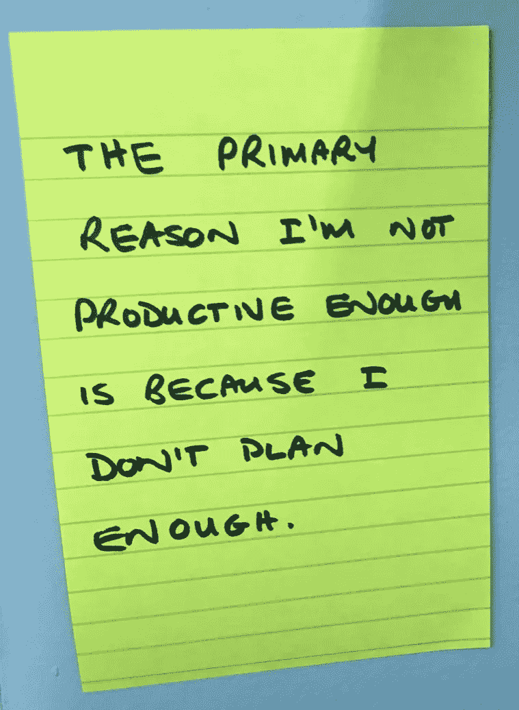

# 生产力最重要的领先指标

> 原文：<https://medium.com/swlh/the-single-most-important-leading-indicator-of-productivity-fcdab4341b18>

Photo by [rawpixel](https://unsplash.com/photos/Lh_bn9SgRSY?utm_source=unsplash&utm_medium=referral&utm_content=creditCopyText) on [Unsplash](https://unsplash.com/search/photos/goals?utm_source=unsplash&utm_medium=referral&utm_content=creditCopyText)

对我们大多数人来说，生产率有点像圣杯。我们知道，如果我们能够超级高效，我们将完成更多的工作，我们将更快地朝着我们的目标前进，我们将有时间花在让我们的生活更加充实的事情上。

然而，对我们许多人来说，生产率仍然是一个难以实现的目标。

正确的系统可以解决我所有的生产力问题
我一生都在研究生产力。一个系统总是有希望的，如果我们忠实地执行它，它会神奇地导致一个更有生产力的生活。这个系统是解药——它会解决我所有的问题。我甚至编写了自己的系统来帮助我提高效率(我成长为一名软件开发人员)。

但是不管什么系统许诺了治疗我效率低下的方法，我似乎从来没有坚持过一个系统。他们都没有兑现承诺。

# 内疚恶魔伸出手指

几周前，我一大早走进我的办公室。我“迅速”检查了我的电子邮件。一封电子邮件让我偏离了正题，去检查一些看起来很有前途的新工具，不知何故让我检查了我的中等统计数据，在我知道之前，一个小时已经过去了，我仍然没有完成我计划的事情。

我内心的负罪感立即坐了起来，用手指着我:“你没有效率！”他的工作完成了——我立刻感到内疚，因为我没有像自己承诺的那样富有成效。

**找到根本原因**
像其他许多时候一样，我的工作效率没有达到自己的预期，我试图分析当时的情况。我不只是感到内疚和匆忙完成工作，而是反思是什么导致了我的良好意愿被忽视。因为真正的生产力学生(正如我所想的)会寻求持续改进那些不起作用的东西，而不是抛弃这个系统去寻找一个更好的。

这一次，不知何故，我有了一个小小的顿悟，似乎挥之不去。

# 小小的顿悟

这个小小的顿悟——或者说洞察力——立即挂在了我工作的地方旁边的墙上:

但是等等，我听到你说——这当然不是新的？当然不是。许多其他人写道，计划是高效的核心部分。我不是第一个意识到这一点的人。

但是问题来了:我们可以一次又一次地听到深刻而有见地的事情，却没有真正理解它如何影响我们个人，如何让它成为我们生活的一部分，从根本上改变我们的所作所为和思考方式。

再说一次，这很正常——我们通常没有正确的精神状态去真正欣赏深刻的东西。对我们来说，这可能需要时间来实现。这没关系。

这一次对我来说发生的是一个额外的洞察力，这是我以前没有的。

# 生产力最重要的领先指标

请注意，有两种指标:

*   领先指标让你在事情发生之前就知道可能会发生什么。例如，气压下降表明天气可能会发生变化，通常是下雨或暴风雨。
*   **滞后指标**告诉你发生了什么——在事实之后。例如，失业率告诉你失业人数上升或下降。

我小小的个人顿悟让我意识到，有一个单一的领先指标可以衡量我一天的工作效率:

> 确切地知道你今天需要完成什么是生产力的唯一最重要的领先指标。

当我早上走进办公室时，我确切地知道我今天需要做什么，我很可能会度过富有成效的一天。相反，如果我走进办公室，对我需要做什么只有一些模糊的想法，我肯定不会有效率。

# 领先指标的酷之处在于

生产率专家喜欢领先指标。它们会在事情发生之前告诉你可能会发生什么——这给了你改变事情的机会，这样不同的事情更有可能发生。

例如，当你早上走进办公室开始工作时，你不太清楚今天需要完成什么，你可能有时间在开始工作前做一些规划。有可能你会有一个更有成效的一天。

同样，营销效果是未来销售的领先指标。如果你的营销没有效果(或者你没有做任何营销)，你未来的销售可能会很惨淡。但是，如果你加大营销力度，或者让营销更有效，你将来可能会有更好的销售业绩。

# 使用领先指标提高您的生产力

如果你确切地知道当天需要完成什么，你就更有可能度过富有成效的一天。如果你接受这是一个领先指标，你可以开始做一些事情来确保你每天走进办公室时都知道你需要做什么。

但是你的日常工作当然是更大图景的一部分——你不只是日复一日地工作。这涉及到一个更大的图景，一个或多个你正在努力实现的长期目标。

因此，今天的工作是我们本周需要完成的工作的一部分，而这又是我们这个月需要完成的工作的一部分，以此类推。实际上，我们可以从今天“缩小”到本周、本月等等，直到我们面前有一幅大图。

它看起来有点像这样:

*   我知道我今天需要做什么；因此
*   我需要在前一天计划好每一天；因此
*   我应该清楚地知道我每周需要做什么；因此
*   我需要提前计划好我的周计划；最后
*   我需要知道我想去哪里。

按照正确的计划顺序，我需要知道我想去哪里，这样我就可以计划如何到达那里，这让我可以计划未来几周，这又让我可以计划下周的每一天。

各级领先指标
每次放大或缩小时，我们可以查看领先指标，以显示我们实现大目标的可能性有多大。知道我们要去哪里是我们到达那里的可能性的领先指标。知道我们每周需要做什么是我们有多大可能在那个方向上取得进展的主要指标。直到最后，如果我们知道今天需要完成什么，我们就有可能度过富有成效的一天。

# 分心是生产力杀手

我小小的顿悟还有一部分帮助我变得真正高效:

> 在手头的任务完成之前，忽略其他一切。

有太多的分心事物争夺我们的注意力，以至于我们很容易分心——而分心是生产力杀手。因此，我们需要培养关闭所有外界干扰的能力，这样我们才能完成面前的任务。没有通知，没有铃声让我们知道有新邮件，除了完成我们面前的任务，世界上没有什么是重要的。

像激光一样集中注意力——忽略其他一切——直到当前的任务完成。

# 摘要

领先指标告诉你某事发生的可能性有多大。以下每个领先指标将告诉我们实现大目标的可能性有多大:

*   我们知道我们要去哪里(目标是什么)；
*   我们有一个清单，上面列有我们需要做的事情。
*   我们知道下周我们需要做什么才能到达那里；和
*   走进办公室之前，我们知道今天需要做什么。

这些领先指标是我们实现目标的最佳机会。如果这些领先指标指向正确的方向，那么我们需要学习如何忽略其他一切，这样我们才能完成下一个任务。下一个，再下一个。这就是我们进步的方式。

你的领先指标看起来如何？

*原载于 2019 年 2 月 18 日*[*blog.britewrx.com*](https://blog.britewrx.com/the-single-most-important-leading-indicator-of-productivity/)*。*

## 这篇文章发表在 [The Startup](https://medium.com/swlh) 上，这是 Medium 最大的创业刊物，拥有+425，678 名读者。

## 在这里订阅接收[我们的头条新闻](https://growthsupply.com/the-startup-newsletter/)。

