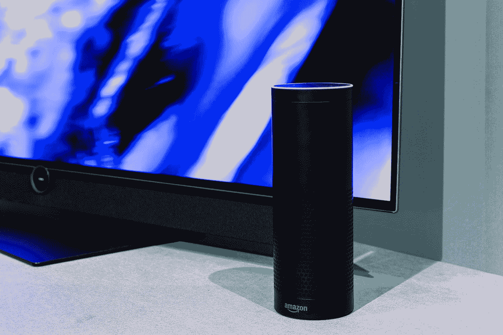

# 我做过的最明智的个人理财决定是“剪断脐带”

> 原文：<https://medium.com/swlh/the-smartest-personal-finance-decision-i-ever-made-was-cutting-the-cord-35f722705132>

大多数人应该放弃有线电视。

Photo by [Loewe Technologies](https://unsplash.com/@loewe?utm_source=medium&utm_medium=referral) on [Unsplash](https://unsplash.com?utm_source=medium&utm_medium=referral)

他的故事不是为了推销任何产品。除了作为一名客户，我不属于本故事中提到的任何公司。我是“亚马逊生态系统”的订户这个故事不应该被视为对亚马逊所有政策的认同。我会部分…