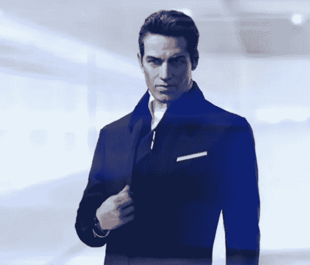

# 首席执行官中的反社会者

> 原文：<https://medium.com/swlh/the-sociopath-in-the-c-suite-ada97956577>

## “伟人”理论的有毒版本是如何扼杀公司的

[https://imgur.com/gallery/ozdgF](https://imgur.com/gallery/ozdgF)

上周，我写了一篇文章，呼吁首席执行官和创始人提高同情心和人际交往能力。作为验证我的假设的一种方法，我在我所在的几个脸书企业家和小企业团体中发布了以下声明:

> 同理心是最…