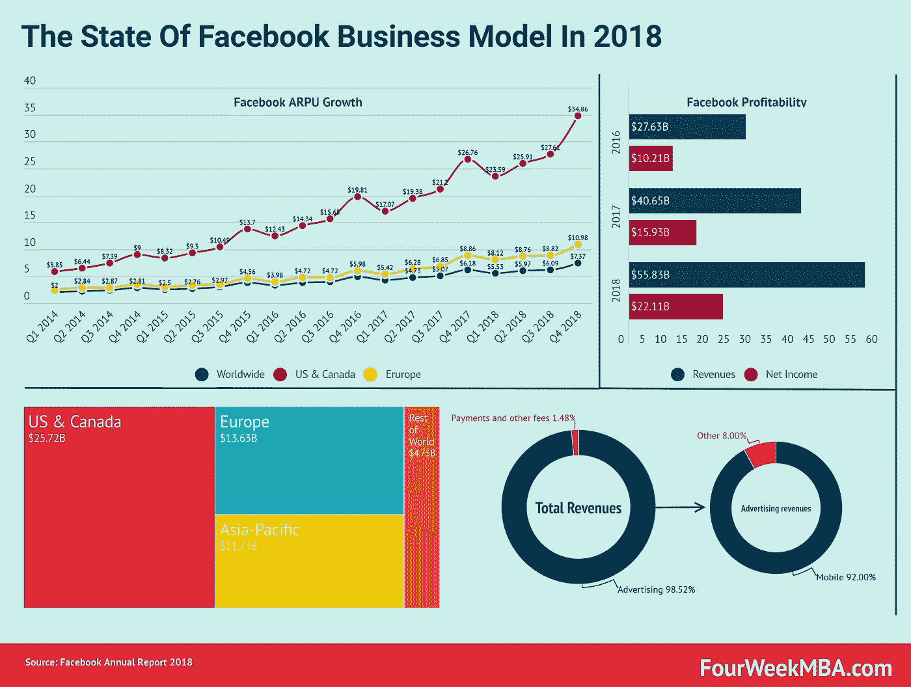
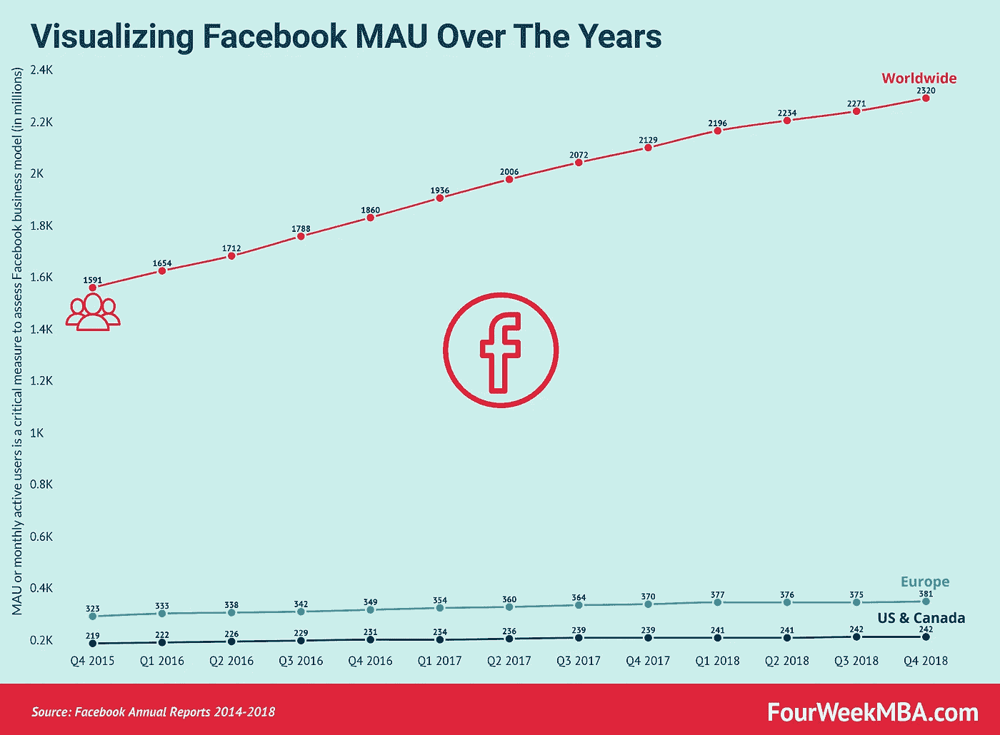
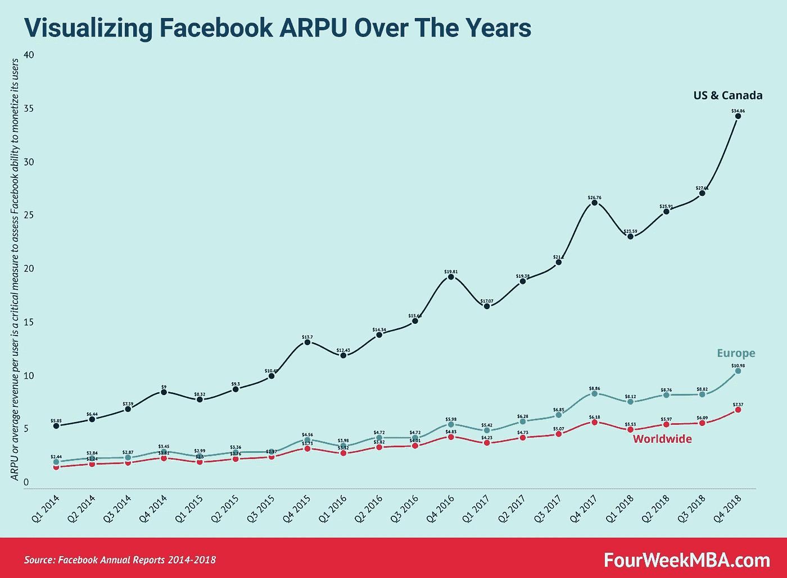
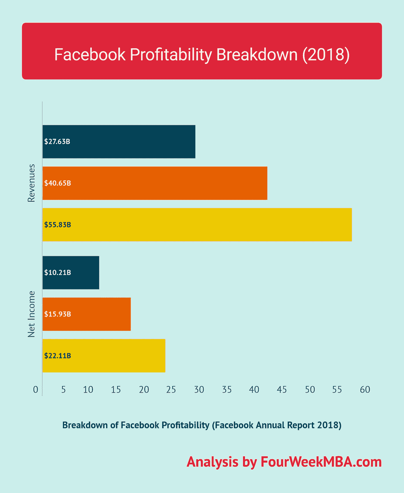
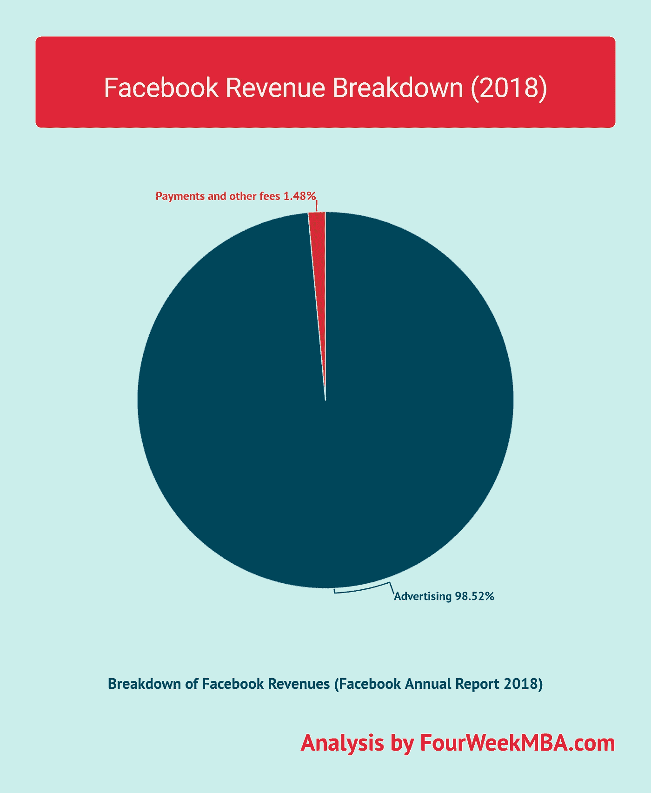
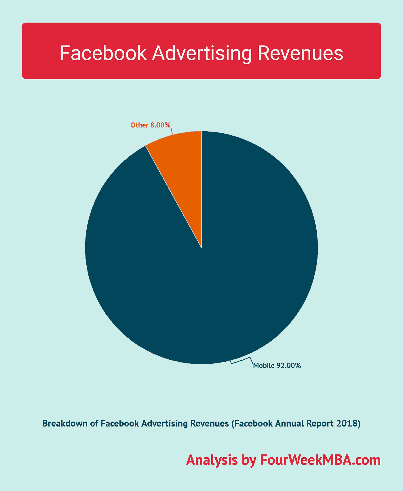
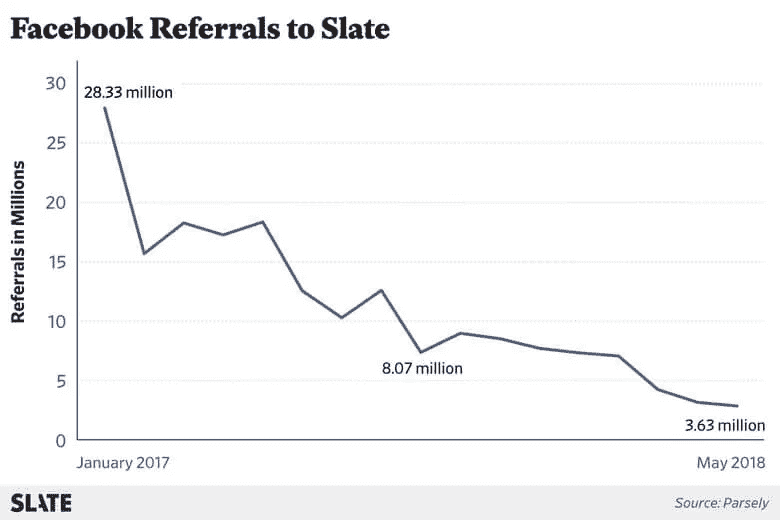

# 2018 年脸书状况[报告]

> 原文：<https://medium.com/swlh/the-state-of-facebook-2018-report-a4062ba672bd>

对于脸书公司来说，2018 年并不轻松。经历了几起丑闻，马克·扎克伯格被召入国会，我们一次又一次地听到越来越多的用户离开平台的故事。

在这份报告中，我们剖析了脸书 2018 年全年的关键数据，以了解其[商业模式](https://fourweekmba.com/what-is-a-business-model/)的状况。

在之前的报告中，我已经注意到，尽管如此，看看 2018 年第三季度[脸书](https://fourweekmba.com/how-does-facebook-make-money/)的数据，整体业务看起来不错。

**阅读** : [移动广告如何推动脸书增长](https://fourweekmba.com/facebook-mobile-advertising-growth/)

2018 年还是这样吗？

# 脸书·毛和 ARPU

随着[脸书通过广告](https://fourweekmba.com/how-does-facebook-make-money/)将其用户货币化，它需要能够让人们每天都回来，并每月定期使用它。就此而言，[脸书](https://fourweekmba.com/how-does-facebook-make-money/)追踪一个叫做 [MAU 的指标，即每月活跃用户](https://fourweekmba.com/facebook-mobile-advertising-growth/)。

MAU 衡量有多少用户在 30 天内至少回到脸书一次。在计算 MAU 时，脸书没有考虑 Instagram，只考虑了脸书和 Messenger 的用户。

通过观察这些年来的 MAU，我们可以注意到美国和加拿大的增长是如何停滞的，欧洲保持了一点增长，而全球范围内增长显著。2018 年，全球 MAU 增长至 23.2 亿用户，与 2017 年相比增长了 9%。

然而，这主要是由亚太地区(从 2017 年的 8.28 亿用户到 2018 年的 9.47 亿用户)和世界其他地区(从 2017 年的 6.92 亿用户到 2018 年的 7.5 亿用户)的增长推动的。

即使这对平台来说是一个好的迹象，与美国和加拿大相比，脸书对这些用户的货币化程度更低。

脸书的货币化战略怎么样？

尽管美国和加拿大的增长停滞不前，但另一个关键指标 ARPU 或每用户平均收入却大幅增长。我们将在下面的段落中看到是什么推动了增长。

# 分解数字

2018 年，[脸书](https://fourweekmba.com/how-does-facebook-make-money/)营收达到 558.4 亿美元，同比增长 37%。这些收入主要由广告构成。事实上，广告收入为 550.1 亿美元，同比增长 38%。

[脸书是一棵摇钱树](https://fourweekmba.com/how-does-facebook-make-money/)(就目前而言)，令人难以置信的是它的盈利能力。脸书 2018 年的净收入为 221.1 亿美元，利润率为 39.6%。相比之下，Alphabet Inc .(Google)2018 年的整体净利润率为 22.4%。

如果我们看看 2018 年的 ARPU，[脸书](https://fourweekmba.com/how-does-facebook-make-money/)全球 ARPU 为 24.96 美元，比 2017 年增长了 24%。ARPU 在欧洲增长了 34%，在美国增长了 33%，在世界其他地区增长了 21%，在亚太地区增长了 20%。

用户群的增长主要是由亚太地区和世界其他地区推动的。

# 脸书全力以赴做广告

正如[脸书](https://fourweekmba.com/how-does-facebook-make-money/)2018 年度报告“*所指出的，我们几乎所有的收入都来自广告。*

因此，脸书没有使其商业模式多样化，而是变得更加依赖广告，广告在 2018 年占其总收入的 98%以上。

[脸书广告收入](https://fourweekmba.com/how-does-facebook-make-money/)是通过在脸书、Instagram、Messenger 和第三方附属网站或移动应用上展示广告产品而产生的。

更准确地说，营销人员根据印象或用户通过脸书采取的一系列行动(点击、分享、喜欢等)支付广告费用。

# 是什么推动了脸书的增长？

脸书的增长主要是由移动广告推动的，移动广告占总广告收入的 92%。移动设备广告收入的增长推动了这一增长。

[脸书](https://fourweekmba.com/how-does-facebook-make-money/)已经过渡到移动优先，因为它预见到消费者对移动设备习惯的改变。这取得了很好的回报，2017 年脸书移动广告收入占其总广告收入的 88%，2018 年保持增长，占其总广告收入的 92%。

2018 年广告收入的增长可以细分为:

*   广告投放数量增加了 22%
*   每条广告的平均价格增长了 13%(2017 年增长了 29%)

影响这一增长的主要因素是:

*   广告投放的增长是由用户及其参与度的增加推动的
*   脸书产品上展示的广告数量和频率增加
*   正如脸书年度报告中所指出的，其增长是由“现有营销人员的支出增加**，在我们平台上投放广告的营销人员数量增加，以及这些广告的质量、相关性和表现”**推动的

需要注意的一点是，现在很难说增加的预算是因为营销人员愿意在脸书广告库存上花费更多，还是因为脸书广告变得更贵了。理解这一点很重要。

事实上，我已经分析了脸书有机到达在 2018 年是如何下降的，我把一个流行的出版物《石板:

然而，随着脸书的有机覆盖范围下降，为了让出版商和营销人员接触到他们想要的受众，他们不得不购买更多的广告库存。

因此，现在还很难说预算增加是否是因为这种现象。一个信号可能指出，随着脸书变得更贵(贵了 13%)，营销人员确实心甘情愿地增加了他们的预算。然而，没有 2017 年那么多(比前一年贵 29%)。

一个问号留在这里:如果营销人员只是因为脸书广告变得更贵而增加支出，我们能指望这种情况会持续下去吗？

第二个因素是 Instagram，很难从官方数据中剖析出来。事实上，由于脸书没有公布 Instagram 数据的细目分类，很难说它对其整体底线有多大贡献。然而，我们可以假设它做了大时间。

这是因为脸书的广告收入是通过在脸书、Instagram、Messenger 和第三方附属网站或移动应用程序上展示广告产品产生的。

**阅读** : [广告经济:脸书赚钱机器内部](https://fourweekmba.com/facebook-advertising-business/)

# 关键要点

*   移动业务正在推动脸书的增长，现在它占其总广告收入的 92%
*   2018 年，脸书全力投入广告业。它的商业模式没有变得更加多样化。恰恰相反，广告现在占其收入的 98.5%
*   脸书用户群(包括脸书和信使)在美国和加拿大停滞不前
*   由于亚太地区(从 2017 年的 8.28 亿用户到 2018 年的 9.47 亿用户)和世界其他地区(从 2017 年的 6.92 亿用户到 2018 年的 7.5 亿用户)的大幅增长，脸书的用户群在欧洲保持了小幅增长，在全球范围内也保持了增长
*   尽管如此，美国和加拿大的增长停滞，脸书 ARPU 却大幅增长。为什么会这样？第一个明显的原因是，脸书正在通过移动设备赚钱，似乎越来越多的营销人员加入了这个平台(我们无法从其财务数据中得知具体数字)，这些营销人员正在花费更多。与此同时，脸书的广告“表现”更好
*   Instagram 可能会推动脸书的增长
*   脸书在 2018 年的价格上涨了 13%，但没有 2017 年贵 29%那么多
*   越来越多的营销人员正在加入这个平台，并在广告上投入更多
*   营销人员可能会在广告上花费更多，这也是因为脸书切断了他们的有机联系。简而言之，广告仍然是接触脸书观众最有效的手段
*   2018 年，脸书的利润率为 39.6%，这使得它(目前)成为一棵摇钱树，甚至超过了谷歌的 Alphabet(2018 年的利润率为 22.4%)

*原载于 2019 年 3 月 3 日*[*【fourweekmba.com*](https://fourweekmba.com/facebook-report-2018/)*。*

## 这篇文章发表在 [The Startup](https://medium.com/swlh) 上，这是 Medium 最大的创业刊物，拥有+431，678 名读者。

## 在此订阅接收[我们的头条新闻](https://growthsupply.com/the-startup-newsletter/)。

