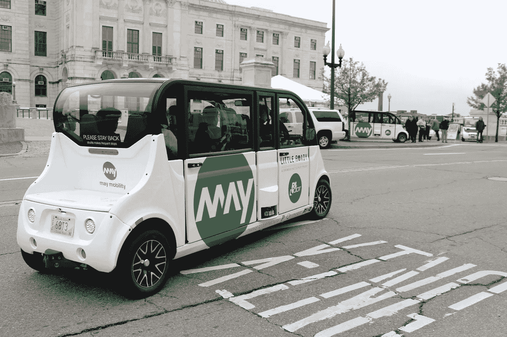

# 罗德岛州正在试行无人驾驶穿梭车队，为通勤者提供免费乘车服务

> 原文：<https://medium.com/swlh/the-state-of-rhode-island-is-piloting-a-driverless-shuttle-fleet-by-giving-free-rides-to-commuters-9895d86356b6>

## 该项目是该国最长的免费公共交通路线

Courtesy Photo

*[*以下片段*](https://www.americaninno.com/rhodeisland/inno-news-rhodeisland/little-roady-autonomous-vehicle-pilot-project-comes-to-the-ocean-state/) *最初于 2019 年 6 月 19 日通过* [*罗德岛创新*](https://www.americaninno.com/rhodeisland/) *发布，经允许在此重新发布。**