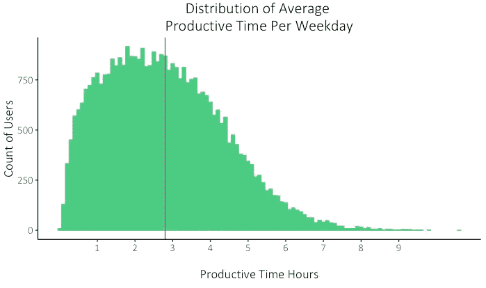

# 2019 年工作与生活平衡的状态:我们通过研究 1.85 亿小时的工作时间学到了什么

> 原文：<https://medium.com/swlh/the-state-of-work-life-balance-in-2019-what-we-learned-studying-185-million-hours-of-working-time-e69b7575d819>

*Read the full report on RescueTime:* [*https://blog.rescuetime.com/work-life-balance-study-2019/*](https://blog.rescuetime.com/work-life-balance-study-2019/)

随着把我们的工作日装进口袋的能力和“永远在线”的工作文化的不断兴起，难怪这么多人在工作与生活的平衡中挣扎。

根据[哈佛商学院的一项调查](https://hbr.org/2009/10/making-time-off-predictable-and-required)，94%的服务人员每周工作 50 多个小时。虽然有些人声称长时间工作是必要的，但一项又一项研究表明，当我们失去工作与生活的平衡时，每个人都会受到影响。

一旦我们超过了工作时间的某个阈值，我们的[睡眠就开始受到损害](https://hbr.org/2015/08/the-research-is-clear-long-hours-backfire-for-people-and-for-companies)；我们更容易感到沮丧和压力。甚至[更难沟通、协作和完成工作。](https://blog.rescuetime.com/overworked/)

我们在 [RescueTime](https://www.rescuetime.com/?utm_source=Blog) 的使命是帮助你找到平衡，把更多的时间花在对你真正重要的事情上。为了帮助你实现这个目标，**我们分析了 1.85 亿个工作时间的匿名和汇总数据，这些数据是关于去年 RescueTime 用户如何度过他们的时间的。**

**关键要点:**

*   员工平均每天只有 2 小时 48 分钟的生产设备时间
*   21%的工作时间花在娱乐、新闻和社交媒体上
*   28%的员工在早上 8:30 前开始一天的工作(5%的员工在早上 7 点前开始工作)
*   40%的人在晚上 10 点后使用电脑
*   26%的工作是在正常工作时间之外完成的
*   每年有 89 天(约 50%的周末),员工平均在工作时间之外至少工作 1 小时
*   我们平均每 6 分钟检查一次电子邮件和即时消息
*   我们一天中有 40.1%的时间是用通讯工具进行多任务处理的
*   2018 年最容易分心的日子是 11 月 26 日和 7 月 7 日(感恩节后的周一和 7 月 4 日)

RescueTime 通过屏蔽令人分心的网站，并为您提供关于您如何在数字设备上度过时间的深度报告，帮助您找到工作与生活的平衡。****。****

# *高层次的工作生活平衡:人们每周工作多少？*

*根据 2014 年的一项研究，美国人现在平均每周工作 47 小时，这是世界上最高的数字之一。但是那段时间是怎么度过的呢？*

*当我们查看自己的数据时，我们发现普通知识工作者每天仅在电脑上花费的时间就超过了 5 个小时。这还不包括花在开会、打电话、查看电子邮件和移动设备空闲时间上的时间(根据[不同的](https://www.themuse.com/advice/how-much-time-do-we-spend-in-meetings-hint-its-scary) [研究](https://www.theatlantic.com/business/archive/2014/12/the-wasted-workday/383380/)，这些会给你的工作日增加 50%到 100%的时间)。*

**

*就其本身而言，在你的设备上呆上 5 个小时似乎不是问题。不幸的是，这 5 个小时并不完全富有成效。事实上，他们远非如此。*

# *工人平均每天只花 2.8 小时在生产任务上*

*看看*人们如何度过 2018 年，我们发现**知识工作者平均每天只有 2 小时 48 分钟用于生产性任务(或每周 14 小时 8 分钟)。****

**

*剩下的时间用于中性活动(1 小时 6 分钟)和分散注意力的活动(1 小时 12 分钟)。事实上，平均 21%的工作日花在娱乐、新闻和社交媒体上。*

*如果你很好奇，2018 年时间花费的平均细目计算如下:*

*   *1 小时的沟通和日程安排*
*   *36 分钟的商务任务*
*   *36 分钟的设计和组成*
*   *软件开发 42 分钟*
*   *24 分钟关于参考和学习*
*   *公用事业 30 分钟*
*   *新闻网站 12 分钟*
*   *社交媒体 18 分钟*
*   *娱乐 30 分钟*

# *这些时间是如何度过的:“平均”一天是什么样子的？*

*深入了解人们是如何度过工作时间的，有几个数据很突出。*

*先来看看 ***什么时候*的人最有可能开始一天的生活**。*

**

*根据我们的数据，平均来说，人们在早上 9:30 开始使用他们的数字设备，28%的人在早上 8:30 之前开始工作，5%的人在早上 7 点之前开始一天的工作。*

*然而，当我们按工作角色进行细分时，会出现一些变化。首先，**从事支持工作的人更有可能更早开始一天的工作**(更接近上午 8:30)，而设计师和学生的平均开始时间最晚(上午 9:40 左右)。*

# *40%的人在晚上 10 点后使用电脑*

*结束时间呢？通过观察人们停止使用数字设备的平均时间，我们描绘了一幅无法断开连接的画面。*

*虽然很多人在下午 5-6 点结束了一天的工作，但**近 40%的人在晚上 10 点后继续使用他们的设备。** ( ***注:*** *这是只花在台式电脑和笔记本电脑上的时间。不是智能手机。*)*

**

*虽然我们不能肯定地说这是花在工作上的时间，但它确实表明了我们的数字设备在多大程度上占据了我们的生活——在某些情况下，我们一天中有 12 个多小时都在使用数字设备。*

****想知道你是如何在你的数字设备上度过时间的吗？RescueTime 为您提供了深入的报告，因此您可以建立更好的数字习惯。*** [***免费试用***](https://www.rescuetime.com/?utm_source=Blog) ***。****

# *精疲力竭和过度工作:我们把 26%的工作带回家*

*花在设备上的时间越长，用于生产性工作的时间越少，这意味着我们会更早、更晚甚至在周末工作。根据一项调查，33%的工薪阶层说他们在周末工作。*

*在我们自己的数据中，我们发现平均来说，只有 74%的工作是在正常工作时间完成的。换句话说，我们把超过四分之一的工作带回家。*

*对于我们在工作时间之外所做的 26%的工作，71%发生在工作之前或之后(大部分是之后)，而 29%发生在周末。*

*还有这种工作时间以外的工作是什么时候发生的？*

*查看一整年的数据，我们发现，平均而言，一年中有 89 天**员工在正常工作时间之外至少*工作了* 1 小时，有 41 天至少额外工作了 2 小时，有 20 天至少额外工作了 3 小时。***

*更糟糕的是，其中 28 次是在周末，这意味着平均来说，我们在 1/2 的周末时间里要花一个小时或更多的时间在工作上。*

# *工作与生活平衡的最大威胁:是什么阻碍了事情的完成？*

*工作场所的分心、浪费时间，以及我们做事情的效率低下，都增加了我们失去工作与生活平衡的可能性，最终导致我们在工作时间之外工作。*

*根据我们的数据，以下是一些最严重的违规者:*

# *沟通超载:我们每 6 分钟检查一次电子邮件和即时消息*

*问问大多数人他们一天的大部分时间都在哪里，你会听到电子邮件、Slack 或其他一些交流工具。*

*当我们查看[不同职位的沟通时间](https://blog.rescuetime.com/honest-job-description/)时，我们发现**软件开发人员平均每天花 21%的时间在沟通上。而高管和产品经理的支出高达 37%！***

**

*然而，不仅仅是花在交流上的时间扼杀了我们集中注意力的能力。而是我们使用这些工具的频率。*

*[在我们的分析](https://blog.rescuetime.com/communication-multitasking-switches/)中，我们发现**知识型员工平均每 6 分钟检查一次电子邮件和空闲时间**(35.5%的员工每 3 分钟或更少时间检查一次。)*

*使用 RescueTime 控制你花在电子邮件、即时消息和社交媒体上的时间。 [***免费试用***](https://www.rescuetime.com/?utm_source=Blog) ***。****

# *多任务处理:40%的知识工作者从未有超过 30 分钟的专注时间*

*我们中的大多数人都把时间花在从一个任务跳到另一个任务上，或者试图通过多任务处理来弥补失去的时间。(平均来说，[我们每天使用 56 个不同的应用程序和网站，并在它们之间切换近 300 次](https://blog.rescuetime.com/225-million-hours-productivity/)。)*

*众所周知，除了 1-2%的人之外，对于大多数人来说，一心多用是不可能的。为了做到最好，我们需要长时间的专注。然而，[根据我们的研究](https://blog.rescuetime.com/communication-multitasking-switches/)， **40%的知识工作者在一个工作日中从未有过连续 30 分钟以上的专注时间。***

**

*[单看用通讯工具进行多任务处理](https://blog.rescuetime.com/communication-multitasking/)，**大多数人平均在工作日花 40.1%的时间进行多任务处理**。*

*换句话说，你每天花在生产性任务(无论是写作、软件开发还是设计)上的将近一半时间也花在了同时处理电子邮件和即时通讯上。*

# *分心:在工作时间，我们 21%的设备时间花在了令人分心的网站上*

*工作场所充满了干扰。但是一些最糟糕的不是同事、会议或电子邮件。而是我们自己对分散注意力和非生产性活动的吸引。*

*正如我们之前所写的，**我们在工作时间使用设备的时间有 21%花在了娱乐、新闻和社交媒体上。**11 月 26 日和 7 月 7 日(感恩节后的周一和 7 月 4 日)花在分散注意力的活动上的时间最多。*

*[RescueTime 的 FocusTime](https://www.rescuetime.com/?utm_source=Blog) 功能允许你在想要保持专注的时候[屏蔽分散注意力的网站](https://blog.rescuetime.com/getting-the-most-out-of-rescuetimes-website-blocking/)(同时如果你愿意的话，还允许你解除屏蔽)。*

**

*纵观我们 2018 年的数据，**被屏蔽最多的前 5 个网站是:***

1.  ***Youtube:**163，000 个区块(15.2%的时间未被封锁)*
2.  ***脸书:**125，000 个数据块(12%的时间畅通无阻)*
3.  ***Reddit:** 47k 块(2.7%的时间被解除封锁)*
4.  ***Twitter:** 44k 块(16%的时间是畅通的)*
5.  *亚马逊: 17k 块(31%的时间是畅通的)*

*(有些干扰比其他干扰更不可抗拒。虽然网飞不在我们屏蔽最多的五个网站之列，但我们的数据显示，用户在 50.6%的时间里屏蔽了它。)*

# *你的工作生活平衡受到了冲击。但是你有办法保护它。*

*什么是工作与生活的平衡对每个人来说都有不同的意义。但在查看了 1.85 亿小时工作时间的数据后，我认为可以肯定的是，工作和“其他一切”之间的界限已经变得越来越模糊。*

*我们每天拥有的时间比我们想象的要少，因此，为了跟上进度，我们不得不在晚上和周末加班。但不一定要这样。*

*意识是关键。我们越是能够设定并坚持我们工作日的适当界限，抵消那些会占用我们生产时间的分心、多任务和交流过载，我们就越能找到平衡，保持健康和快乐，并完成更多工作。*

****寻找一点额外的帮助？RescueTime 为你提供了保持专注、高效工作和找到真正的工作与生活平衡所需的工具和见解。*******。*****

****

## **这篇文章发表在 [The Startup](https://medium.com/swlh) 上，这是 Medium 最大的创业刊物，拥有+417，678 名读者。**

## **在这里订阅接收[我们的头条新闻](http://growthsupply.com/the-startup-newsletter/)。**

****