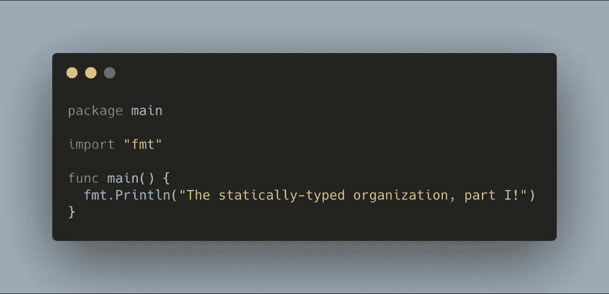

# 静态类型的组织，第一部分

> 原文：<https://medium.com/swlh/the-statically-typed-organization-part-i-9c39f338368>

随着软件组织的成长，协调工作变得越来越困难。

让我试着说明这一点。假设您正在开发一个新的工作流，该工作流要求您向移动应用程序的一些客户端发送推送通知。另一个团队正在维护`OutboundMessagingService`，这是一个用 Java 编写的微服务，处理发送推送的所有混乱细节…