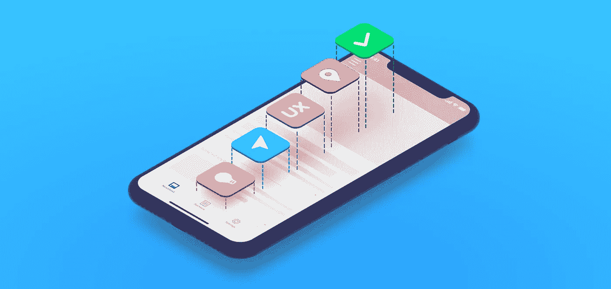
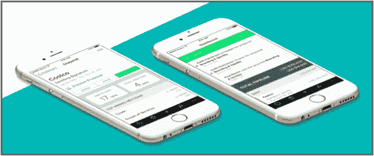
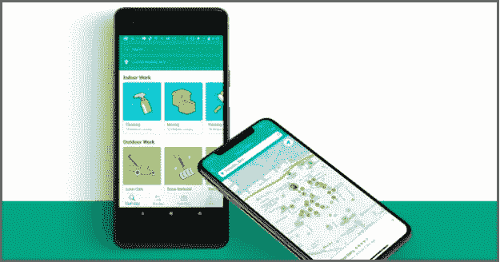
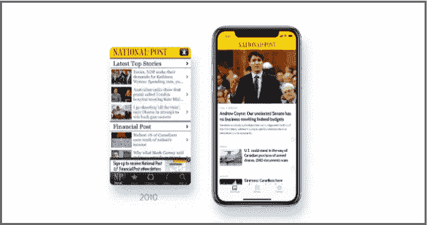
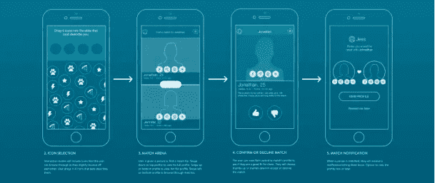
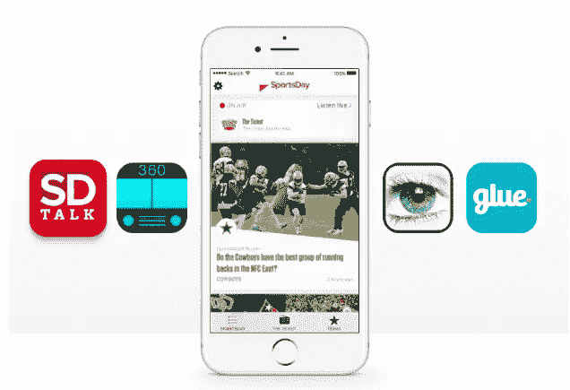

# 2019 年打造优秀 iPhone 应用的循序渐进过程

> 原文：<https://medium.com/swlh/the-step-by-step-process-for-building-great-iphone-apps-in-2019-eb2f03f084f>

在这篇文章中，你将了解到 [MindSea](http://mindsea.com/) 团队将 iPhone 应用带入生活的一步一步的过程。没错——我们正在拉开帷幕！

下面是我们今天将带您完成的 3 步流程:

*   第一步:从你的移动应用策略开始
*   步骤 2:规划你的应用程序的 UX(在你编码之前)
*   步骤 3:创建您的产品路线图

但是在我们一头扎进去之前，有一个问题我们必须回答:

**你为什么要听我们要说的话？**

在过去的 10 年里，我们一直在为 B2B 和 B2C 品牌 years 公司、新闻媒体等等——开发移动应用。数百万用户下载了我们开发的应用程序。

我们和 SaaS 的公司合作过，比如 [Proposify](https://mindsea.com/case-study/proposify/) :

像[亚当帮](https://mindsea.com/case-study/adam/)这样的 B2C 品牌:

像国家邮报这样的新闻媒体:

在我们所有的移动应用项目中，什么是不变的？

**我们的 3 步流程。**

我们使用同样的循序渐进的过程，我们称之为我们的[移动应用蓝图](https://content.mindsea.com/blueprint)，来构建这些和其他几十个成功的 iPhone 应用。

所以说，让我们开始吧！

# 第一步:从你的移动应用策略开始

如果你想建立一个成功的移动应用程序，你必须从一个策略开始。

在你真正写一行代码**或**构建你的第一个线框之前，你需要知道你在构建什么以及为什么。

在这一步骤中，有三件具体的事情需要关注:

# 为你的移动应用建立主要目标

在你投入开发过程之前，先退一步确定你实际上想用你的移动应用实现什么。

如果你不在一开始就设定目标，剩下的过程将会漫无目的——你不知道你是否在朝着正确的方向前进。

# 确定你的目标受众——并且要具体！

产品市场适合度很高。

你以前听过这句话:

如果你想成为所有人的一切，你将会一事无成

在规划你的移动应用程序时，确保你不是试图针对大众。定义你的受众，不要太宽泛。

但也不要在另一个方向走得太远。如果你的目标受众太小，从长远来看，你不会看到积极的投资回报。

# 只创造值得创造的东西

有想法是好事——毕竟，这是导致你开发应用的原因。

但是…

太多的想法(和太多的功能)会让你的移动应用做很多事情，但都做得很差。

你如何避免这种情况？

**关注需求。你的受众需要从你的移动应用中得到什么？**

它应该提供什么功能？

它应该解决哪些问题？

必须包含哪些功能*？*

现在就开始工作，这样可以避免以后当你不得不重新构建整个应用程序的时候做两次那么多的工作。记住:第一次迭代不一定是唯一的一次迭代，所以不要试图把所有东西都塞进你的第一次构建中。

# 步骤 2:规划你的应用程序的 UX(在你编码之前)

现在你知道你的目标是什么，你需要包括什么特性，下一步就是写代码，对吗？

没那么快。

**在** **之前，你写了一行代码……**

…你需要规划出应用程序的工作方式以及用户的旅程。然后你必须全部测试。

我们是这样做的:

# 逐屏勾勒用户旅程

构建移动应用最重要的步骤之一是:

**路线图人们将如何*实际*使用应用程序。**

如果[用户体验](https://www.apptentive.com/blog/2018/07/12/what-role-does-ux-research-play-in-creating-better-apps/)很差，你的用户会很快点击“删除”,永远消失。

为了确保从开始到结束的无缝体验，用草图和线框一屏一屏地绘制用户旅程([有工具](https://mindsea.com/tools-app-development/)可以帮助)。你可能会发现一些你不会注意到的问题。

# 创建原型和用户测试关键特性

事情是这样的:

你的第一个原型是**而不是**将会是一个完美的、被下载十亿次的、获奖的杰作。

这完全没问题！

[构建一个移动应用原型](https://mindsea.com/how-to-prototype-a-mobile-app/)并对关键功能进行用户测试是*发现错误、障碍和改进机会的最佳方式。*

如果你等到你的应用程序完成后才开始测试，你将会花费大量的时间(和金钱)来进行修改。

# 更少的开发修订=更低的开发成本

这里的想法很简单:

如果你在计划你的应用程序之前就构建了你的应用程序，你最终将会浪费宝贵的资源，重新创建大量的应用程序。

那是因为你根本不会真正知道你在建造什么。

在你真正写一行代码之前，花时间规划你的整个应用程序。然后你可以使用这个计划进行第三步。

# 步骤 3:创建您的产品路线图

既然你已经知道你的移动应用的目标是什么，你想接触谁，用户的旅程将会是什么样子，那么*差不多是*开始构建的时候了。

*(我们就快到了——我保证！)*

在开始编码之前，您需要做的最后一件事是:

**创建您的移动应用产品路线图。**

路线图应该准确地列出要做什么，什么时候做，要花多长时间，以及要花多少钱。

以下是你的路线图将为你做的三件事:

# 为您(或您的应用构建者)制定一个完整的开发计划

一个完善的产品路线图会给你一个完整的计划，告诉你需要开发什么，什么时候需要开发。

您将为您的应用程序制定技术要求，并记录您在开发过程中需要的任何 UX、开发或设计帮助。这样你就有了开始自己构建应用程序所需的一切——或者将构建工作委托给经验丰富的移动应用程序团队。

# 详细说明资金和时间要求

在开始构建之前，了解你的应用程序的成本是非常重要的。否则，你可能会陷入一个兔子洞，修改的费用远远超过最初的预算。

使用您已经记录的关于应用程序功能和 UX 的信息来创建流程的时间表。

每一步需要多长时间？

构建每个功能需要多长时间？

测试应用程序的每个部分需要多长时间？

一旦你规划出这个过程需要多长时间，你就可以计算出你的移动应用程序将花费多少钱，以及你是否需要来自移动应用程序代理机构的外部帮助。

# 加强你对投资者的推销——甚至在你的应用建立之前

这是最精彩的部分:

有了步骤 2 中的概念验证原型和深入的开发流程路线图，您就可以开始构建演示文稿并向投资者推介了。

这个应用甚至还不需要存在！

# 是时候开始构建您的移动应用程序了

最后，是时候投入并开始构建了。

您现在应该已经:

*   具有明确目标和关键功能的移动应用战略
*   详细的用户旅程
*   可供用户测试的原型
*   整个项目的路线图

现在的下一步是**构建 app** 。

无论你是单飞，依靠内部开发团队，还是与移动应用代理合作，你都已经准备好将你的移动应用带入生活。

# 现在轮到你了

就是这样:我们构建成功的 iPhone 应用程序的过程。

大幕正式拉开了！

如果你遵循这三个步骤，你将为自己的成功做好准备，并在过程中大大减少返工和修改的数量。

**这里为你快速回顾一下 3 个步骤:**

*   第一步:从你的移动应用策略开始
*   步骤 2:规划你的应用程序的 UX(在你编码之前)
*   步骤 3:创建您的产品路线图

一路寻找帮助？

我们的[移动应用蓝图](http://content.mindsea.com/blueprint)流程可以帮助你在短短三周内从头脑风暴到蓝图。您将与我们屡获殊荣的设计师、产品策略师和移动应用程序开发人员一起工作，创建您梦想中的移动应用程序。

[**今天就和产品战略家谈一谈**](http://content.mindsea.com/blueprint) **开始行动吧！**

*原载于 2019 年 2 月 22 日*[*mindsea.com*](https://mindsea.com/build-iphone-app/)*。*

## 这篇文章发表在 [The Startup](https://medium.com/swlh) 上，这是 Medium 最大的创业刊物，拥有+431，678 读者。

## 在这里订阅接收[我们的头条新闻](https://growthsupply.com/the-startup-newsletter/)。

