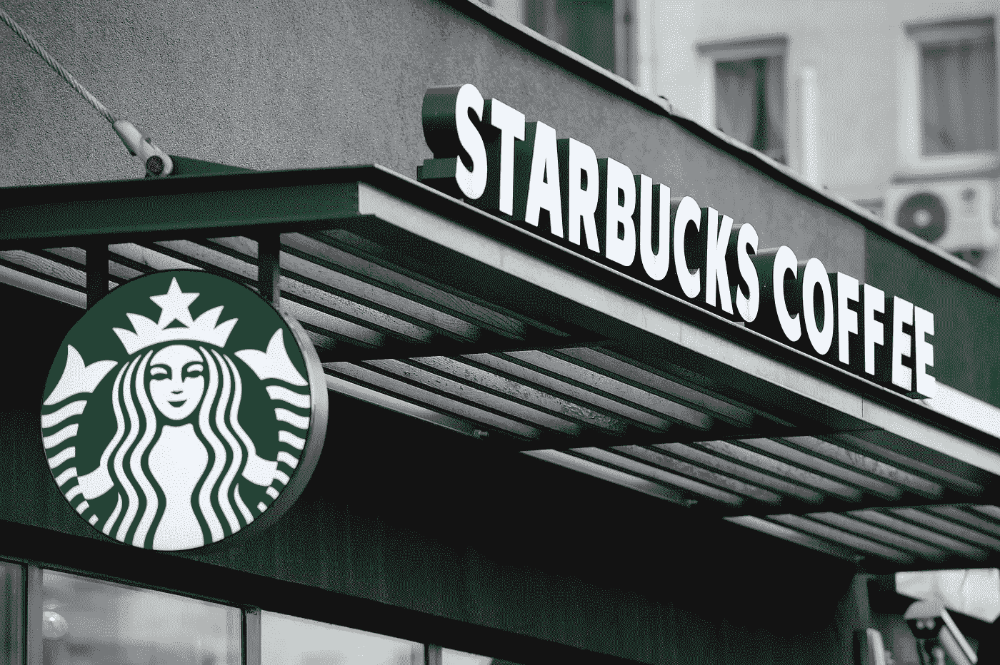

# 星巴克咖啡背后的故事

> 原文：<https://medium.com/swlh/the-story-behind-the-starbucks-coffee-bc31f77cd8fe>

品牌如何主宰咖啡行业

Photo by [Jaap Arriens](https://www.gettyimages.com/detail/news-photo/starbucks-coffee-shop-is-seen-warsaw-poland-on-april-2-2018-news-photo/941125838)

星巴克在全球拥有近 30，000 家咖啡馆，已经不仅仅是一个家喻户晓的名字。从其标志性的杯子，往往装饰着拼写错误的名字，到里面的浓缩咖啡，星巴克在过去的 47 年里从西雅图的一家咖啡豆店一跃成为 800 亿美元的庞大企业。