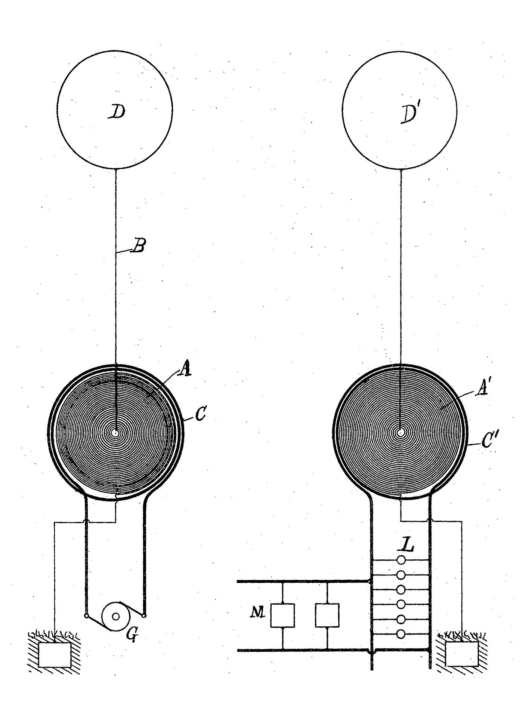

# 生物技术产业的骨骼

> 原文：<https://medium.com/swlh/the-structural-bones-of-the-biotechology-industry-db6e94985692>

一个既多样化又具有革命性的领域。

> 如果你的天赋带你走向科学、编程、生物学进步或能源突破，这些深层领域将会是最大的变革源泉。

*   比尔·盖茨，林·曼努尔·米兰达与比尔·盖茨夫妇的对话

生物医学研究和设备可能是本世纪最有前途的工业领域。经济颠覆性技术，一种颠覆整个行业的技术，如网飞到百视达，似乎刚刚在市场上崭露头角。例如，再生医学或 CRISPR 基因编辑可以改变疾病治疗的策略，从药丸或疗法到替换有缺陷的组织。

生物技术(biotech)产业的扩展远不止疾病治疗；这个名称可以适用于任何旨在直接或间接操纵活细胞的产品，包括法医技术的 DNA 指纹、农业转基因生物或替代能源的生物燃料。尽管生物技术的应用范围很广，但该行业有显著的相似性和特点；学术渊源，专注于创新(这反过来依赖于研究支出和 FDA 批准)，以及针对狭窄客户群的独特营销策略——这些方面对于理解本世纪最具革命性的行业非常重要。

**扎根于研究**

Genentech headquarters in San Francisco, California.

作为一个高度科学和专业化的领域，生物技术产业首先出现在大学研究中。斯坦福大学和加州大学研究人员努力用细菌生产胰岛素的成果基因泰克只是未来的一个信号。由于对先进科学知识的依赖，当代工业通常有着相似的根源。

生物技术的高科技性质的另一个后果是研究和开发的高成本，吸走了 20%的收入。技术本身，如基因测序、细胞培养、药物生产或医疗设备，本身可能很昂贵，但如此高成本的原因扩展到竞争。根据专利法，发明产品的公司有权控制谁生产和销售该技术，为期二十年([美国专利商标局](https://www.uspto.gov/web/offices/pac/mpep/s2701.html))。然而，一旦自申请专利起二十年过去了，其他公司就有权随心所欲地生产和销售该产品。因此，如果公司想保持其技术垄断者的地位，就必须不断创造新技术并申请新专利。

为了进一步理解这个概念，考虑红皇后假说。广受欢迎的儿童书籍*《爱丽丝梦游仙境*》的作者在续集中说，“现在，在这里，你看，你需要尽一切努力去保持在同一个地方”(卡罗尔，路易斯。*透过镜子*。).这句话是红皇后说的，因此得名，用来描述生物进化生物学中的现象，生物进化不仅仅是为了获得相对于其他物种的优势，而是为了保持自己在食物链中的地位。为了维持一个公司的运营，必须不断创新，而创新需要钱。

Sierra Sciences 是一家专注于逆转和防止人类衰老的生物技术公司，该公司总裁兼首席执行官比尔·安德鲁斯(Bill Andrews)博士在被问及未来生物技术公司进入的最大障碍是什么时表示，“资金，绝对是。”

**规章制度**

A patent diagram of a wireless electrical transmission system by Nikola Tesla

我与安德鲁斯博士讨论的另一个障碍是规章制度。为了使一种药物或设备，特别是用于医疗保健目的的，在美国销售，它必须得到 FDA 的批准。这种批准包括临床试验，对患者进行安全性、有效性和疗效的测试，这一过程可能需要 3 到 6 年。这种测试的时间和成本对小公司来说是一个巨大的障碍，也是进入的最大障碍，“成本”

然而，FDA 的批准会带来比成本和时间更多的问题。当我问安德鲁斯博士，他是否认为目前的法律体系对生物医药行业来说是令人满意的，他列举了几个对 FDA 的不满:“这些规定极其荒谬。”他说，太多的项目获得了不应该获得的批准，太多的项目没有获得应该获得的批准。因此，许多公司将他们的产品送到其他国家进行测试并投放市场。

**成本和挑战**

销售和营销对生物技术公司来说也是一个挑战，因为它们的客户范围很窄。营销的目标是卫生保健提供者、医生、医院，甚至其他更大的制药公司。广告出现在医学杂志、医学会议上，当然也通过流行的电视广告直接面向消费者。销售和市场营销可能是生物技术行业最大的支出，超过研发([第一研发](http://mergent.firstresearch-learn.com.ezproxy1.lib.asu.edu/industry_detail.aspx?pid=174&chapter=1))。

**一个美丽新世界**

生物技术世界的未来发展集中在即将到来的技术上，特别是再生和基因工程。关于遗传工程和生物技术的出版物 GEN 引用了癌症免疫疗法(利用免疫系统治疗癌症)、电子治疗设备(文章引用了电子吸入器)以及细胞和基因治疗(广泛的再生和遗传治疗)( [GEN](https://www.genengnews.com/a-lists/5-biopharma-trends-to-watch-in-2019/) )。当我问安德鲁斯医生我们目前对再生医学的理解有多复杂时，他简单地说，“我们正处于黑暗时代。”

总之，生物技术产业充满了经济和改变生活的希望，然而它比药物或设备的生产复杂得多。其商业模式受到研发支出、测试和营销中额外困难的控制。通过单独理解生物技术的各个方面，更容易从整体上看到这场最具革命性的运动。

**作品引用**

安德鲁，比尔。个人面试。2019 年 2 月 2 日

卡罗尔，刘易斯。*透过窥镜*。麦克米伦，1871 年。

盖茨比尔。"林·曼努尔·米兰达与比尔和梅林达·盖茨的对话."*脸书*，2018 年 2 月 13 日。[https://www.facebook.com/BillGates/videos/](https://www.facebook.com/BillGates/videos/)10155239754391961/。2019 年 2 月 12 日。