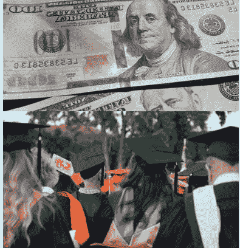
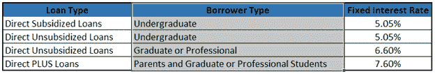
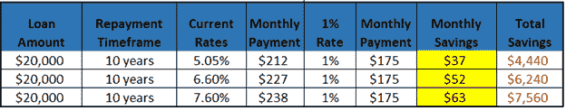

# 学生贷款危机

> 原文：<https://medium.com/swlh/the-student-loan-crisis-619b03f14b9>

## 政客们今天如何停止花言巧语，做点什么！

在过去的 30 年里，大学费用急剧增加。这些增长远高于通货膨胀或类似商品的增长。这当然导致美国人欠下 1.5 万亿美元的大学贷款债务。

哪里有重大的公共问题，哪里就有政客捶胸顿足，叫嚣着需要解决的问题。今天华盛顿特区的必要提案是关于债务免除的。让美国政府免除借款人债务的想法对许多人来说非常有吸引力，尤其是那些背负了大量学生债务的人。如果这一行动方案获得通过，将会产生其他严重的复杂情况和影响。

不幸的是，似乎国会和各级候选人都想把它作为一个谈话点或一个平台项目。我们已经看到了伊丽莎白·沃伦提出的解决方案，我相信其他 2020 年总统候选人还会提出更多方案。这些提议都没有被众议院或参议院作为法案大力推行。

华盛顿特区耍花招的现实是，国会今天可以很容易地采取行动，而不增加额外的 1.5 万亿美元的国债。这一解决方案不会消除债务，但它会帮助所有学生贷款债务人全面。这个解决方案是降低所有新学生贷款的利率，并允许现有学生贷款持有人以较低的利率合并或重新合并他们的贷款。

需要明确的是，利率不是由市场、贷款加工公司或其他任何人设定的。他们每年七月成立国会。这意味着联邦政府显然有能力减轻负担。

这些抱怨大学费用高昂的政客们将继续奖励贷款人、加工企业和美国政府。谁从你的贷款中赚钱取决于你何时获得贷款。如果你在 2010 年 6 月 30 日之前获得了联邦政府支持的学生贷款，那么私人贷款机构会提供资金，他们会将利息作为收入。如果你的贷款是在那个日期之后发放的，那么贷款是直接来自联邦政府的，现在是美国政府在赚取这笔钱，同时向贷款处理公司支付一小部分。

现在，降低利率不会消除债务总额，但它可以为债务人节省数千美元的利息成本。如果华盛顿选择将税率降至 1%，数百万美国人的月供将会减少。目前的利率是这样的:

那么，这对那些申请学生贷款的人来说意味着什么呢？我做了一些计算来显示每月的差额和总的节省。在这些计算中，我使用了 20，000 美元的贷款，这大约是今天 4 年制州立大学学位平均成本的一半，我使用了 10 年的付款期限作为标准。许多学生在大学毕业后将贷款期限延长至 15 年、20 年或 30 年，这导致支付更多的利息。利用这些数据点，我发现了以下情况:

上面用黄色突出显示的节省可以用于其他开支:租金、汽车、汽油、食品等。或者，如果债务人聪明，他们可以将额外的金额用于贷款本金。通过将此应用于本金，您将能够更快地还清贷款。

如你所见，如果国会为了学生的利益而不是哗众取宠，将会给许多美国人带来巨大的好处。不幸的现实是，我们在国会的许多代表更感兴趣的是利用这个问题来赢得选民，而不是真正做出有影响力的改变。

每年，国会在 7 月份制定下一年的利率。我还没有听到国会有人讨论降低今年的税率，所以我预计下个月不会有任何积极的变化。

*原载于 2019 年 6 月 16 日*[*【https://businessinquisitor.com】*](https://businessinquisitor.com/2019/06/16/how-to-start-fixing-the-student-loan-debt-today/)*。*