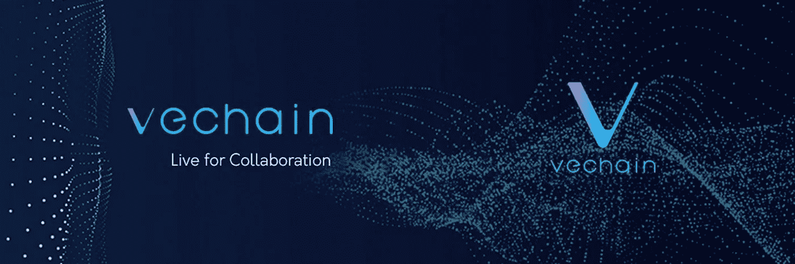
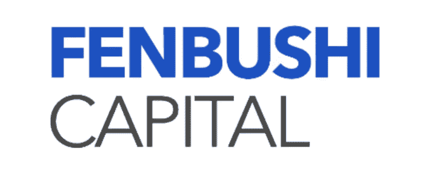
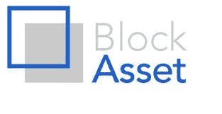
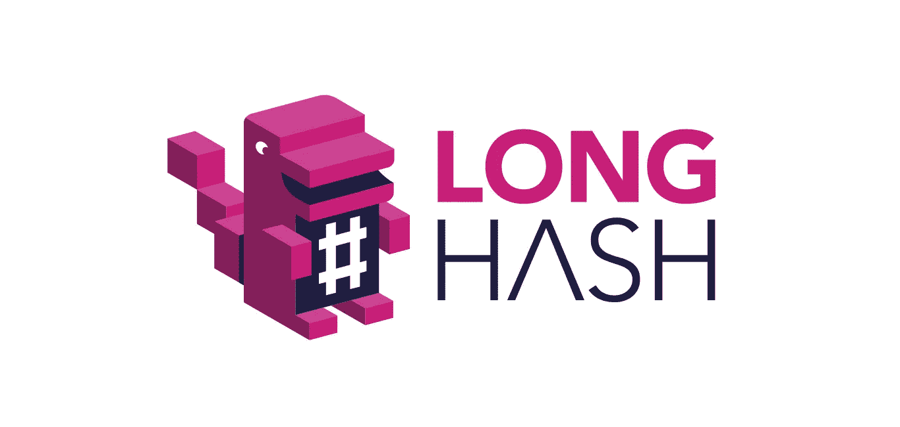
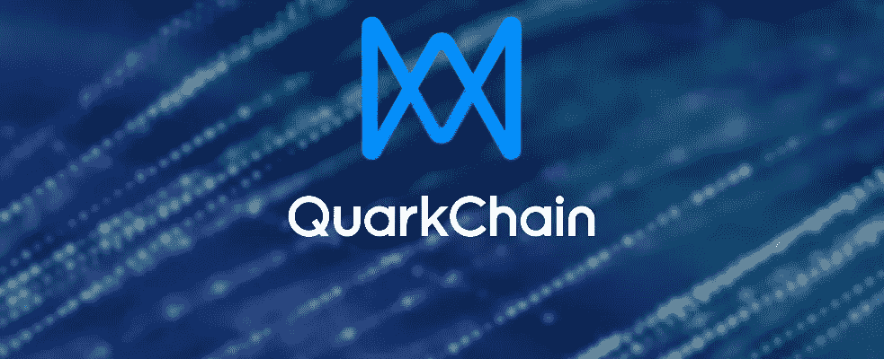
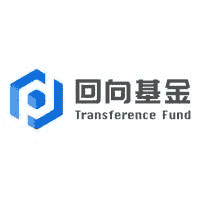
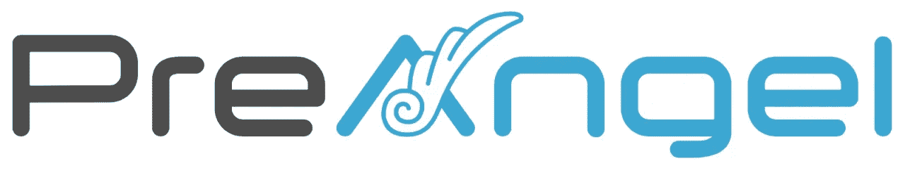
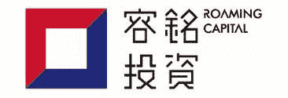
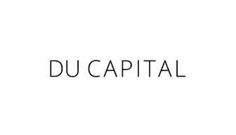
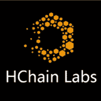

# MXC 的支持者——概述

> 原文：<https://medium.com/swlh/the-supporters-of-mxc-an-overview-4c4528a9fb9>

# 让我们先来看看机器兑换硬币？

MXC 是一家总部位于德国的非营利组织，凭借革命性的 MXProtocol 在物联网生态系统中崭露头角。MXProtocol 旨在解决 LPWAN(低功耗广域网)问题，旨在弥合不同基础设施之间的数据鸿沟。

根据白皮书

> MXProtocol 通过解决 LPWAN 数据冲突问题，为传感器提供智能投标系统以向 MXC 支付网络访问费用，以及建立连接 LPWAN 硬件和免许可区块链的链间数据市场，增强了 LPWAN 技术。

由 MXProtocol 驱动的机器兑换硬币 (MXC)旨在实现各种设备之间的支付。MXC 实现了机器对机器(M2M)交易的自动化，分散了大数据并实现了设备数据经济。MXC 的主要目的是推动数据所有者、数据接收者和数据网络主机的大规模采用，这将推动硬币在日常交易中的使用。

如果你想了解更多关于 MXC 和 MXProto col 的信息，你可以访问[网站](https://www.mxc.org)了解更多。

# 投资者

项目的质量可以由与它一起工作的人以及支持它的个人/实体来定义。让我们调查一下该项目的一些主要支持者。

# VeChain 基金会

VeChain Foundation 是一个位于新加坡的公共区块链平台，专注于为众多行业提供企业级区块链解决方案，如制药、酒类、汽车、奢侈品、零售、物流、供应链、食品和冷藏等。

# 分布施资本

总部位于中国的分不实资本成立于 2015 年，是第一家专门投资区块链公司的风险投资公司。截止到今天，分布施资本已经投资了 52 个区块链项目，包括 MXC、Hashgaurd、TOP network、GIFTO 等。

# 节点资本

据该网站介绍，Node Capital 迄今已投资了 200 家企业，主要是在区块链的项目。Node Capital 的投资组合涵盖了来自区块链生态系统各个角落的项目，包括交易所、媒体、数字资产交易、加密资产钱包、技术开发和应用、区块链数据挖掘和分析等。主要投资项目有火币、Chainup、Bgogo、BitTemple、B+、北汽、Gifto、Zipper、锦瑟金融、Coldlar、Scry、IOST、Zilliqa、Beam、nervos 等。

# 大宗资产风险投资

BlockAsset Ventures 是一家位于新加坡的加密公司。BlockAsset Ventures 的目标是利用他们在数字资产领域的多年经验，共同投资领先的数字资产组合。其他主要投资项目包括 Kyber Network、Polkado、DFINITY、Enigma 等。

# 长灰

Longhash 是一个加速开发和理解区块链技术的平台。Longhash 提供独立的数据分析和媒体评论，以及对区块链初创企业的全方位支持，包括但不限于专业服务、模块化知识共享、辅导服务和投资者外联。

# 夸克链

QuarkChain 是一个无需许可的区块链协议，旨在通过提供一个高容量的对等交易系统，使用实现分片的双层区块链架构，为区块链业务设立一个全球商业标准。QuarkChain 认为这项技术每秒可以成功处理超过 10 万笔交易。

# 转移资本管理有限公司

Transference Capital 成立于 2018 年初，是一家总部位于中国的加密基金。他们的投资组合包括 ArcBlock，Odaily，Mobile Coin，Thunder Token，Irisnet，Hashgard，HT，Lots，DCC，BITKOP，Telegram 等。

# 天使前期

PreAngel 是一只 3000 万人民币的投资基金，专注于早期互联网初创企业。每个项目的投资从 10 万到 100 万人民币不等。除了投资，PreAngel 作为“联合创始人”扮演着至关重要的角色，在创业运营、商业模式提炼、行业资源等方面提供指导。他们的投资组合包括 Pretty Instant、Smarking、Avanoo、Paperspace、Bluesmart、Weft、Pomello、STOWER 等

# 漫游资本

漫游资本在中国和美国投资了几十家创业公司。到目前为止，已有超过 20 亿元人民币投资于股权基金和数字项目。

# 杜资本

Du Capital 是一家总部位于新加坡的多阶段投资公司，专注于支持在分布式账本技术、加密资产和周围生态系统中冒险的公司。到目前为止，杜资本已经资助了 60 多个顶尖的项目，包括、IOTA、NANO、Aeternity、Selee、Theta 等

# 海恩实验室

蜂巢链实验室(HChain Labs)专注于区块链跨学科项目的孵化，包括但不限于大数据、人工智能、物联网等。他们的投资组合包括 ICO.com，JinNiu.cn，雷霆令牌，CertiK，Skycoin 等。

# 万达林资本

Wandarin Capital 成立于 2018 年，是一家总部位于台湾的投资基金，投资于区块链的项目和初创公司。他们的投资组合包括 Ultrain，Origin，Uranus，Bitmax 等。

# 结论

MXC 可以说是最有前途的物联网项目之一，因为他们的使命是将区块链与硬件联系起来。这只是冰山一角，在未来，我们可以看到更多突出的名字加入名单。

## 这篇文章发表在 [The Startup](https://medium.com/swlh) 上，这是 Medium 最大的创业刊物，拥有+446，678 名读者。

## 订阅接收[我们的头条](https://growthsupply.com/the-startup-newsletter/)。

