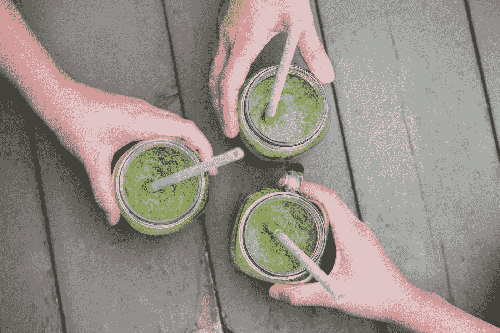

# 自我保健方法的成本和效果之间惊人的反比关系

> 原文：<https://medium.com/swlh/the-surprising-inverse-relationship-between-the-cost-of-self-care-methods-and-their-effectiveness-405f79ec6648>

## 你并不总是得到你所付出的，但他们不想让你知道这一点。

Photo by [Jose Soriano](https://unsplash.com/@josesorianophoto?utm_source=medium&utm_medium=referral) on [Unsplash](https://unsplash.com?utm_source=medium&utm_medium=referral)

对于自我保健和健康行业，业务正在蓬勃发展。我所到之处，都有产品、课程和项目为你提供更好的健康和更少的…