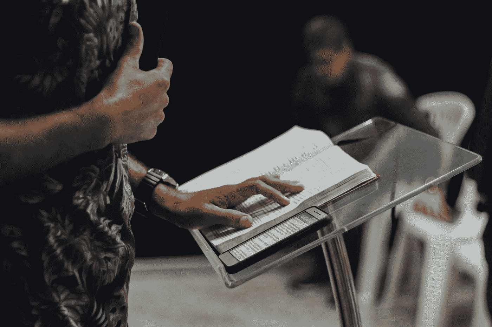

# 焦虑和兴奋之间令人惊讶的关系

> 原文：<https://medium.com/swlh/the-surprising-relationship-between-anxiety-and-excitement-42621f868dc9>

Originally published on [**JOTFORM.COM**](https://www.jotform.com/blog/managing-anxiety/)

聚在一起。如果你不能冷静下来，你会把一切都搞砸的。

我正在为一个演示做准备，突然想到:如果我不迅速冷静下来，我可能会搞砸。

通常，我对公开演讲不会太紧张，但这次感觉不同。我正在向一个我非常尊敬的同伴群体展示，我正在分享一些…