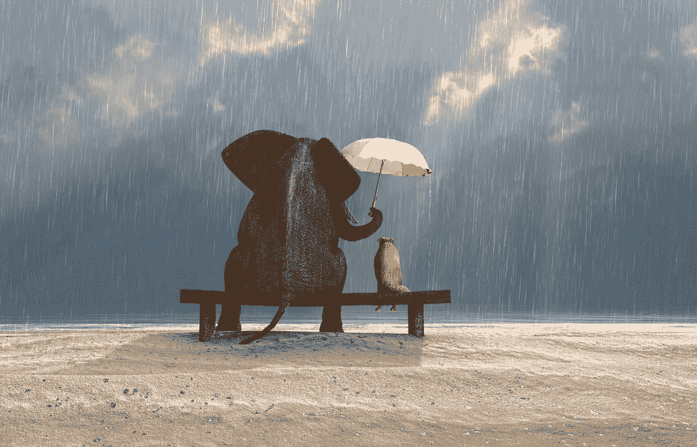
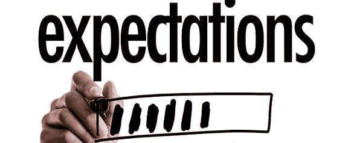
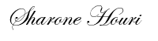

# 做好人的惊人风险

> 原文：<https://medium.com/swlh/the-surprising-risks-of-being-nice-be6352e8ae2>

## 一个关于政治、商业世界和投掷物的故事

[https://www.bhpalmbeach.com/pro-articles/role-kindness-plays-healing-addiction/](https://www.bhpalmbeach.com/pro-articles/role-kindness-plays-healing-addiction/)

如果我抓到有人试图对我外交，我可能会呕吐。

…尽管我确实为自己小时候(当我非常想要某样东西的时候)有些“圆滑”而感到内疚。

我会讨好爸爸妈妈，这样我就能在 16 岁时拥有一辆崭新的汽车，也许还会在新年向我姐姐借她新的万圣节服装时甜言蜜语。

但是说实话:

你应该是一个善于操纵和“外交”的人，这是有层次的。

# 让我们谈生意吧

在商界，政治是理所当然的。

有些日子你不想工作，有些日子你会感觉好极了。这两者的共同点是，不管情况如何，你都必须在这两天表现得一样。

没有人愿意在职场上看到一个无望、沮丧、焦虑的员工。你必须描绘出一幅坚强、快乐、有抱负的工人的画面，他们会毫无怨言地完成自己的工作。

真实的*严酷的*事实是，当有人雇你做某事时，他们并不太关心你的私生活——他们只是想让你完成工作..并把它做好。

他们太专注于他们的投资回报率和利润，而不关心你今天早上为什么生病。

这会让他们付出代价。毕竟，你那天没有工作，他们将不得不支付你的病假工资。

你也可能在请了几天病假后被解雇，他们甚至可能不在乎你为什么会错过这些天。

他们想的都是——“下一个。”

是的，我的朋友们，欢迎来到专业的世界。

# 你会被利用的

当你是个好人时会发生这样的事。

你开始你朝九晚五的工作，你呆到很晚，因为你关心你的客户，甚至没有得到报酬。

你领导你的同事，随时提供帮助，甚至支付你团队的午餐费用。

你会对你的工作和同事如此投入，以至于你开始被利用。

他们会保持这种关系，因为他们喜欢免费午餐，也因为你只是*在那里*随时提供帮助。

他们会开始使用*和*，并且在某一点上他们会期待它。

他们需要你的努力工作、奉献、加班、免费午餐等等。

然后，当你没有足够的灵活性伸出援手时，他们会感到不安。

…可能还会解雇你。

**底线:**不要急于把别人的需求放在自己的需求之前。有些人会认为这是软弱的表现，一有迹象就攻击。

# 你会吸引错误的人

尽管善良绝对是健康和有意义的关系的先决条件，但它也证明了无法为那些情感需求枯竭的人设置限制。

这可能是给我妹妹(穿万圣节服装的那个)的惊人建议，她给需要情绪稳定的人提供了超越自我的帮助。

如果你太善良，对于那些依赖给予者精神支持的人来说，这是一个完美的邀请。

对那些你很好的人要小心，当他们在凌晨 3 点打电话给你，问你该如何对待他们的生活时，确保你能处理好，因为他们正在崩溃。

如果你已经达到了另一个层次的友善，你将开始吸引那些需要你、要求你、过度情绪化和控制欲强的人，他们会把你视为他们的救世主。

如果作为一个救世主，你不帮助那些需要帮助的人，一定要知道他们会让你感到内疚，让你觉得自己是一个非常糟糕的人。

底线:不要太友好，否则你会吐在自己身上。

# 你可能会失去你的可信度

事实是，真正的人是一种罕见的品种——尤其是当它涉及到商业和商业的专业世界。

如果你纯粹是一个好人，你可能会被误解，被怀疑，甚至被指责。

人们会开始质疑你做这么好的事情或以尊严和尊重对待他人是否有不可告人的动机。

他们会开始怀疑你为什么太善良，并开始编造你为什么太付出的阴谋。

是的，我的朋友们。

如今，要想在商界表现得好，你需要有一个*理由。*

底线:我刚刚吐了

# 你会开始期待回来

如果你是那种好到不期待任何回报的人，你就是我最担心的人。

在外面要保持警惕。

至于其他承认有时有点自私的人，善良将意味着互惠。

> 你付出的，你会得到回报。

但有时候，不是那样的。

当你开始为别人做好事，在项目上花费比你需要的更多的时间(没有报酬)，以及投资于和同事的友谊，将会导致新的、不切实际的标准。

你会期望帮别人一个忙会让你要求回报。

你会期望在一个项目上努力工作会得到提升。

你会期望，当事情不顺利时，投资于与同事的友谊会带来一支守军。

**底线:**期望是一个巨大的风险。

通过明智地选择投资来消除它们，不要带着假设给出。

# 个人观点

虽然我不是占星学的最坚定的信徒，但我记得读过一篇文章，说处女座对我的世俗信仰产生了巨大的影响，那就是所有的事情都应该公平、公正、平等。

作为处女座，我更倾向于天真，但对每个人都很友好。

感同身受，对他人的需求敏感。

事实上，怀疑论占星术分析描述了我的部分人格。

事实是，我一直非常纠结于这样一个想法:要想有所成就，你必须有点政治色彩——即使你绝对鄙视这种想法。

你必须描绘出一幅完美的图画，说明为什么你是某个职位的理想候选人，并稍微修改一下缺点。

企业有时不得不扭曲他们拥有的客户数量、员工数量、办公室数量以及超额完成纸面上的承诺。

他们不得不歪曲为什么他们不能把事情做好，并为他们为什么犯下如此重大的错误编造借口。

政治可能很糟糕。

然而在其他时候，它们可以起到保护作用。

在人际关系中，有时你不得不对你爱的人撒谎，以免伤害他们的感情。

和你的孩子在一起，即使你的家庭正在分崩离析，你也必须面带微笑，以掩饰痛苦。

和你的丈夫或妻子在一起，为了保持士气，你将不得不说一些你并不真正相信的事情，你将不得不框定敏感的话题。

当我还在考虑在整个外交事务中站在哪一边的时候，我只是在想:

今天到底有什么是真的？

*在这一切中，真正的人性在哪里？*

*我们会成为真正的自己吗？还是这一切都只是虚假的微笑和声明？*

我让你考虑一下。

带着爱，

## 这篇文章发表在 [The Startup](https://medium.com/swlh) 上，这是 Medium 最大的创业刊物，拥有+406，714 名读者。

## 订阅接收[我们的头条新闻](http://growthsupply.com/the-startup-newsletter/)。

