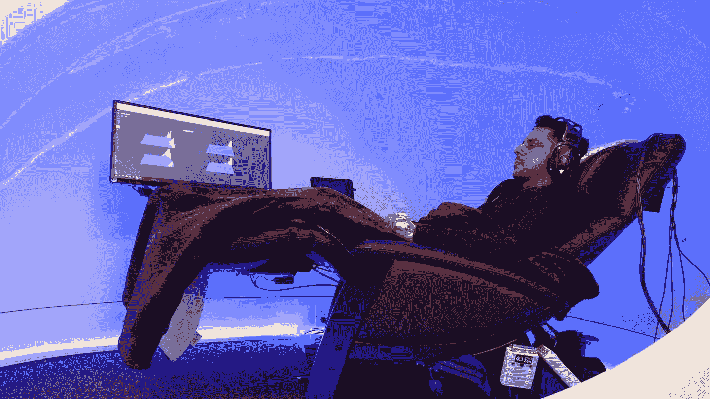

# 用冥想技术研究我的大脑 7 天，我学到了一件令人惊讶的事情

> 原文：<https://medium.com/swlh/the-surprising-thing-i-learned-from-studying-my-brain-with-meditation-technology-for-7-days-114c5d24032e>

我从 14 岁起就开始冥想。

这是我最珍视的日常习惯之一。有充分的理由。

截至 2015 年，超过 1400 项研究将冥想和正念归功于从长寿到提高生产力、幸福甚至善良的方方面面。所以最后一次…