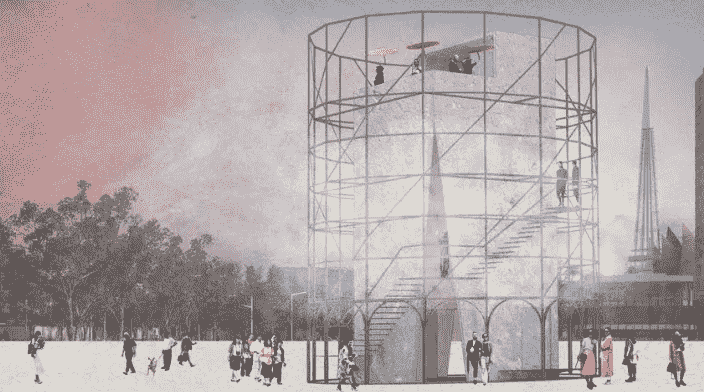

# 体验系统——建筑、技术和哲学碰撞的地方

> 原文：<https://medium.com/swlh/the-system-of-experiences-where-architecture-tech-philosophy-collide-680c80b244b8>

The Water Temple, EQ — Post Architecture

结构是建筑和哲学的共同兴趣。建筑研究的是*的物质，*哲学研究的是看似*的无形，*是心理和社会。然而两者以惊人的方式重叠。这篇文章探索了建筑和哲学交汇处的一种结构——*体验系统*——它在身体和心理上都发挥着它的力量。通过体验系统，*技术*和*空间*已经帮助公共和私人机构将体验商品化。这给建筑行业提供了一个独特的机会，因为演员们是这一行为的同谋，如果他们愿意的话，可以在谈判桌上占有一席之地。

"这篇文章论证了在混乱的界限中寻找快乐，以及在界限的构建中承担责任."—唐娜·哈拉威，一个机器人宣言

**……**

这种探索的基础来自于两个关键的文本，米歇尔·福柯的“全景主义”，它通过*物理* *结构*勾勒了一个*学科*的系统，以及吉勒·德勒兹的“关于控制社会的后记”，它详细描述了一个通过*技术结构*的*控制*的系统。

运用杰里米·边沁最初设计的圆形监狱的概念，福柯在 19 世纪一个规训社会的“圆形监狱主义”中概述了权力和控制的演变。一个纪律社会通过机构的纪律手段行使权力。它代表了以前控制模式的重大转变，以前的控制模式是*主权社会*，要求服从国王或中央权威人物的法律*。*

圆形监狱的设计简单而有力；中间是一个圆形的塔，周围是一圈细胞。最大限度地利用资源和权力，只需要一个人来监视所有的囚犯，有效地分离和分类他们。不仅如此，囚犯们无法看到是否有人真的在塔里，并开始认为他们总是被监视着，改变他们的行为，最终，从根本上改变他们是谁。最可怕的是，这种控制囚犯的力量是无形的，但却是坚定不移的；一台自动化的机器，除了被监视着完美工作的想法之外，什么都不需要。

在这个论证中，福柯将建筑定位为在一个规训社会中促进控制动力的结构——工具。这是剧情不可或缺的一部分。然而，这个场景并不完全来自于物理结构本身(建筑)，而是来自于它对居住者的精神状态，在结构和精神之间创造了一种伙伴关系。

吉勒·德勒兹在《控制社会的后记》中推进了福柯的观点。他认为，我们已经离开了纪律社会，进入了一个由技术驱动的控制社会。当你审视现代生活的结构时，这看起来非常合理。

起床——手机上的闹钟。穿好衣服——查看手机上的天气应用程序。去上班——用手机搭乘公共交通工具。买一杯咖啡——通过点击你的手机购买。写报告——使用在线数据可视化系统创建图表。购买午餐——使用优步订购。了解新闻——通过手机收听新闻播客。做晚餐——在你的 iPad 上按照 Tasty 的食谱指导视频做。

技术是现代人几乎每一个结构的驱动力或关键步骤。然而，德勒兹所说的“只有技术才能构建生活”也不完全准确。正如凯利在*的《控制中的纪律*中准确指出的那样，一些“说法……没有被随后的发展所证实，特别是关于纪律机构正在瓦解的说法:虽然一些机构已经衰落，但其他机构(特别是监狱)却在大规模扩张”。事实上，现在的社会秩序是由*结构*和*技术*结合而成的。

这就把我们带到了现在，经验的*系统*，在这里德勒兹和福柯的理论已经融合成一个混合的权力结构。德勒兹确信控制的社会技术机制会摧毁制度。但是福柯的制度并没有被完全摧毁，他们只是发生了变异，他们通过精神和结构之间的伙伴关系留下的纪律遗产仍然存在。心理控制是以数字和物理方式维持的，因为机构跟踪、指导和分类个人到他们想要的目的地。经验系统现在同时控制和训练。它不是自上而下施加权力，而是自下而上，以一种“赋权”和“选择”的叙事方式。它理解对自由的感知的重要性，理解技术提供和限制自由的能力，理解空间沉浸和催眠的能力，并且系统地使用它们。其中，有两个关键角色——机构和个人——在数字和物理两个空间层面上相互作用。

体验系统中这两个层面的联系以最引人注目的方式融合了建筑和技术。有三个阶段——1)确定一个目标并创建一个实现目标的概念，2)将概念转化为现实，3)评估结果。在资本主义的驱动下，体验系统的目标很简单——促进消费。社会从生产资本主义发展到生产产品的资本主义，现在又发展到消费产品的资本主义。消费的行为就是体验。体验系统与消费的东西无关(食物、蹦极、有趣的事实、新闻、故事、艺术、视频等等)。)，简直就是它的载体。

这种错综复杂的消费空间经验的迷宫为建筑职业创造了一个冲突的节点。如果建筑师的角色是为人类构建体验——事实如此——那么建筑师在建筑结构中的角色从哪里开始，技术的角色从哪里开始？德勒兹的陈述很好地总结了建筑师必须面对的物理和技术结构的冲突和融合:

“控制机制的概念，在任何给定的时刻给出开放环境中任何元素的位置……不一定是科幻小说。费利克斯·瓜塔里想象了一个城市，在那里，人们可以离开自己的公寓、街道和邻居，这要归功于一张(个人的)电子卡，它可以提高一定的障碍；但是在某一天或某几个小时内，这张卡很容易被拒绝；重要的不是屏障，而是跟踪每个人的位置(合法或非法)并实现通用调制的计算机。”

技术——卡片跟踪系统——和物理空间——障碍和邻居——之间存在不可否认的关系，它们共同使一个由权力来源决定的控制系统合法化，在这种情况下，权力来源是一个公共实体。不过，一个更有趣的用例并没有如此直接地阻碍自由……正如福柯所提出的，权力并不直接与自由对立。选择中有力量，选择的力量。

**。…**

虚拟的*西部世界*公园是体验系统的一个例子。西方世界是从禁忌、社会结构或任何真正的法律形式中解放出来的，至少对人类来说，是现代人的自由绿洲。故事发生在过去的美国西部荒野，任何负担得起的人都可以来到西部世界，随心所欲。没有规则，只有永生的假象(不能伤害客人)。当客人“选择”他们自己要追逐的冒险时，这是一种终极的沉浸式体验。

西部世界公园通过两个关键工具——技术和建筑——对体验进行系统控制。技术和建筑共同维持着公园里自由的幻觉。这种伙伴关系的一个例子是主人和客人之间的关系。

这个公园的刺激真实性是基于主人和客人之间的关系，主人实际上是电子人，而客人是人类。这种关系建立在身体、技术和心理的欺骗和谎言的基础上——宿主不知道他们不是人类。他们真的相信自己是凡人，有自己的自由意志，这种欺骗和自由的幻觉对于创造客人追求的体验是必不可少的。主持人必须真正相信他们是一个真实故事的一部分，以便让人类相信这一点。虽然一整篇文章可以专门讨论这种关系的道德性，但这种关系的*结构*同样重要。这种欺骗有两种主要的维持方式，通过编程和物理空间设计。

程序非常聪明。主持人的记忆在他们“死亡”后被抹去，所以他们(理论上)不记得发生过的任何事情，并准确地从他们开始的地方重新开始——在他们精心制作的叙事的开始。

公园的物理空间设计是故意骗人的。主持人不会面对会让他们质疑现实版本的物体(比如电话)或空间(比如未来隧道)。从公园到各种作战前哨的入口和出口都巧妙地隐藏在人造景观中，似乎一直延续到永恒。这些前哨站隐藏在公园的每个角落，因此工作人员可以轻松地访问、检索、擦除和归还主机。这些隐藏在真实和虚构之间的门道对于在秘密控制的环境中创造自由的体验是必不可少的。

虽然这是一个虚构人物的虚构例子，但是问问你自己——如果这是真的，你会想去*西部世界*吗？*正是。对体验的渴望是超越的，不管是虚构的还是非虚构的，这就是西方世界如此强大和危险的原因。它源于一个关于社会现状的真理，现代人天生渴望体验而不是拥有，并说明了个人愿意去实现这些体验的程度。*

机器人性爱娃娃或虚拟现实僵尸游戏等技术的后果已经被广泛讨论，但空间却没有，尽管它在促进这些体验方面发挥了作用。它既受影响又是同谋，需要考虑生产阶段使用的技术机制以外的问题。体验建立在技术和物理空间之间的关系上，因为它们将*总是*在某个地方发生，而那个人将*总是*与某种技术设备相连。它们是物理和心理的结果，从一开始就错综复杂，形成了建筑师必须应对的空间难题。**虽然建筑师目前通过他们在空间生产中的力量提供经验，但他们也必须成为这个空间创造的成果的倡导者。在空间体验的商品化过程中，它们必须不仅仅是一个工具。建筑师拥有完美的技能来保护和捍卫个人的边界、融合和鸿沟。通过抓住这个机会，建筑师可以在经验系统的最初和最后阶段重获权力，并倡导更好的物理和技术空间成果，而不仅仅是高效和综合的生产。**