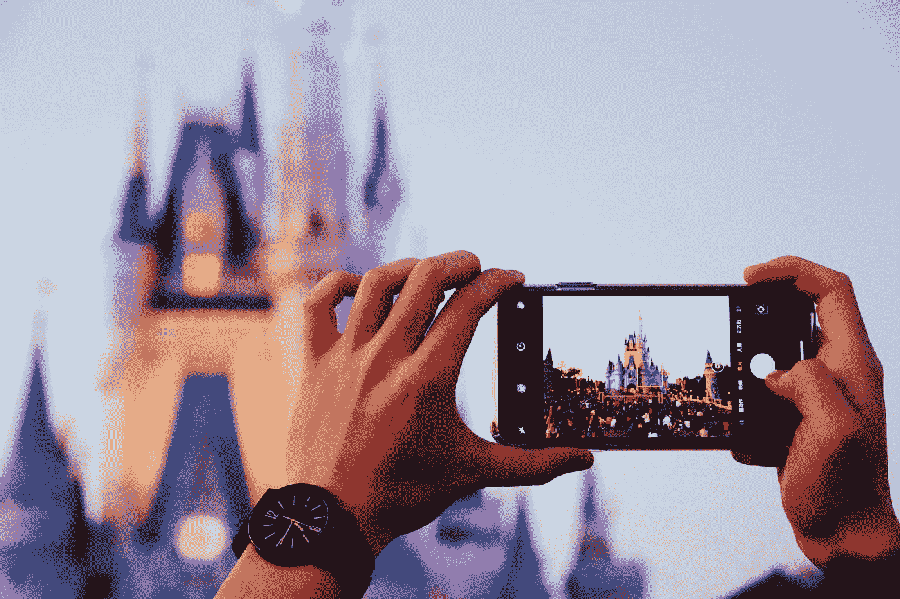

# 技术偏见

> 原文：<https://medium.com/swlh/the-tech-prejudice-29b31eeb0745>

## 每个人都很关心“科技巨头”，但没有人提到迪士尼。这只是我所说的“技术偏见”的另一个例子。

Photo by [Elijah Chan](https://unsplash.com/@elijah23?utm_source=medium&utm_medium=referral) on [Unsplash](https://unsplash.com?utm_source=medium&utm_medium=referral)

有传言称，华特·迪士尼公司与 21 世纪福克斯公司达成了一笔 710 亿美元的交易。按 [*守护*](https://www.theguardian.com/film/2019/mar/20/disney-seals-71bn-deal-for-21st-century-fox-as-it-prepares-to-take-on-netflix) :