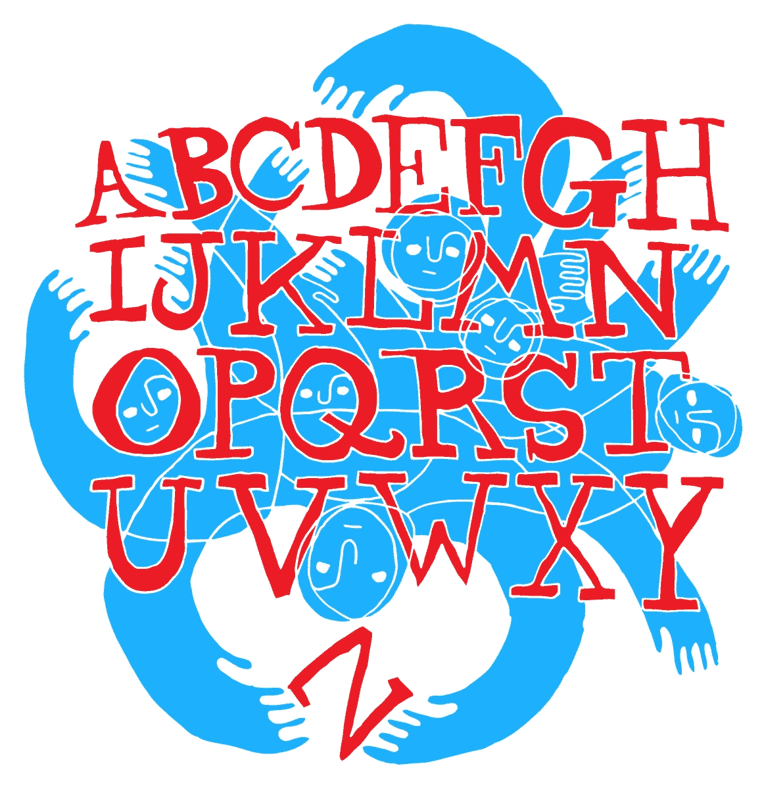

# 图形和字体设计之间的张力

> 原文：<https://medium.com/swlh/the-tension-between-graphic-and-type-design-80ae8fb42e65>

*注:这篇短文也可以在* [*设计观察者*](https://designobserver.com/feature/the-tension-between-graphic-and-type-design/40072) *上找到。*

在美国早期，大约在“平面设计师”一词诞生 120 年前，字体和出版业之间的紧张关系达到了沸点。1802 年，在约翰·邓勒普出版第一份独立宣言的短短 26 年后，国会决定对欧洲金属印刷字体征收 7.5%的税。该税旨在扩大最近取消的对欧洲开采的锑的现有关税，锑是一种与锡和铅混合的金属，使金属类型足够耐用，可以承受繁忙的印刷机的日常敲打。众议院商业和制造业委员会发布了一份报告，明确表示其决定通过抑制外国竞争同时对其原材料进行折扣来使国内类型的铸造厂受益，这是为了保护国内制造业。更具体地说，它保护了一家国内制造商:费城的 Binny 和 Ronaldson。

阿奇博尔德·宾尼和詹姆斯·罗纳尔德森是当时美国唯一一家铅字铸造厂的所有者，他们成功地让国会相信，欧洲开采的锑的高成本加上欧洲铅字铸造厂的竞争压力威胁到了国内铅字行业的生存。将他们的单一业务称为“行业”有些牵强，但国会似乎对他们的说法信以为真。Binny 和 Ronaldson 能够说服立法者，他们的铸造厂有能力提供足够的金属铅字来满足这个年轻国家所有印刷商和出版商的需求。

印刷商和出版商不同意。在他们看来，国会是在授予一个单一的、装备不良的铅字铸造厂垄断权，这实际上是在财政上扼杀他们的出版业务，扼杀新闻和思想在整个美国的传播，而当时通讯对维持羽翼未丰的联盟是至关重要的。

纽约市已经是一个充满活力的出版中心。在曼哈顿下城的鹅卵石路上，一系列的书籍和报纸被印刷出来，和贝类一起出售。1802 年 2 月，54 名图书和报纸出版商和销售商在华尔街的商业咖啡屋会面，讨论宾尼和罗纳尔德森游说团制造的危机。他们一起写了一份请愿书，描述了“对进口活字印刷征收额外关税的建议的重要性。”他们把这一责任框定为“对美国每一位读者征收的税，因为只有少数人参与了打字工作。”此外，他们宣称征收这种税会“对所有与印刷业有关的人造成广泛的伤害”最后，他们分享了他们的集体专业估计，Binny 和 Ronaldson 只能提供“美国印刷商需求的二十分之一。”签名的请愿书在他们会面的同一天被邮寄到众议院。

出版商递交请愿书后不久，纽约市的印刷工人聚集在富兰克林印刷协会，起草了他们给国会的请愿书。他们的请愿书和他们雇主的请愿书是本着同样的精神写的。此外，他们将危机框定为劳工问题，推测拟议的税收将“剥夺美国三分之二的熟练印刷工人的生存手段。”一个月之内，由费城、波士顿、巴尔的摩和查尔斯顿的出版商和印刷商团体起草的类似请愿书被邮寄到了国会。最终，这些请求的总和被证明是有说服力的。1804 年，国会同意废除欧洲金属印刷活字税。

宾尼和罗纳尔德森的游说太过火了。安排一个政府授权的垄断会产生反效果，让他们所有的顾客都反对他们。这一事件改变了美国铅字业和出版业的发展轨迹，并使它们之间的关系复杂化。当我第一次偶然发现这个鲜为人知的故事时，它埋藏在史蒂文·卡尔·史密斯引人入胜的[书](https://www.amazon.com/Empire-Print-Publishing-American-Republic/dp/0271078510)、*印刷帝国:美利坚共和国早期的纽约出版业*中，它引起了共鸣，因为 215 年后，平面设计和字体设计领域之间仍然存在一种奇怪的紧张关系。

今天，经常听到人们贬低图形设计师的努力，说“但是，他们只是选择字体？”具有讽刺意味的是，这些人通常根本没有意识到类型设计器的存在。在街上问某人是否听说过 Helvetica，他们可能会说是的。问他们谁设计了 Helvetica，我保证他们不会知道。字体很基本，可以被认为是理所当然的。即使是平面设计师，他们非常小心地使用字体设计师的作品，也可能因为暴露而忘记隐藏在每个字母背后的多年学习和努力。

字体设计师知道他们的工作是理所当然的。下次你发现自己在一个满是字体设计师的房间里，问问他们对光学字距调整的看法，看着他们沮丧地扭成一个个结。具有讽刺意味的是，光学字距调整是一种排版软件设置，它用一种算法意见取代了字体设计者无数小时的光学字母间距调整。当图形设计师使用光学字距调整时，他们要么告诉字体设计师，他们不信任他们，要么不同意他们的判断。两者都是难以下咽的苦果。不管是什么原因，字体设计师经常觉得平面设计师没有资格在字母间距的问题上反驳他们。光学字距调整只是这些复杂联系的学科之间仍然可能出现的紧张关系的一个例子。

> “我还学习了平面设计，作为发现类型的一种方式。我认为字体设计是最纯粹的形式。在我们的领域里，你能期望的最好的。”——[*伊丽莎白·凯里·史密斯*](https://elizabethcareysmith.com/)

图形设计师使用字体，但是图形设计师和字体设计师之间的联系远远超出了工具制造者和工具使用者之间的联系。田地之间的界线很模糊。此外，字体不是一种工具，而是一种材料。字体不仅仅是有用的，它还是平面设计的原矿——阅读的原矿。尽管这两个领域在不同层次的阅读体验上运作，但都同样关注读者的需求。几乎不可能想象没有字体设计的平面设计。这些学科超越了它们的界限，因此群体之间任何程度的蔑视都等同于不安全。

平面设计领域已经发展到相信顾客的同理心应该是设计过程的基石。字体设计领域似乎已经从这一进化轨迹中略微分支。最近，杰斯·麦卡蒂[在 TypeCon 上谈到了这一点](https://www.resources.nicertype.com/typecon-talk)，鼓励字体设计师采取顾客需求的心态。她的演讲在一定程度上受到了她在 Twitter 上发的一条帖子的启发，在这条帖子里，平面设计师分享了他们对字体设计师的感受。她收到的回复是这样的:“我遇到了一些太多的字体设计师，他们基本上提出了一些版本的‘你需要这么高才能使用我的作品。’还有:“设计师可能会让普通大众感到害怕，但是在这个行业里，喜欢打字的人通常会让普通设计师感到害怕。还有:“字体设计师把自己塑造成冷漠、自命不凡的天才。他们忘记了他们是在服务行业。麦卡蒂注意到“没有一个回复是正面评价[字体设计]行业的。"

这些文化差异的总和可能就是 [Mary Catherine Pflug](http://marycatherin.es/) 在她的 *2017 字体购买习惯* [*调查*](/@mcpflugie/the-2017-font-purchasing-habits-results-3fc588283b33)*(1900 名受访者)中描述的“类型泡沫”她解释道，“我这里说的不一定是金融泡沫。我说的是社会泡沫。字体设计师群体的想法与其他[设计]群体不同。在 Pflug 的 2018 年[调查](/@mcpflugie/the-2018-font-purchasing-habits-survey-results-complete-edition-92baefd95001) (15，745 名受访者)中，她指出，“字体设计师的反应仍然与其他人群非常不同。”*

> *对于那些不认为自己是平面设计师的全职字体设计师来说，我认为对于平面设计师想要什么和需要什么经常会有一点困惑——[*蒂埃里·宝珀*](http://www.thierryblancpain.com/)*

*我问了 Pflug 为什么字体设计师会有不同的想法。她观察到，虽然评论对图形和字体设计都有帮助，但字体设计师将对印刷特征的评论发挥到了极致，因为制作字体本质上就是关注最小的细节。她指出“对于字体设计者来说，重要的是在批判性思维和开放性之间找到平衡，以鼓励新人加入进来，尝试，犯错，学习。”字体设计文化的标志性的高度批判性会成为进入这一领域的障碍。同样的障碍也会在字体设计者和他们的客户之间制造距离。*

*公平地说，当通过成长心态表达时，这种临界性也有可能表现为社区。我所经历的这种建设性友谊的最好例子，与麦卡蒂前面提到的 Twitter 帖子中分享的流行观点相反，是托马斯·乔金的型周四[活动](https://www.typethursday.org/)中温暖、鼓舞人心的气氛。每月一次，平面设计师和字体设计师聚集在曼哈顿的字体总监[俱乐部](https://www.tdc.org/)——以及横跨两大洲的其他七个城市——举杯畅谈，并对一些与会者正在开发的字体进行评论。没有平面设计师通常归因于字体设计文化的傲慢或排外。*

*不管准确与否，平面设计师确实认为字体设计的文化是排外的，感知塑造现实。也许这种紧张是一种遗留现象，是前数字时代的遗留物？也许像周四这样的事件预示着一个新的范例？平面设计工具的民主化使公众发现了一种新的对平面设计的欣赏和喜爱。也许字体设计工具的民主化对图形和字体设计师之间的关系有着同样的影响。当平面设计师尝试字体设计时，他们会更欣赏设计字体的努力，更同情字体设计的文化。也许，在描述平面设计和字体设计之间的社会差距时，杰斯·麦卡蒂和玛丽·凯瑟琳·菲拉格实际上是在帮助缩小这种差距。*

*前面我说过图形和字体设计的学科“超越了它们的界限”事实上，他们之间的紧张关系类似于家庭成员之间的紧张关系，正是因为他们非常了解对方，所以才会让对方发疯。那种亲密的紧张感是和某种程度的爱包装在一起的。焦虑之下有爱。*

*1802 年纽约市出版商的会议，受到 Binny 和 Ronaldson 的启发，也启发了出版商组织第一届全国书展，同年举行。美国的出版业从未呈现出统一的全国性特征。展会第一天结束时，出版商和印刷商聚在一起吃晚餐，并举起了他们的酒杯，共 16 杯，为他们行业的各个方面精心准备。其中一个祝酒词是“创造字母的姐妹艺术”*