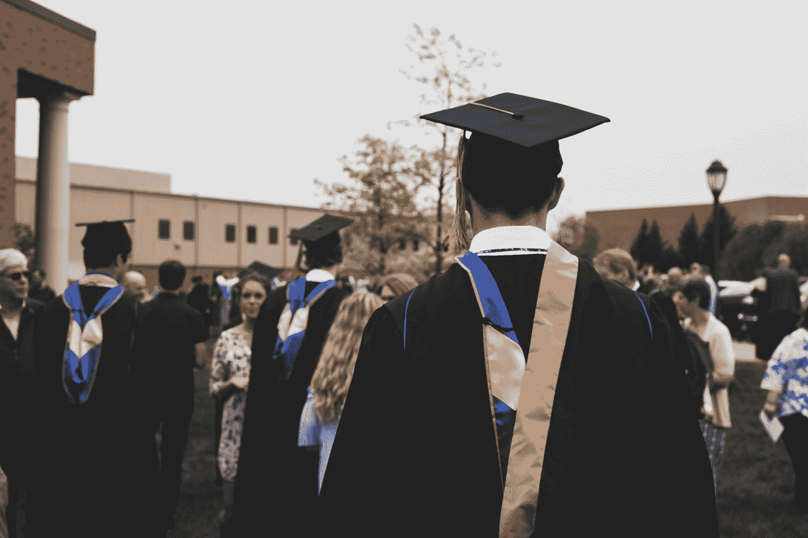

# 我希望在上大学之前就知道的事情

> 原文：<https://medium.com/swlh/the-things-i-wished-id-known-before-i-went-to-college-6ccfe9f5a881>

Photo by [Charles DeLoye](https://unsplash.com/@charlesdeloye?utm_source=medium&utm_medium=referral) on [Unsplash](https://unsplash.com?utm_source=medium&utm_medium=referral)

> ***“教育是一个人忘记了在学校里所学的一切之后剩下的东西。好奇心在正规教育中幸存下来，这是一个奇迹。”***
> 
> ***——爱因斯坦***

我们很多人小时候都有过类似的经历。一位父母或成年人告诉我们有多聪明，并预言我们会上大学，然后变得富有。我不确定是不是…